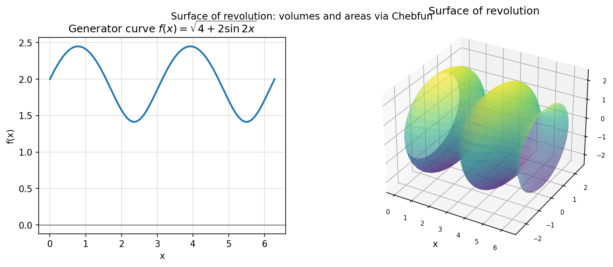

# Surfaces of revolution

**Georges Klein, March 2013**

---

A *surface of revolution* is created by rotating a planar generator curve
$f(x)$ defined on $[a, b]$ around the $x$-axis.  Chebfun makes the
integrals that describe the geometric properties of such surfaces
straightforward to compute to machine precision.

## Volume

The volume enclosed is

$$
V = \pi \int_a^b f(x)^2\, dx.
$$

For $f(x) = \sqrt{1 - x^2}$ on $[-1, 1]$ (generating a sphere):

```python
import jax.numpy as jnp
import chebfunjax as cj

f     = cj.chebfun(lambda x: jnp.sqrt(jnp.maximum(1.0 - x**2, 0.0)))
V     = float(jnp.pi) * float((f * f).sum())
print("Unit sphere volume =", V)          # (4/3)*pi = 4.1888...
```

For $f(x) = \sqrt{4 + 2\sin 2x}$ on $[0, 2\pi]$ the exact answer is
$V = 8\pi^2$:

```python
dom = (0.0, 2.0 * float(jnp.pi))
f   = cj.chebfun(lambda x: jnp.sqrt(4.0 + 2.0 * jnp.sin(2.0 * x)), domain=dom)
V   = float(jnp.pi) * float((f * f).sum())
print("V =", V, "  exact 8*pi^2 =", 8 * float(jnp.pi)**2)
```

## Surface area

$$
A = 2\pi \int_a^b f(x)\,\sqrt{1 + \bigl|f'(x)\bigr|^2}\, dx.
$$

```python
df  = f.diff()
one = cj.chebfun(lambda x: jnp.ones_like(x), domain=dom)
integrand = f * (one + df * df).sqrt()
A = 2.0 * float(jnp.pi) * float(integrand.sum())
print("Surface area A =", A)
```

## Centre of gravity

$$
z_G = \frac{\pi}{V} \int_a^b x\, f(x)^2\, dx.
$$

```python
x_cf = cj.chebfun(lambda x: x, domain=dom)
zG   = float(jnp.pi) / V * float((x_cf * f * f).sum())
print("Centre of gravity z_G =", zG)   # in (0, 2*pi)
```

## Moment of inertia

$$
J = \frac{\pi}{2} \int_a^b f(x)^4\, dx.
$$

```python
f4 = (f * f) * (f * f)
J  = float(jnp.pi) / 2.0 * float(f4.sum())
print("Moment of inertia J =", J)
```

## Gallery



*Left*: Generator curve $f(x) = \sqrt{4 + 2\sin 2x}$.
*Right*: Resulting surface of revolution coloured by height.

## Reference

Klein, G. (2013).
*Surfaces of revolution* (Chebfun example calc/SurfaceRevolution.m).
[chebfun.org](https://www.chebfun.org/)
