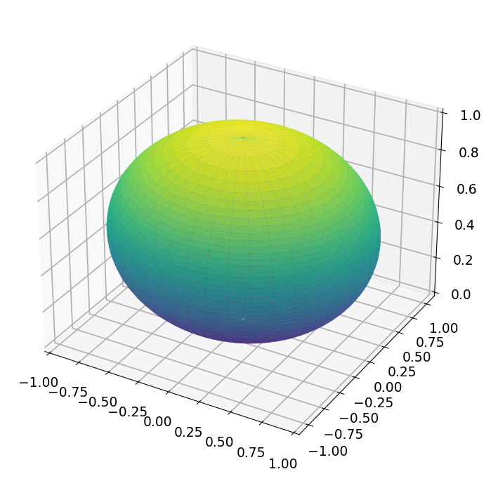
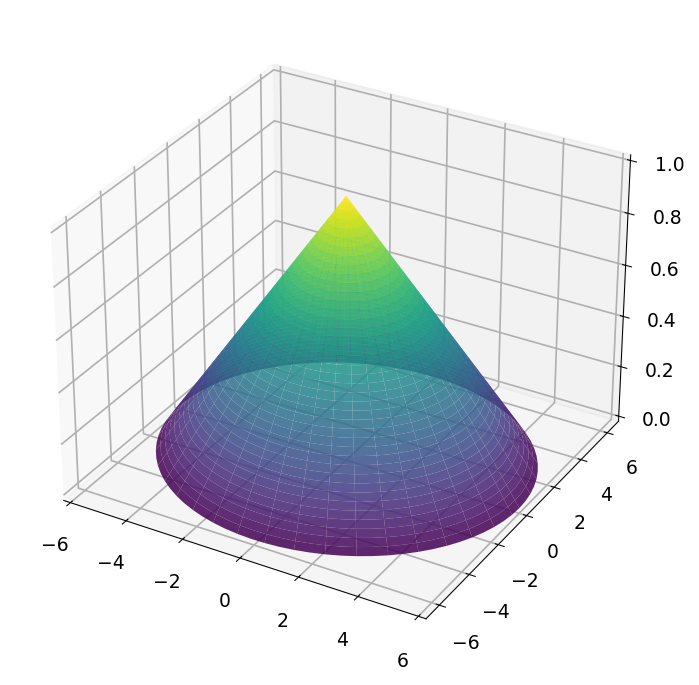
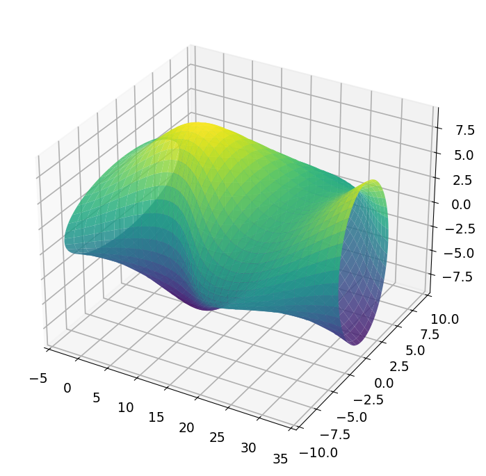
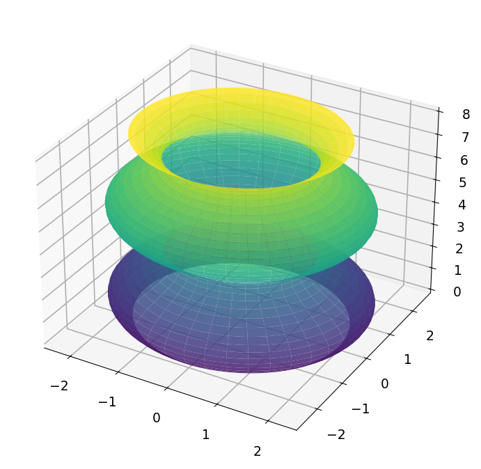
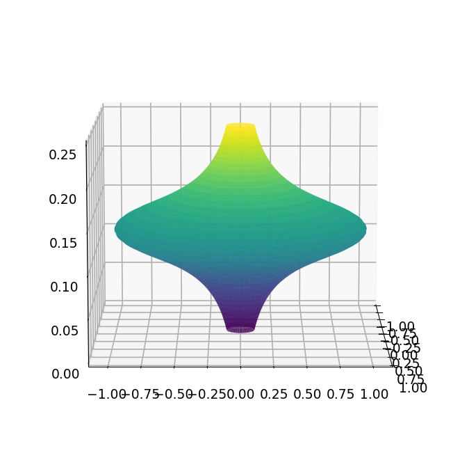

# Surfaces of revolution

*Georges Klein*

[Original MATLAB Chebfun example](https://www.chebfun.org/examples/calc/SurfaceRevolution.html)

(Chebfun example calc/SurfaceRevolution.m)

A surface of revolution arises from rotating the graph of a function
about an axis.  From a chebfun $f$ the surface is generated directly;
here are a sphere, a cone, and a horizontally-oriented sine surface:





For $f(x) = \sqrt{4 + 2\sin 2x}$ on $[0, 2\pi]$, the classical
quantities of the solid of revolution are chebfun integrals.  The
volume $V = \pi \int f^2$ (exactly $8\pi^2$ here):

```python
import jax.numpy as jnp
import numpy as np
import chebfunjax as cj

x = cj.chebfun(lambda t: t, domain=[0, 2 * np.pi])
f = cj.chebfun(lambda t: jnp.sqrt(4 + 2 * jnp.sin(2 * t)),
               domain=[0, 2 * np.pi])
V = np.pi * (f**2).sum()
```
```
V =
  78.956835208714836
error =
    -2.842170943040401e-14
```



The surface area $A = 2\pi \int f \sqrt{1 + f'^2}$, the center of
gravity $z_G = \frac{\pi}{V} \int x f^2$, and the moment of inertia
$J = \frac{\pi}{2} \int f^4$:

```
A =
  95.016245402718440
zG =
   2.891592653589794
J =
     1.776528792196084e+02
```

Finally, a lens-shaped surface from the Runge-like function
$1/(1+8x^2)$:


