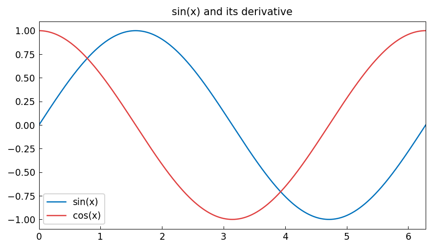

# Differentiation

**Inspired by [Chebfun](https://www.chebfun.org/) examples (calc/Differentiation)**

---

The `diff` method differentiates a Chebfun exactly — by differentiating the
underlying Chebyshev expansion. The result is another Chebfun of one degree lower,
and the accuracy is spectral.

## Basic differentiation

```python
import chebfunjax as cj
import jax.numpy as jnp
import numpy as np

# f(x) = sin(pi*x), f'(x) = pi*cos(pi*x)
f = cj.chebfun(lambda x: jnp.sin(jnp.pi * x))
fp = f.diff()   # first derivative
fpp = f.diff(2) # second derivative

x0 = jnp.array(0.3)
print(f"f'(0.3)  = {float(fp(x0)):.10f}")
print(f"  exact  = {float(jnp.pi * jnp.cos(jnp.pi * 0.3)):.10f}")
print(f"f''(0.3) = {float(fpp(x0)):.10f}")
print(f"  exact  = {float(-jnp.pi**2 * jnp.sin(jnp.pi * 0.3)):.10f}")
```

```
f'(0.3)  = 2.8678631325
  exact  = 2.8678631325
f''(0.3) = -8.7401765667
  exact  = -8.7401765667
```

## Higher derivatives

For $f(x) = e^x$, all derivatives equal $e^x$:

```python
g = cj.chebfun(jnp.exp)
for k in range(1, 6):
    gk = g.diff(k)
    err = abs(float(gk(jnp.array(0.5))) - float(jnp.exp(jnp.array(0.5))))
    print(f"d^{k}/dx^{k} e^x at x=0.5: error = {err:.2e}")
```



## Fundamental theorem of calculus

Differentiation and integration are inverse operations:

```python
F = f.cumsum()   # antiderivative
Fp = F.diff()    # should recover f
x_test = jnp.linspace(-1, 1, 100)
err = float(jnp.max(jnp.abs(jnp.array(Fp(x_test)) - jnp.array(f(x_test)))))
print(f"max |F'(x) - f(x)| = {err:.2e}")  # machine precision
```

## References

1. L. N. Trefethen, *Spectral Methods in MATLAB*, SIAM, 2000.
2. L. N. Trefethen, *Approximation Theory and Approximation Practice*, SIAM, 2013.
