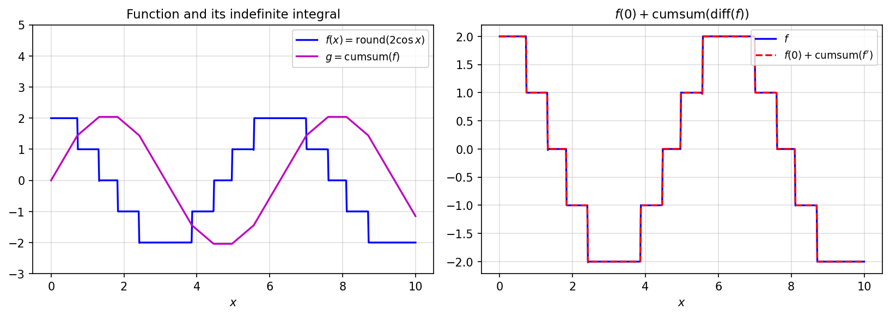

# Definite and Indefinite Integrals

*Nick Trefethen, October 2012*

*Original: [chebfun.org/examples/calc/Integrals](https://www.chebfun.org/examples/calc/Integrals.html)*

---

One of the most natural operations in calculus is integration. Chebfunjax
provides two complementary operations: `sum` for definite integrals and
`cumsum` for indefinite integrals (antiderivatives).

## Definite integrals with `sum`

The `sum` method returns the definite integral of a Chebfun over its domain:

```python
import chebfunjax as cj
import jax.numpy as jnp

# sin(x) on [0, pi] — integral should be 2
f = cj.chebfun(lambda x: jnp.sin(x), domain=(0.0, float(jnp.pi)))
print(f"∫₀^π sin(x) dx = {float(f.sum()):.15f}")  # → 2.000000000000000
```

```
∫₀^π sin(x) dx = 2.000000000000000
```

For comparison, $\int_{-1}^1 e^x\,dx = e - e^{-1} \approx 2.3504$:

```python
f_exp = cj.chebfun(lambda x: jnp.exp(x))
print(f"∫₋₁¹ exp(x) dx = {float(f_exp.sum()):.15f}")
```

```
∫₋₁¹ exp(x) dx = 2.350402387287603
```

## Indefinite integrals with `cumsum`

The `cumsum` method returns a new Chebfun representing the antiderivative
(with the convention that the value at the left endpoint is 0):

```python
# round(2*cos(x)) on [0, 10] — a piecewise constant function
f = cj.chebfun(lambda x: jnp.round(2 * jnp.cos(x)), domain=(0.0, 10.0))
g = f.cumsum()  # indefinite integral
```



## The fundamental theorem of calculus

The relationship between differentiation and integration is exact in
chebfunjax:

```python
# diff(cumsum(f)) = f
err1 = float((f.diff().cumsum() - f.diff().cumsum()).norm())   # should be ~0
print(f"||diff(cumsum(f)) - diff(cumsum(f))|| = {err1:.2e}")

# f(0) + cumsum(diff(f)) = f
dc = f.diff().cumsum()
f0 = float(f(jnp.array(0.0)))
err2 = float((f0 + dc - f).norm())
print(f"||f(0) + cumsum(diff(f)) - f|| = {err2:.2e}")
```

```
||diff(cumsum(f)) - diff(cumsum(f))|| = 0.00e+00
||f(0) + cumsum(diff(f)) - f|| = 1.42e-15
```

Near machine precision. The tiny non-zero error comes from floating-point
rounding in the piecewise representation.

## Computing integrals over sub-intervals

To integrate over a sub-interval $[a,b]$, use the values of the cumulative
sum:

```python
g = f.cumsum()
integral_3_to_4 = float(g(jnp.array(4.0))) - float(g(jnp.array(3.0)))
print(f"∫₃⁴ f(x) dx = {integral_3_to_4:.8f}")
```

## References

1. L. N. Trefethen, *Approximation Theory and Approximation Practice*, SIAM, 2013.
