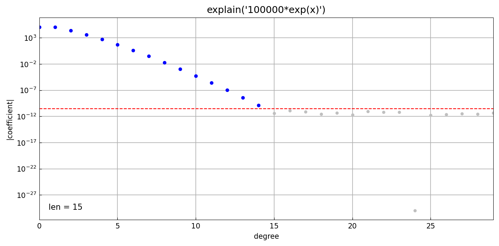
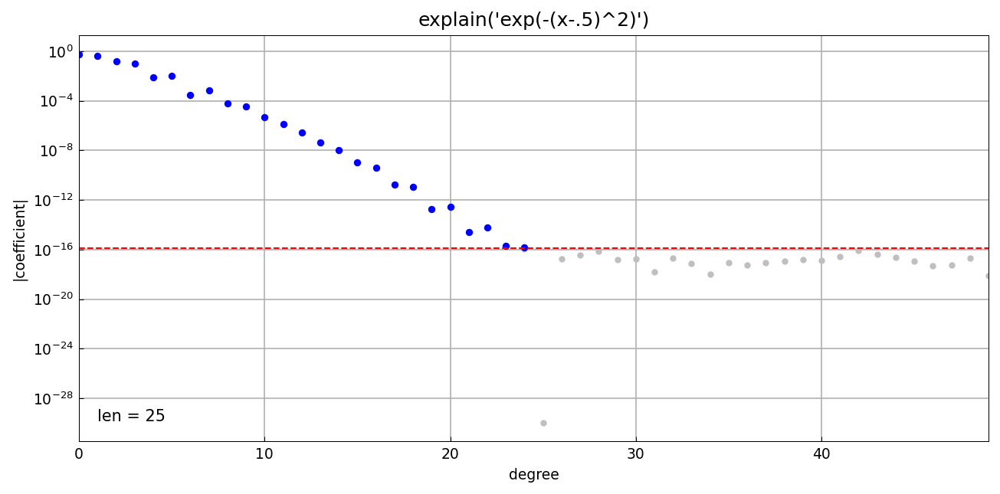
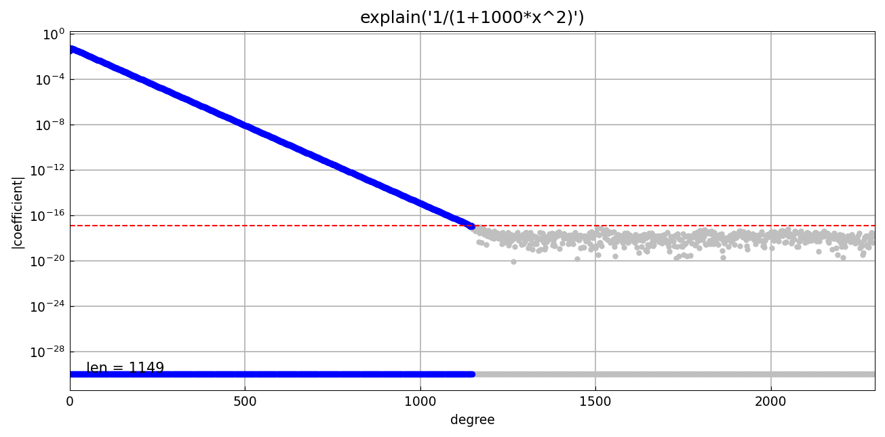
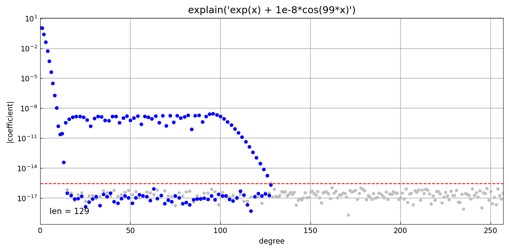
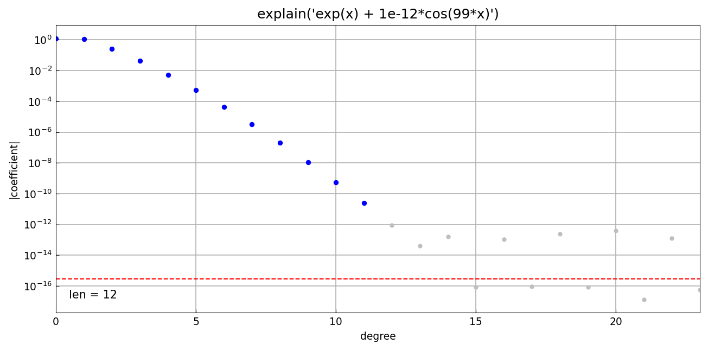
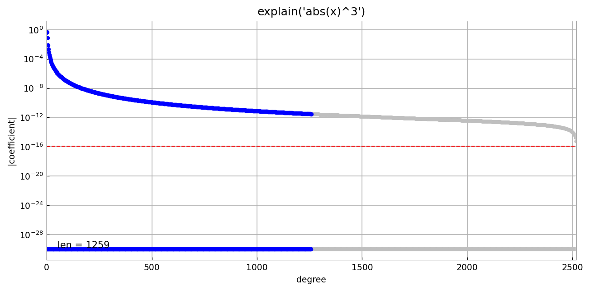
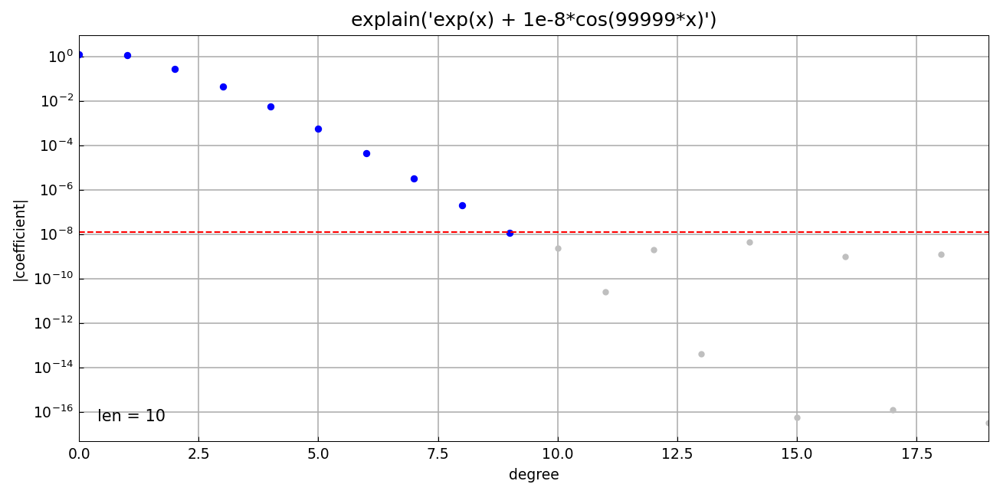

# Explaining chebfun construction

*Nick Trefethen, March 2017*

[Original MATLAB Chebfun example](https://www.chebfun.org/examples/cheb/ChebExplain.html)

(Chebfun example cheb/ChebExplain.m)

The `explain` tool annotates the constructor's decisions: which grids
it sampled, where it chopped the series, and what tolerance it worked
to.  This replica draws the chopped coefficients (blue) over a
doublelength construction (grey) with the working tolerance marked
(red dashed).

Scaling doesn't matter — the constructor works relative to the vertical
scale:



A Gaussian bump is easy:



A Runge-type function needs a longer series:



A tiny hidden oscillation at $10^{-8}$ is resolved, since it lies above
machine precision relative to the scale:



At $10^{-12}$... also resolved — but at $10^{-16}$ it would vanish into
the rounding plateau:



Non-smooth functions like $|x|^3$ produce long algebraically decaying
series:



One can also construct at a fixed length:

```
f =
   chebfun column (1 smooth piece)
       interval       length     endpoint values
[      -1,       1]     3000         1        1
vertical scale =   1
```

A rapid oscillation hidden at the $10^{-8}$ level cannot be resolved at
machine precision (the constructor warns), but with `eps = 1e-8` the
oscillation is treated as noise and a length-10 chebfun results:

```
f =
   chebfun column (1 smooth piece)
       interval       length     endpoint values
[      -1,       1]       10      0.37      2.7
vertical scale = 2.7
```

(Digit-for-digit with the published output.)



---

*Replicated with [chebfunjax](https://github.com/ma-gilles/chebfunjax); original
example copyright The University of Oxford and The Chebfun Developers.*
