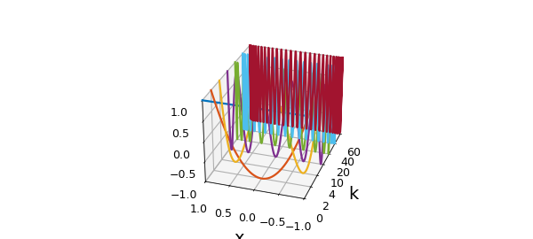
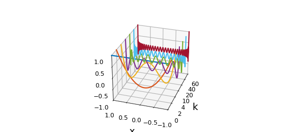

# Chebyshev polynomials as plotted by Fornberg and Higham & Higham

*Nick Trefethen, December 2011*

[Original MATLAB Chebfun example](https://www.chebfun.org/examples/cheb/ChebPolysHigham.html)

Python translation: [`examples/cheb/cheb_polys_higham.py`](https://github.com/ma-gilles/chebfunjax/blob/main/examples/cheb/cheb_polys_higham.py)

Attractive 3D plots of several Chebyshev polynomails appear in both Fornberg's book [1] (p. 159) and Higham & Higham's book [2] (p. 259). Here are similar plots reproduced in Chebfun.

```matlab
k = [0 2 4 10 20 40 60];
x = chebfun('x'); one = 1 + 0*x;
FS = 'fontsize'; fs = 14;
for j = 1:length(k)
  plot3(j*one,x,chebpoly(k(j)),'linewidth',1.6), hold on
end
axis([1 length(k) -1 1 -1 1])
box on
set(gca,'dataaspectratio',[1 0.75 4]), view(-72,28)
set(gca,'xticklabel',k)
xlabel('k',FS,fs), ylabel('x',FS,fs), set(gca,FS,fs)
h = get(gca,'xlabel'); set(h,'position',get(h,'position')+[1.5 0.1 0])
h = get(gca,'ylabel'); set(h,'position',get(h,'position')+[0 0.25 0])
```



Fornberg also includes the Legendre polynomials for comparison. This can be easily done in Chebfun by replacing `chebpoly` with `legpoly` above. Here is the result:

```matlab
clf;
for j = 1:length(k)
  plot3(j*one,x,legpoly(k(j)),'linewidth',1.6), hold on
end
axis([1 length(k) -1 1 -1 1])
box on
set(gca,'dataaspectratio',[1 0.75 4]), view(-72,28)
set(gca,'xticklabel',k)
xlabel('k',FS,fs), ylabel('x',FS,fs), set(gca,FS,fs)
h = get(gca,'xlabel'); set(h,'position',get(h,'position')+[1.5 0.1 0])
h = get(gca,'ylabel'); set(h,'position',get(h,'position')+[0 0.25 0])
```



## References

1. B. Fornberg, *A Practical Guide to Pseudospectral Methods*, Cambridge University Press, 1996.
2. D. J. Higham and N. J. Higham, *Matlab Guide*, 2nd ed., SIAM, 2005.

---

*Translated with [chebfunjax](https://github.com/ma-gilles/chebfunjax); prose and MATLAB code from the original example, copyright The University of Oxford and The Chebfun Developers.  Printed outputs and figures are chebfunjax's.*
