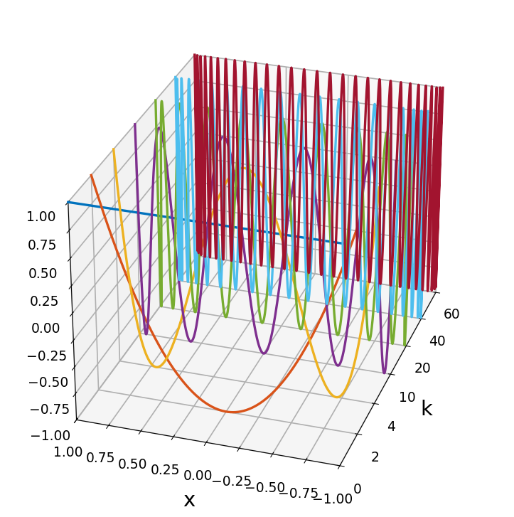
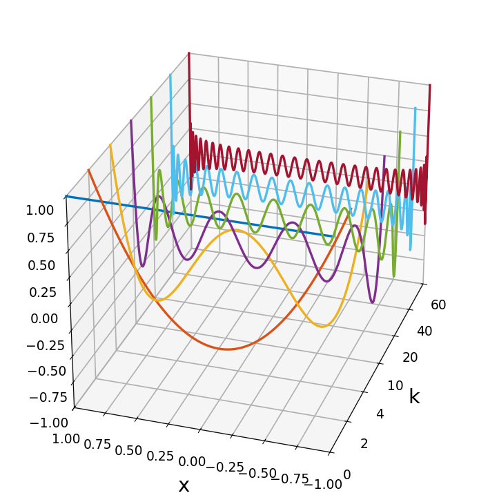

# Chebyshev polynomials as plotted by Fornberg and Higham

*Nick Trefethen, December 2011*

[Original MATLAB Chebfun example](https://www.chebfun.org/examples/cheb/ChebPolysHigham.html)

(Chebfun example cheb/ChebPolysHigham.m)

Bengt Fornberg's book on pseudospectral methods and Des Higham and Nick
Higham's _MATLAB Guide_ contain attractive three-dimensional "waterfall"
plots of Chebyshev polynomials.  Here is such a plot for
$T_k$, $k = 0, 2, 4, 10, 20, 40, 60$:

```python
import chebfunjax as cj
from chebfunjax.utils.polynomials import chebpoly, legpoly

for k in (0, 2, 4, 10, 20, 40, 60):
    p = cj.chebfun(chebpoly(k), coeffs=True)
    # plot3(j, x, p)
```



And the analogous plot for Legendre polynomials, whose extremes decay
toward the middle of the interval instead of equioscillating:



---

*Replicated with [chebfunjax](https://github.com/ma-gilles/chebfunjax); original
example copyright The University of Oxford and The Chebfun Developers.*
