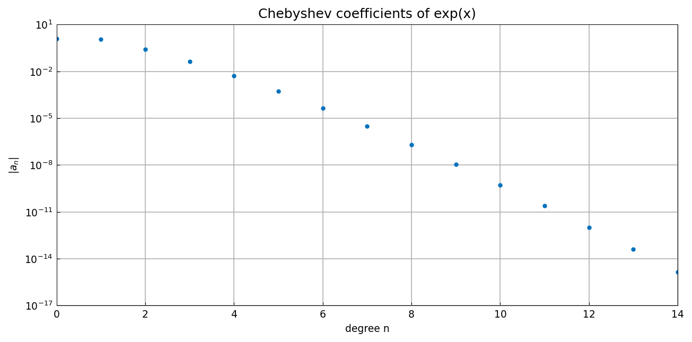
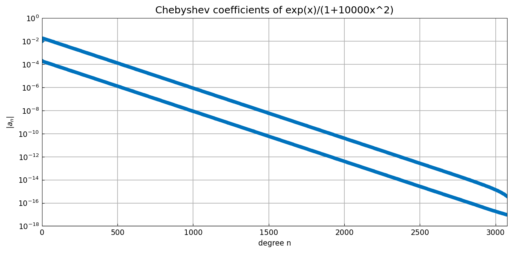
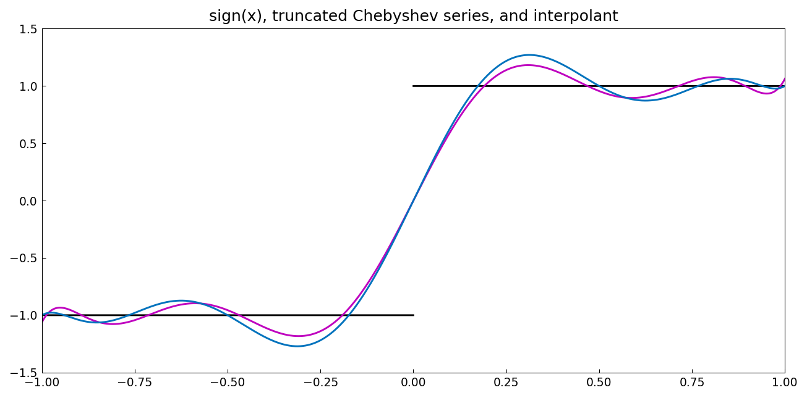

# Chebyshev coefficients

*Nick Trefethen, September 2010*

[Original MATLAB Chebfun example](https://www.chebfun.org/examples/cheb/ChebyshevCoeffs.html)

(Chebfun example cheb/ChebyshevCoeffs.m)

Every function defined on $[-1,1]$ has a unique expansion in Chebyshev
polynomials, and the `coeffs` of a chebfun expose it.  A cubic
polynomial gives exactly four coefficients:

```python
import chebfunjax as cj
x = cj.chebfun(lambda t: t)
p = 99*x**2 + x**3
p.coeffs
```
```
Cheb coeffs of 99x^2 + x^3:
a =
   49.500000000000000
   0.750000000000000
   49.500000000000000
   0.250000000000000
```

The coefficients of $e^x$ decay super-geometrically:

```
Cheb coeffs of exp(x):
a =
   1.266065877752008
   1.130318207984970
   0.271495339534077
   0.044336849848664
   0.005474240442094
   0.000542926311914
   0.000044977322954
   ...
```

(Every printed digit matches the published MATLAB output.)  Here is the
coefficient plot:



For a function with a pair of poles very close to the interval, the
decay is geometric but slow:



Non-smooth functions have non-decaying tails in a different sense.  For
$\mathrm{sign}(x)$, the exact Chebyshev series has coefficients
$4/(\pi k)(-1)^{(k-1)/2}$ for odd $k$:

```
a =
   0.000000000000000
   1.273239544735163
   0.000000000000000
  -0.424413181578388
   0.000000000000000
   0.254647908947033
   ...
```

Here is $\mathrm{sign}(x)$ together with its 10-term truncated
Chebyshev series (magenta) and, for comparison, its 10-point Chebyshev
interpolant:



---

*Replicated with [chebfunjax](https://github.com/ma-gilles/chebfunjax); original
example copyright The University of Oxford and The Chebfun Developers.*
