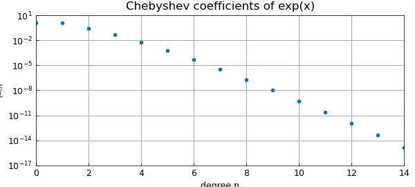
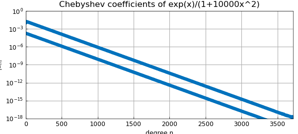
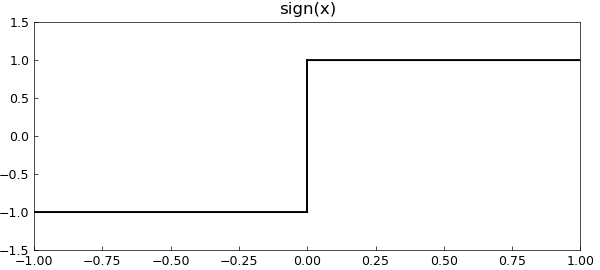
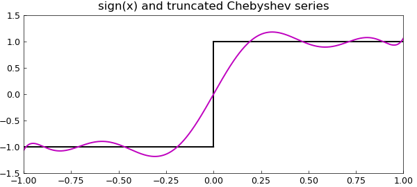
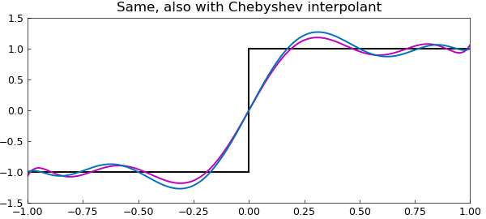

# Chebyshev coefficients

*Nick Trefethen, September 2010*

[Original MATLAB Chebfun example](https://www.chebfun.org/examples/cheb/ChebyshevCoeffs.html)

Python translation: [`examples/cheb/chebyshev_coeffs.py`](https://github.com/ma-gilles/chebfunjax/blob/main/examples/cheb/chebyshev_coeffs.py)

[revised June 2019]

Every function defined on $[-1,1]$, so long as it is a little bit smooth (Lipschitz continuity is enough), has an absolutely and uniformly convergent Chebyshev series:

$$ f(x) = a_0 + a_1 T_1(x) + a_2 T_2(x) + \cdots . $$

The same holds on an interval $[a,b]$ with appropriately scaled and shifted Chebyshev polynomials.

For many functions you can compute these coefficients with the command `chebcoeffs`. For example, here we compute the Chebyshev coefficients of a cubic polynomial:

```matlab
x = chebfun('x');
format long
disp('Cheb coeffs of 99x^2 + x^3:')
p = 99*x^2 + x^3;
a = chebcoeffs(p)
```

```text
Cheb coeffs of 99x^2 + x^3:
a =
   49.500000000000000
   0.750000000000000
   49.500000000000000
   0.250000000000000
```

Similarly, here are the Chebyshev coefficients down to level $10^{-15}$ of $\exp(x)$:

```matlab
disp('Cheb coeffs of exp(x):')
a = chebcoeffs(exp(x))
```

```text
Cheb coeffs of exp(x):
```

You can plot the absolute values of these numbers on a log scale with `plotcoeffs`:

```matlab
plotcoeffs(exp(x)), grid on
xlabel('degree n')
ylabel('|a_n|'), ylim([1e-17 1e1])
title('Chebyshev coefficients of exp(x)')
```



Here's a similar plot for a function that needs thousands of terms to be represented to 15 digits. (Can you explain why there are two lines of dots?)

```matlab
plotcoeffs(exp(x)/(1+10000*x^2)), grid on
xlabel('degree n'), ylabel('|a_n|')
ylim([1e-18 1])
title('Chebyshev coefficients of exp(x)/(1+10000x^2)')
```



These methods will work for any function $f$ that's represented by a global polynomial, i.e., a chebfun consisting of one fun. What about Chebyshev coefficients for functions that are not smooth enough for such a representation? Here one can use the `'trunc'` option in the Chebfun constructor. For example, suppose we are interested in the function

```matlab
f = sign(x);
figure, plot(f,'k','jumpline','-'), ylim([-1.5 1.5])
title('sign(x)')
```



If we try to compute all the Chebyshev coefficients, we'll get an error. On the other hand we can compute the first ten of them like this:

```matlab
p = chebfun(f,'trunc',10);
a = chebcoeffs(p)
```

```text
a =
   1.266065877752008
   1.130318207984970
   0.271495339534077
   0.044336849848664
   0.005474240442094
   0.000542926311914
   0.000044977322954
   0.000003198436462
   0.000000199212481
   0.000000011036772
   0.000000000550590
   0.000000000024980
   0.000000000001039
   0.000000000000040
   0.000000000000001
a =
   0.000000000000000
   1.273239544735163
   0.000000000000000
  -0.424413181578388
   0.000000000000000
   0.254647908947033
   0.000000000000000
  -0.181891363533595
   0.000000000000000
   0.141471060526129
```

Here's the degree 9 polynomial obtained by adding up these first terms of the Chebyshev expansion:

```matlab
hold on
plot(p,'m')
title('sign(x) and truncated Chebyshev series')
```



This is not the same as the degree 9 polynomial interpolant through 10 Chebyshev points, but they are close. See Chapters 4, 7, and 8 of [1].

```matlab
pinterp = chebfun(f,10);
plot(pinterp)
title('Same, also with Chebyshev interpolant')
```



## References

1. L. N. Trefethen, *Approximation Theory and Approximation Practice*, SIAM, 2013.

---

*Translated with [chebfunjax](https://github.com/ma-gilles/chebfunjax); prose and MATLAB code from the original example, copyright The University of Oxford and The Chebfun Developers.  Printed outputs and figures are chebfunjax's.*
