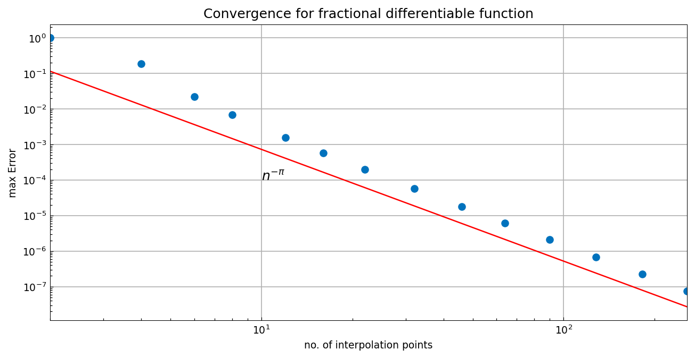
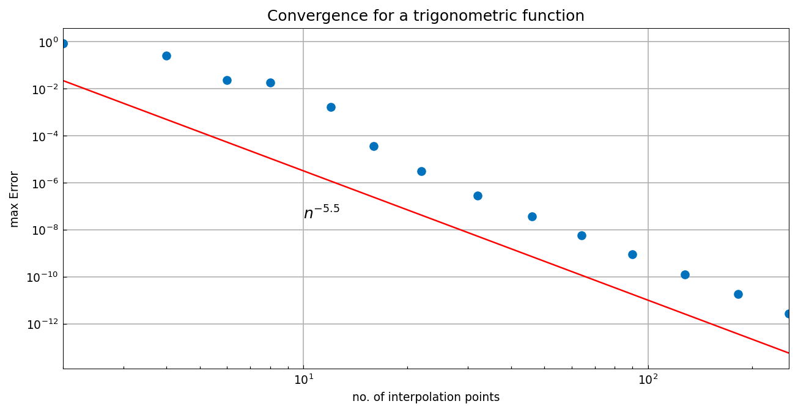

# Convergence rates for functions of fractional smoothness

*Alex Townsend, October 2010*

[Original MATLAB Chebfun example](https://www.chebfun.org/examples/cheb/Convergence.html)

(Chebfun example cheb/Convergence.m)

The smoother a function, the faster its approximants converge.  For
functions of fractional smoothness the convergence rate is algebraic
with a fractional exponent.  Here is the interpolation error for
$f(x) = |x|^\pi$, converging at the rate $n^{-\pi}$:

```python
import jax.numpy as jnp
import chebfunjax as cj

f = lambda x: jnp.abs(x)**jnp.pi
for n in nn:
    fn = cj.chebfun(f, n=n)
    # err = norm(f - fn, inf)
```



And for $f(x) = \sin(|x|^{x+5.5})$, whose smoothness at $x=0$ gives
the rate $n^{-5.5}$:



In both cases the dots track the red reference-rate lines, matching the
published figures.

---

*Replicated with [chebfunjax](https://github.com/ma-gilles/chebfunjax); original
example copyright The University of Oxford and The Chebfun Developers.*
