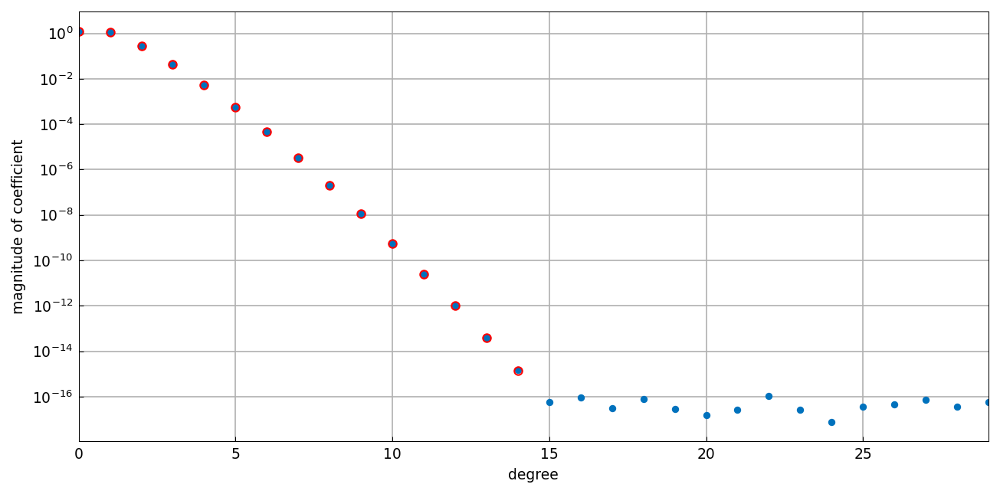
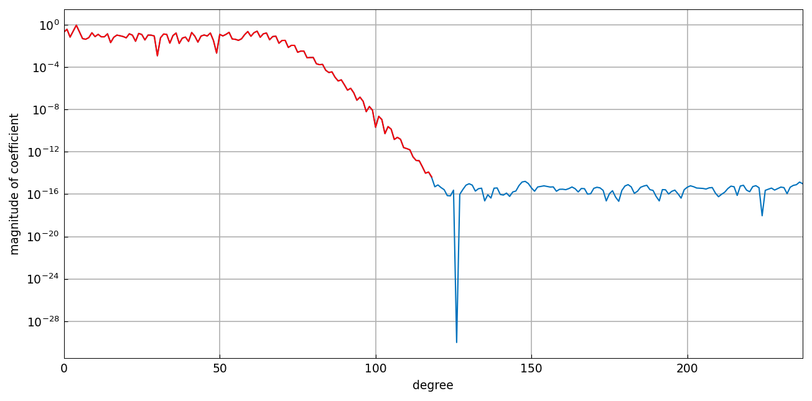
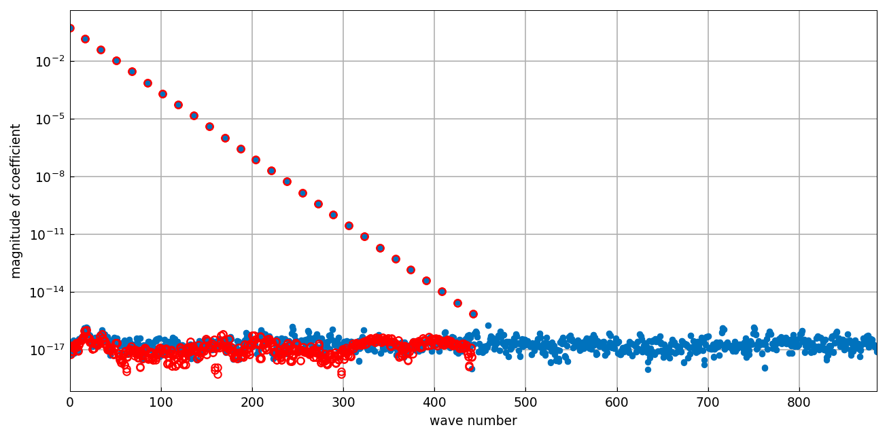

# The doublelength flag

*Nick Trefethen, July 2019*

[Original MATLAB Chebfun example](https://www.chebfun.org/examples/cheb/DoublelengthFlag.html)

(Chebfun example cheb/DoublelengthFlag.m)

Sometimes one wants to see what lies *below* the level at which the
constructor chops a Chebyshev series — the rounding plateau.  The
`doublelength` flag constructs a chebfun with twice the length the
standard construction would choose (emulated here by a fixed-length
construction at `2*len(f)`):

```python
import jax.numpy as jnp
import chebfunjax as cj

f = cj.chebfun(lambda x: jnp.exp(x))
f2 = cj.chebfun(lambda x: jnp.exp(x), n=2*len(f))  # 'doublelength'
```



The blue dots continue past the red circles into the plateau of
rounding noise.  Here is a wigglier function on $[0,10]$:



And a periodic function constructed with `trig`, whose two-sided
coefficient plot shows the same effect:



---

*Replicated with [chebfunjax](https://github.com/ma-gilles/chebfunjax); original
example copyright The University of Oxford and The Chebfun Developers.*
