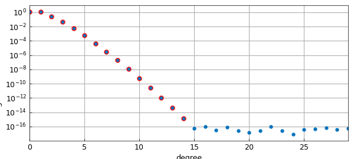
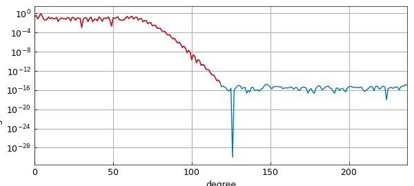
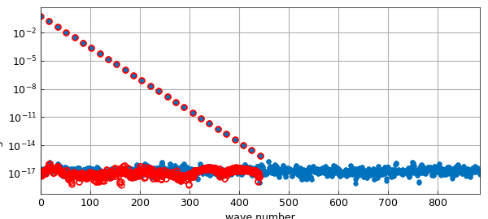

# The doublelength flag

*Nick Trefethen, February 2015*

[Original MATLAB Chebfun example](https://www.chebfun.org/examples/cheb/DoublelengthFlag.html)

Python translation: [`examples/cheb/doublelength_flag.py`](https://github.com/ma-gilles/chebfunjax/blob/main/examples/cheb/doublelength_flag.py)

Recently we've added a `doublelength` flag as an option to the Chebfun constructor. A picture gives the idea. Here we see the usual Chebyshev coefficients for $\exp(x)$ plotted as red circles, together with blue dots for the coefficients of the same function constructed with `doublelength`.

```matlab
f = chebfun('exp(x)');
f2 = chebfun('exp(x)','doublelength');
plotcoeffs(f2,'.'), hold on
plotcoeffs(f,'or'), hold off
```



When you construct a chebfun with `doublelength`, it comes out with twice the expected length. To be precise, here is what happens. First, Chebfun silently constructs a chebfun in the usual way. Then it does it again, but with the degree $d$ multiplied by 2. Thus the length, if it would ordinarily be $d+1$, actually comes out as the odd number $2d+1$.

The purpose of this option is to give a nice way to illustrate how the Chebfun constructor chops a Chebyshev series. Why does the constructor stop when it does? Basically because going any further would achieve nothing, because of rounding errors. Here's another example, with doublelength coefficients in blue and ordinary ones in red:

```matlab
f = chebfun('sin(x)+sin(x^2)',[0 10]);
f2 = chebfun('sin(x)+sin(x^2)',[0 10],'doublelength');
plotcoeffs(f2), hold on
plotcoeffs(f,'r'), hold off
```



What about trigfuns, i.e., periodic Chebfun representations of periodic functions? The idea of `doublelength` here is analogous, and to be precise, it is again actually the degree that is doubled. Here is an example:

```matlab
ff = @(t) 1/(2-cos(17*(t-1)));
f = chebfun(ff,[-pi pi],'trig');
f2 = chebfun(ff,[-pi pi],'trig','doublelength');
plotcoeffs(f2,'.'), hold on
plotcoeffs(f,'.r'), hold off
```



---

*Translated with [chebfunjax](https://github.com/ma-gilles/chebfunjax); prose and MATLAB code from the original example, copyright The University of Oxford and The Chebfun Developers.  Printed outputs and figures are chebfunjax's.*
