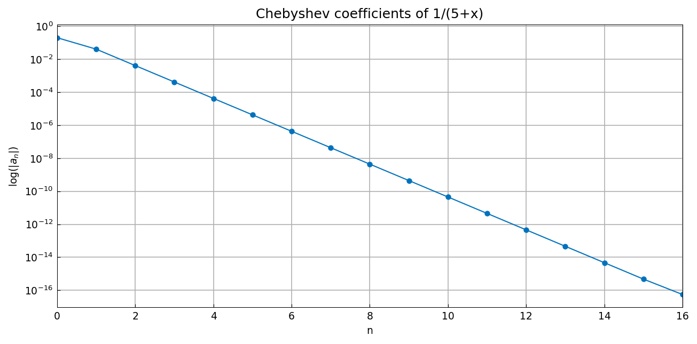

# Exact Chebyshev coefficients of 1/(5+x)

*Mark Richardson, May 2011*

[Original MATLAB Chebfun example](https://www.chebfun.org/examples/cheb/ExactChebCoeffs.html)

(Chebfun example cheb/ExactChebCoeffs.m)

For the simple rational function $f(x)=1/(5+x)$ the Chebyshev
coefficients are known in closed form: they decay geometrically as

$$ a_k = \frac{1}{\sqrt 6}\,\frac{(-1)^k}{(5+\sqrt{24})^{k}}. $$

Here they are compared with the computed `chebcoeffs`:

```python
import numpy as np
import chebfunjax as cj

fc = cj.chebfun(lambda x: 1.0/(5 + x))
k = np.arange(1, len(fc) + 1)
exact = 1/np.sqrt(6) * (-1.0)**(k-1) / (5 + np.sqrt(24))**(k-1)
```
```
               exact           chebcoeffs           difference
   0.408248290463863    0.204124145231932    0.204124145231932
  -0.041241452319315   -0.041241452319315    0.000000000000000
   0.004166232729288    0.004166232729288   -0.000000000000000
  -0.000420874973563   -0.000420874973563   -0.000000000000000
   0.000042517006342    0.000042517006342    0.000000000000000
   ...
```

(Digit-for-digit with the published output — including the first-row
"discrepancy," which is the usual factor-of-2 convention for $a_0$ in a
Chebyshev series.)  The geometric decay is a straight line on a semilog
coefficient plot:



---

*Replicated with [chebfunjax](https://github.com/ma-gilles/chebfunjax); original
example copyright The University of Oxford and The Chebfun Developers.*
