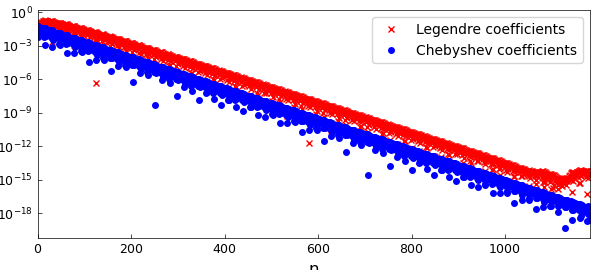
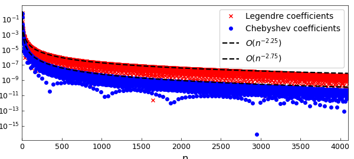
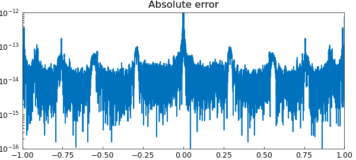
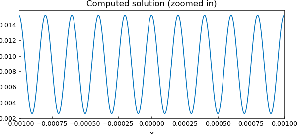

# A fast Chebyshev-Legendre transform

*Alex Townsend and Nick Hale, August 2013*

[Original MATLAB Chebfun example](https://www.chebfun.org/examples/cheb/FastChebyshevLegendreTransform.html)

Python translation: [`examples/cheb/fast_cheb_leg_transform.py`](https://github.com/ma-gilles/chebfunjax/blob/main/examples/cheb/fast_cheb_leg_transform.py)

## The Chebyshev-Legendre transform

Chebfun is based on Chebyshev interpolants and their related fast algorithms. Chebyshev interpolants are a very practical tool for computing with smooth functions. However, in some situations Legendre expansions, i.e.,

$$ p(x) = \sum_{n=0}^N c_n^{leg} P_n(x), $$

where $P_n(x)$ is the degree $n$ Legendre polynomial, are advantageous due to their orthogonality in the standard $L^2$ inner product. Recently, a new algorithm has been derived and implemented in Chebfun by Hale and Townsend that converts between $N$ Legendre and Chebyshev coefficients in $\mathcal{O}( N (\log N)^2/ \log \log N)$ operations [2]. The algorithm is based on a long-established asymptotic formula for Legendre polynomials [4], which was previously used in Chebfun's `legpts` command [1]. The transform comes in two parts: (1) The forward transform, `leg2cheb`, which converts Legendre to Chebyshev coefficients, and (2) The inverse transform, `cheb2leg`, which converts in the other direction.

In this Example a few applications are considered.

## Computing the Legendre coefficients

The problem of computing the coefficients in a Legendre expansion of a function has received considerable research attention since the 1970s, and there are now many approaches (a summary is given [2]). In particular, any fast Chebyshev-Legendre transform can be used to compute the Legendre coefficients of a function by going via Chebyshev coefficients. For example, here are the Legendre coefficients of $1/(1+1000(x-.1)^2)$ using the new fast transform in Chebfun:

```matlab
f = chebfun(@(x) 1./(1 + 1000*(x-.1).^2));  % A Runge-type function
c_cheb = chebcoeffs(f);                     % Chebyshev coeffs in O(NlogN)
c_leg = cheb2leg(c_cheb);                   % Leg coeffs with the new algorithm
LW = 'linewidth'; lw = 1.6;
MS = 'markersize'; FS = 'fontsize'; fs = 12;
semilogy(abs(c_leg), 'xr',MS,4), hold on  % plot them
semilogy(abs(c_cheb), '.b', MS,8)
legend('Legendre coefficients','Chebyshev coefficients')
xlabel('n', FS, fs), set(gca, FS, fs), hold off
```



For an analytic function, the Legendre and Chebyshev coefficients decay at essentially the same geometric rate. However, for algebraically smooth functions the decay of Legendre coefficients is about $n^{-1/2}$ worse than that of the corresponding Chebyshev coefficients, a phenomenon discussed in [5]. Here we witness this disparity for the function $|x-.1|^{7/4}$:

```matlab
f = chebfun(@(x) abs(x-.1).^(7/4)); N = length(f);    % |x-.1|^(7/4)
c_cheb = chebcoeffs(f);                              % Chebyshev coeffs
c_leg = cheb2leg(c_cheb);                             % Legendre coeffs
semilogy(abs(c_leg), 'xr',MS,4), hold on,     % plot them
semilogy(abs(c_cheb), '.b',MS,8),
semilogy(1:N,(1:N).^(-7/4-1+.5), 'k--', LW, lw)
semilogy(1:N,(1:N).^(-7/4-1), 'k--', LW, lw)
legend('Legendre coefficients','Chebyshev coefficients',...
                'O(n^{-2.25})','O(n^{-2.75})')
xlim([0, N]), xlabel('n', FS, fs), set(gca, FS, fs), hold off
```



Note: A similar $n^{-1/2}$ discrepancy occurs for polynomial interpolation since the Lesbegue constant for Legendre points grows like $O(\sqrt{n})$ while for Chebyshev points it grows like $O(\log n)$.

## Fast evaluation of Legendre expansions

Given a Legendre expansion, the fast transform can also be used to rapidly evaluate a Legendre series at Chebyshev points of the second kind. For example,

```matlab
t = .999i; f = chebfun(@(x) 1./sqrt(1 - 2*x.*t +t.^2)); % generating function
N = length(f);
ns = sprintf('No. of evaluation points = %u\n',N);
s = tic;                                                % evaluate f
c_leg = t.^(0:N-1).';                                   % via Legendre coeffs
cheb_vals = chebtech2.coeffs2vals(flipud(leg2cheb(c_leg))); % and time it...
tt = toc(s);
ts = sprintf('Evaluation time = %1.2fs\n', tt);
fprintf([ns, ts])
semilogy(chebpts(length(f)), abs(f.values - cheb_vals))
title('Absolute error', FS, fs), hold off
axis([-1 1 1e-16 1e-12]), set(gca, FS, fs), hold off
```

```text
No. of evaluation points = 31857
Evaluation time = 4.28s
```



## Computing Legendre coefficients by a spectral method

Recently, an ultraspherical spectral method was developed, which solves linear constant-coefficient ODEs in essentially $O(N)$ operations and computes the Chebyshev coefficients of the solution [3]. This approach easily generalises to a fast Legendre spectral method. Now that we have a fast transform, we can rapidly construct a chebfun object from the Legendre coefficients.

Let's solve a linear ODE that requires about $N=32000$ Legendre coefficients to resolve the solution. The ODE is

$$ u''(x) + (10000\pi)^2u = 0, \qquad u(-1) = u(1) = 1, $$

and hence, the solution is $\cos(10000\pi x)$.

```matlab
tic
w = 10000*pi;                                  % solution is cos(wx)
f = chebfun(@(x) cos(w*x)); N = length(f)
D1 = spdiags(ones(N,1),1,N,N); D2 = 3*D1;      % diff operators
S1 = spdiags((.5./((0:N-1)'+.5)),0,N,N) -...
                              spdiags((.5./((0:N)'+.5)),2,N,N);
S2 = spdiags((1.5./((0:N-1)'+1.5)),0,N,N) -... % Conversion operators (see [3])
                              spdiags((1.5./((0:N)'+1.5)),2,N,N);
A = D2*D1 + w^2*S2*S1;                         % u''(x) + w^2u = 0;
A(end-1,:) = (-1).^(0:N-1);                    % left bc
A(end,:) = ones(1,N);                          % right bc
b = [zeros(N-2,1);f(-1);f(1)];                 % rhs
P = spdiags([(1:N-2) 1 1]',0,N,N);             % preconditioner
c_leg = ( (P*A) \ (P*b) );                     % solve
toc
```

```text
N =
       31713
```

We can now form a chebfun from solution using `leg2cheb`:

```matlab
tic
c_cheb = leg2cheb(c_leg);
u = chebfun(c_cheb, 'coeffs');
toc

clf, plot(u{-0.001,0.001}) % plot u on [-0.001, 0.001]
title('Computed solution (zoomed in)', FS, fs)
set(gca, FS, fs), xlabel('x', FS, fs), shg
```

```text
Elapsed time is 1.312230 seconds.
Elapsed time is 3.073024 seconds.
```



Here is the error between the computed and the true solutions:

```matlab
norm(c_cheb - chebcoeffs(f), inf)
norm(u - f)
```

```text
ans =
     4.250615916836926e-02
ans =
     9.941119468412363e-01
```

## Conclusion

The existence of a fast and practical Chebyshev-Legendre transform has many implications. Within Chebfun, it has led to major speedups in the commands `conv` and `polyfit`. Further developments are in the pipeline.

## References

1. N. Hale and A. Townsend, Fast and accurate computation of Gauss-Legendre and Gauss-Jacobi quadrature nodes and weights, *SIAM Journal on Scientific Computing*, 35 (2013), A652-A672.
2. N. Hale and A. Townsend, A fast, simple, and stable Chebyshev-Legendre transform using an asymptotic formula, *SIAM Journal on Scientific Computing*, 36 (2014), A148-A167.
3. S. Olver and A. Townsend, A fast and well-conditioned spectral method, *SIAM Review*, 55 (2013), 462-489
4. T. J. Stieltjes, Sur les polynomes de Legendre, *Annales de Faculte des Sciences de Toulouse*, 4 (1890), G1-G17.
5. H. Wang and S. Xiang, On the convergence rates of Legendre approximation, *Mathematics of Computation*, 81 (2012), 861-877.

---

*Translated with [chebfunjax](https://github.com/ma-gilles/chebfunjax); prose and MATLAB code from the original example, copyright The University of Oxford and The Chebfun Developers.  Printed outputs and figures are chebfunjax's.*
