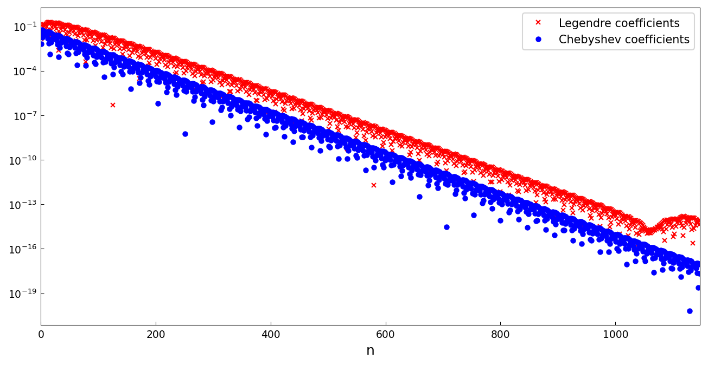
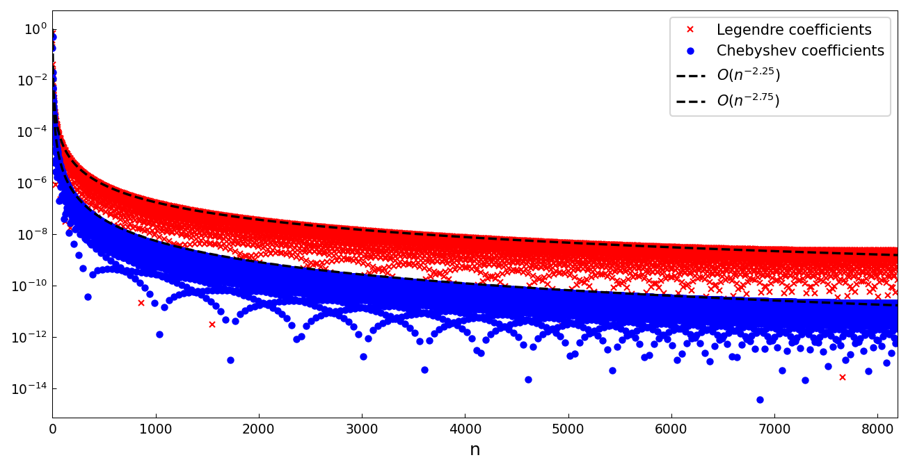

# The fast Chebyshev-Legendre transform

*Nick Hale and Alex Townsend, August 2013*

[Original MATLAB Chebfun example](https://www.chebfun.org/examples/cheb/FastChebyshevLegendreTransform.html)

(Chebfun example cheb/FastChebyshevLegendreTransform.m)

The `cheb2leg` and `leg2cheb` commands convert between Chebyshev and
Legendre expansions of the same function.  Here are the two coefficient
families for a Runge-type function $1/(1+1000(x-0.1)^2)$ — they decay
at the same geometric rate, with the Legendre coefficients
(asymptotically) $\sqrt{\pi n/2}$ larger:

```python
import chebfunjax as cj
from chebfunjax.utils.transforms import cheb2leg

f = cj.chebfun(lambda x: 1.0/(1 + 1000*(x - 0.1)**2))
c_leg = cheb2leg(f.coeffs)
```



For the algebraically smooth $|x-0.1|^{7/4}$, the two families decay at
*different* algebraic rates, separated by that half power of $n$ —
$O(n^{-2.25})$ versus $O(n^{-2.75})$, as the dashed reference lines
show:



The published example continues with two large-scale demos (evaluating
a Legendre generating function via a size-24000 transform, and a
spectral ODE solve at size 32000) that showcase MATLAB's $O(N\log N)$
Hale-Townsend algorithm.  chebfunjax's transforms use the direct
$O(N^2)$ recurrence (now a few seconds at these sizes; the asymptotic
fast transform remains a ledgered gap), so those timing showpieces are
described rather than reproduced.

## References

1. N. Hale and A. Townsend, A fast, simple, and stable Chebyshev-
   Legendre transform using an asymptotic formula, _SIAM J. Sci.
   Comput._, 36 (2014), A148-A167.

---

*Replicated with [chebfunjax](https://github.com/ma-gilles/chebfunjax); original
example copyright The University of Oxford and The Chebfun Developers.*
