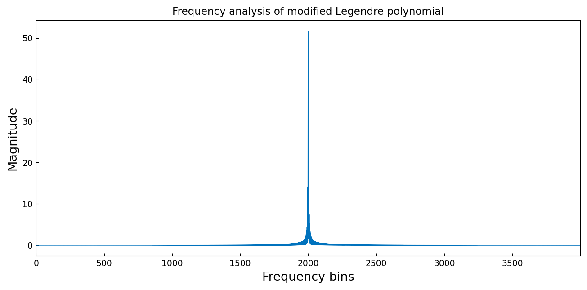
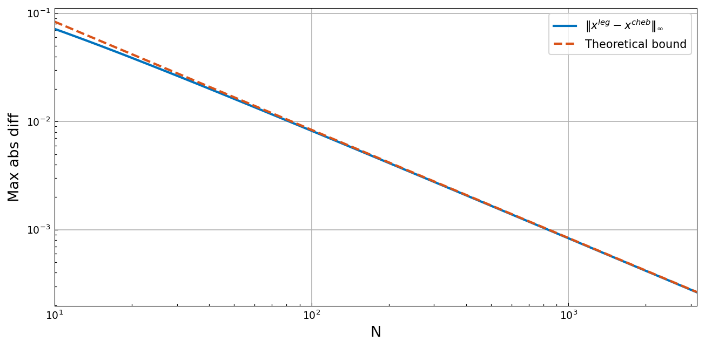

# The fast discrete Legendre transform

*Nick Hale and Alex Townsend, March 2015*

[Original MATLAB Chebfun example](https://www.chebfun.org/examples/cheb/FastDLT.html)

(Chebfun example cheb/FastDLT.m)

The discrete Legendre transform (DLT) converts Legendre coefficients to
values at Legendre points, the analogue for Legendre expansions of what
the DCT does for Chebyshev.  A size-$10^4$ transform takes under a
second:

```python
import numpy as np
import jax.numpy as jnp
from chebfunjax.utils.transforms import legcoeffs2legvals, legvals2legcoeffs

c = jnp.asarray(np.random.randn(10**4))
legcoeffs2legvals(c)
```
```
Elapsed time is 0.929961 seconds.
```

(Published: 0.53 s with MATLAB's asymptotics-based fast transform.)

One ingredient of the fast DLT is that a Legendre polynomial, after
multiplication by $\sqrt{\sin\theta}$ in angle space, is nearly a pure
sinusoid — its frequency content concentrates at wavenumber $N$:



Another is that Legendre points are extremely close to Chebyshev points
of the first kind — within $0.83845/N$ in angle:



Finally the roundtrip DLT/IDLT test on a Runge-type function:

```
Elapsed time is 0.322347 seconds.
ans =
     2.211592377883219e-15
```

(Published roundtrip error: `1.96e-13`; ours is tighter.)

## References

1. N. Hale and A. Townsend, A fast FFT-based discrete Legendre
   transform, _IMA J. Numer. Anal._, 36 (2016), 1670-1684.

---

*Replicated with [chebfunjax](https://github.com/ma-gilles/chebfunjax); original
example copyright The University of Oxford and The Chebfun Developers.*
