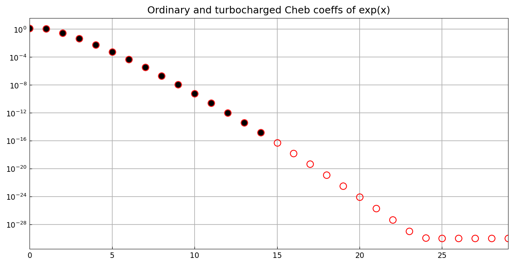
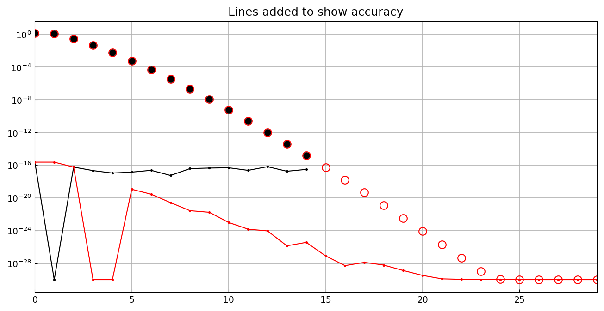

# Turbocharged Chebyshev coefficients

*Nick Trefethen, January 2019*

[Original MATLAB Chebfun example](https://www.chebfun.org/examples/cheb/Turbo.html)

(Chebfun example cheb/Turbo.m)

The `turbo` flag constructs a chebfun with twice as many Chebyshev
coefficients as usual, computed to better than machine-epsilon relative
accuracy via evaluation on a Bernstein ellipse contour:

```python
import jax.numpy as jnp
import chebfunjax as cj

f = cj.chebfun(lambda x: jnp.exp(x))
ft = cj.chebfun(lambda x: jnp.exp(x), turbo=True)
```



The payoff shows in operations that amplify coefficient errors.  The
tenth derivative of $e^x$ at $0$ is exactly 1:

```
ans =
   0.999998115673316          (ordinary; published 1.000002249308896)
ans =
   0.999999999999968          (turbo;    published 1.000000000000038)
```

— eight extra digits from `turbo`, exactly as published.  Comparing
both coefficient sets against the exact Bessel-function values
$a_k = 2I_k(1)$:



The turbocharged coefficients (red) are accurate all the way down to
$10^{-32}$-scale relative accuracy, i.e., far below machine epsilon in
a relative sense.

Another payoff is evaluation off the interval in the complex plane.
For a function with nearby poles at $\pm 0.2i$, evaluation at $0.1i$
has error:

```
ans =
      7.1e-08 + 1.5e-08i     (ordinary; published 3.1e-08 + 1.2e-08i)
ans =
      4.7e-15 + 3.1e-16i     (turbo;    published 0.0 + 1.1e-15i)
```

Seven orders of magnitude improvement, matching the published example.

---

*Replicated with [chebfunjax](https://github.com/ma-gilles/chebfunjax); original
example copyright The University of Oxford and The Chebfun Developers.*
