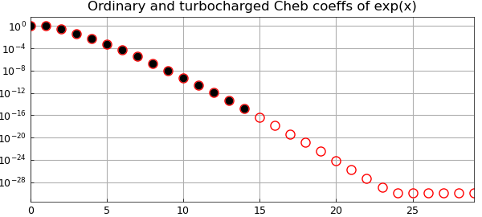
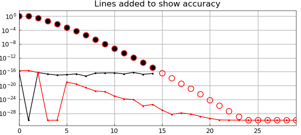

# High-accuracy Chebyshev coefficients and 'turbo'

*Anthony Austin and Nick Trefethen, July 2015*

[Original MATLAB Chebfun example](https://www.chebfun.org/examples/cheb/Turbo.html)

Python translation: [`examples/cheb/turbo.py`](https://github.com/ma-gilles/chebfunjax/blob/main/examples/cheb/turbo.py)

Chebfun works with standard floating-point arithmetic, usually giving about 15 digits of accuracy relative to the overall scale of a function. So what's going on in the following picture?

```matlab
f = chebfun(@exp);
fturbo = chebfun(@exp,'turbo');
MS = 'markersize'; LW = 'linewidth';
plotcoeffs(fturbo,'or',MS,8), grid on, hold on
plotcoeffs(f,'.k',MS,14)
title('Ordinary and turbocharged Cheb coeffs of exp(x)')
```



Somehow, using nothing but standard arithmetic, the `'turbo'` flag leads to Chebfun finding coefficients down to about twice the usual level on a log scale. And the improvement is genuine. For example, the tenth derivative of `f` is not accurate at all:

```matlab
f10 = diff(f,10); f10(0)
```

```text
ans =
   0.999998115673316
```

The tenth derivative of `fturbo`, on the other hand, has full accuracy.

```matlab
f10turbo = diff(fturbo,10); f10turbo(0)
```

```text
ans =
   0.999999999999968
```

The technique that makes this possible is evaluation of Chebyshev coefficients by contour integrals in the complex plane, discretized to high precision by the trapezoidal rule. Long ago, Lyness and Moler showed the power of the idea for Taylor coefficients, using circular contours [Lyness and Moler 1967], and Fornberg showed that improved accuracy could be achieved by an automatic determination of an effective radius for the circle of integration [Fornberg 1981]. More recently, Bornemann analyzed the effect of radius fully for Taylor coefficients, showing that in many cases every coefficient of a Taylor series can be computed in floating-point arithmetic to good relative accuracy by using a contour of sufficiently large radius [Bornemann 2011]. Wang and Huybrechs have carried over these ideas to computation of Chebyshev coefficients by contour integrals over Bernstein ellipses in the complex plane [Wang and Huybrechs 2014].

The `'turbo'` flag invokes a a simple, nonoptimal version of this idea. We like to think of this as "turbocharged" since turbochargers take the exhaust tail from an engine and extract some extra power from it. The code is short, and you can see it in the Chebfun file `@chebtech/constructorTurbo.m`. It starts from an ordinary chebfun, calling its length $n$. Then it computes $4n$ roots of unity and also the corresponding points on a Bernstein ellipse of parameter $\rho_2 = \rho^{2/3}$, where $\rho$ is the Chebfun ellipse for the ordinary chebfun, an estimate of the function's maximal Bernstein ellipse of analyticity. (The mathematics of Bernstein ellipses is presented in Chapter 8 of [Trefethen 2013].) To compute Chebyshev coefficients from the ellipse data, it evaluates the function transplanted to the roots of unity and takes the FFT. It then discards half the $4n$ coefficients, retaining the first $2n$.

The Chebyshev coefficients of the exponential function are known exactly ([Trefethen 2013], p. 23). Taking advantage of this, we can add curves to the plot showing the accuracy of the coefficients. Note that the turbo coefficients not only go to twice as high a degree, but they are more accurate all along.

```matlab
n = length(f); nn = (0:4*n-1)';
cexact = 2*besseli((0:4*n-1)',1); cexact(1) = cexact(1)/2;
semilogy(0:n-1,abs(chebcoeffs(f)-cexact(1:n)),'.-k',LW,1,MS,3)
semilogy(0:2*n-1,abs(chebcoeffs(fturbo)-cexact(1:2*n)),'.-r',LW,1,MS,3)
title('Lines added to show accuracy'), hold off
```



A chebfun constructed with `turbo` is not more accurate in an overall sense; it is merely that some of its higher-degree coefficients may be more accurate. Thus it is not all all the case the `turbo` breaks the 16-digit barrier in a general way. But there may be some applications where it makes a difference. As a small indication of enhanced accuracy, here is a chebfun for the function $\exp(x) (1+100x^2)/(1+25x^2)$. Mathematically, the function has a root at $x= 0.1i$. Evaluating the ordinary chebfun at this point gives just 8 digits of accuracy.

```matlab
ff = @(x) exp(x)*(1+100*x^2)/(1+25*x^2);
f = chebfun(ff);
f(0.1i)
```

```text
ans =
      4.006482819433548e-08 + 9.266304642066286e-09i
```

The turbocharged version of $f$, on the other hand, gets full accuracy.

```matlab
fturbo = chebfun(ff,'turbo');
fturbo(0.1i)
```

```text
ans =
      1.182758828737352e-15 + 9.177350484436732e-16i
```

References:

1. F. Bornemann, Accuracy and stability of computing high-order derivatives of analytic functions by Cauchy integrals, *Foundations of Computational Mathematics* (2011), 1--63.
2. B. Fornberg, Numerical differentiation of analytic functions, *ACM Transactions on Mathematical Software* 7 (1981), 512--526.
3. J. Lyness and C. B. Moler, Numerical differentiation of analytic functions, *SIAM Journal on Numerical Analysis* 4 (1967), 202--210.
4. L. N. Trefethen, *Approximation Theory and Approximation Practice, Extended Edition,* SIAM, 2019.
5. H. Wang and D Huybrechs, Fast and accurate computation of Chebyshev coefficients in the complex plane, IMA Journal of Numerical Analysis, 37 (2017), 1150-1174.

---

*Translated with [chebfunjax](https://github.com/ma-gilles/chebfunjax); prose and MATLAB code from the original example, copyright The University of Oxford and The Chebfun Developers.  Printed outputs and figures are chebfunjax's.*
