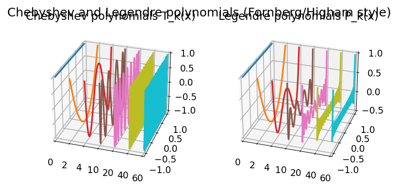

# Chebyshev Polynomials as Plotted by Fornberg and Higham

**Original MATLAB:** [cheb/ChebPolysHigham](https://www.chebfun.org/examples/cheb/ChebPolysHigham.html)
**Author(s):** Nick Trefethen, December 2011

## Overview

Attractive 3D plots of Chebyshev polynomials $T_k(x)$ for selected degrees
$k \in \{0, 2, 4, 10, 20, 40, 60\}$, as appear in Fornberg (1996) and
Higham & Higham (2005). Also shows Legendre polynomials $P_k(x)$ for comparison.

## Mathematical Background

The Chebyshev polynomial of degree $k$ is defined by:

$$T_k(x) = \cos(k \arccos x), \quad x \in [-1, 1]$$

Key properties:
- $T_k(\pm 1) = (\pm 1)^k$
- $|T_k(x)| \leq 1$ for all $x \in [-1, 1]$
- Equioscillation at $k+1$ extrema — the defining property of best approximation

The three-term recurrence $T_{k+1}(x) = 2xT_k(x) - T_{k-1}(x)$ gives an
efficient computation.

Legendre polynomials $P_k(x)$ are orthogonal with weight 1 on $[-1, 1]$,
while Chebyshev polynomials are orthogonal with weight $(1-x^2)^{-1/2}$.

## Code

```python
import numpy as np

def cheb_poly(k, x):
    return np.cos(k * np.arccos(np.clip(x, -1, 1)))

degrees = [0, 2, 4, 10, 20, 40, 60]
x = np.linspace(-1, 1, 300)

for k in degrees:
    T_k = cheb_poly(k, x)  # oscillates faster for higher k
```

## References

1. B. Fornberg, *A Practical Guide to Pseudospectral Methods*, Cambridge, 1996.
2. D. J. Higham and N. J. Higham, *Matlab Guide*, 2nd ed., SIAM, 2005.

## Results


