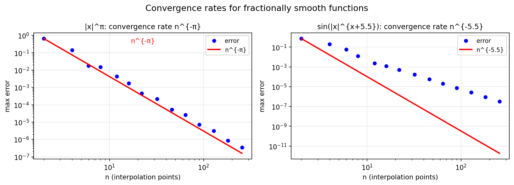

# Convergence Rates for Functions of Fractional Smoothness

**Original MATLAB:** [cheb/Convergence](https://www.chebfun.org/examples/cheb/Convergence.html)
**Author:** Alex Townsend (October 2010, revised July 2019)

## Overview

The smoother a function, the faster its Chebyshev approximant converges.
For functions with fractional smoothness $\alpha$ (not necessarily integer),
the convergence rate is $O(n^{-\alpha})$.

## Mathematical Background

For a function $f$ with exactly $k$ continuous derivatives, Chebyshev
interpolation converges at rate $O(n^{-k})$. For fractional smoothness:

- $f(x) = |x|^\pi$: $\pi$-times differentiable in a fractional sense → rate $O(n^{-\pi})$
- $f(x) = \sin(|x|^{x+5.5})$: smooth to order $5.5$ → rate $O(n^{-5.5})$

**Theorem (Trefethen, ATAP §7):** If $f \in C^k[-1,1]$ but $f^{(k)}$ is not
Lipschitz, then the best polynomial approximant of degree $n$ has error $O(n^{-k})$.
For $f(x) = |x|^\pi$, the nearest integer $k < \pi$ is 3, but the exact fractional
exponent $\pi$ governs the rate.

## Code

```python
import numpy as np

def cheb_interpolant_error(f, nn, x_test):
    errors = []
    for n in nn:
        j = np.arange(n)
        nodes = np.cos(np.pi * (2*j+1) / (2*n))
        # barycentric interpolation at test points...
        errors.append(np.max(np.abs(interp - f(x_test))))
    return np.array(errors)

# Fractional power
f1 = lambda x: np.abs(x)**np.pi
errors1 = cheb_interpolant_error(f1, nn, x_test)
# slope ≈ -pi in log-log plot
```

## References

1. L. N. Trefethen, *Approximation Theory and Approximation Practice*, SIAM, 2013.

## Results

Both examples demonstrate that the fractional differentiability precisely
determines the convergence rate.


