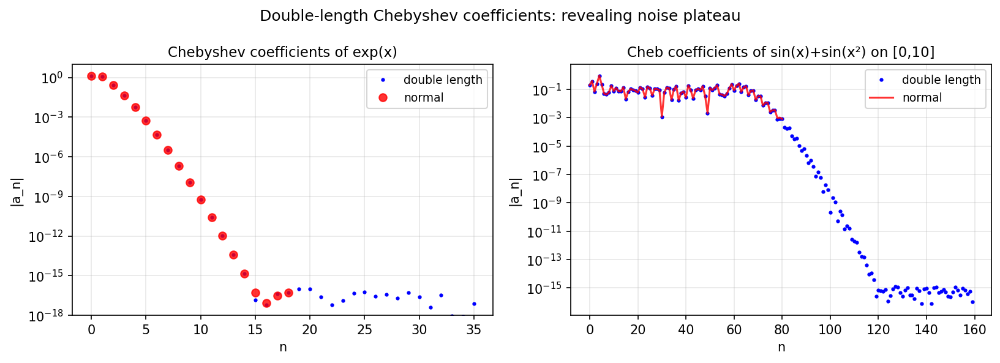

# The Doublelength Flag

**Original MATLAB:** [cheb/DoublelengthFlag](https://www.chebfun.org/examples/cheb/DoublelengthFlag.html)
**Author:** Nick Trefethen (February 2015)

## Overview

The `doublelength` flag (or equivalently, computing Chebyshev series at double
resolution) reveals the "noise plateau" — the level at which Chebyshev
coefficients become dominated by rounding errors.

## Mathematical Background

When a function $f$ is approximated by a Chebyshev series, coefficients
eventually reach machine epsilon $\sim 10^{-16}$ and form a noise plateau.
By computing with twice as many coefficients as needed for convergence, we
expose where the truncation occurred.

The Chebyshev series of $f(x) = e^x$ has coefficients:

$$a_k = 2 I_k(1), \quad k \geq 1$$

where $I_k$ is the modified Bessel function of the first kind. These decay
exponentially, and the noise floor appears around $k \approx 18$ when
computed in double precision.

## Code

```python
import numpy as np

def compute_cheb_coeffs_fft(f, n):
    j = np.arange(n+1)
    theta = np.pi * j / n
    x = np.cos(theta)
    fvals = f(x)
    extended = np.concatenate([fvals, fvals[-2:0:-1]])
    c = np.real(np.fft.fft(extended)) / n
    c = c[:n+1]; c[0] /= 2; c[-1] /= 2
    return c

n = 18
c_normal = compute_cheb_coeffs_fft(np.exp, n)
c_double = compute_cheb_coeffs_fft(np.exp, 2*n-1)
# c_double[n:] shows the noise floor
```

## Results

The double-length series reveals where the noise plateau begins, confirming
that the standard series was correctly truncated at that point.


