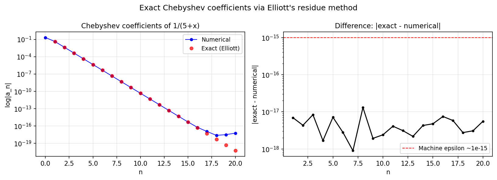

# Exact Chebyshev Expansion Coefficients

**Original MATLAB:** [cheb/ExactChebCoeffs](https://www.chebfun.org/examples/cheb/ExactChebCoeffs.html)
**Author:** Mark Richardson (June 2012)

## Overview

Uses Elliott's residue method [1] to derive an exact closed-form formula for the
Chebyshev expansion coefficients of $f(x) = 1/(5+x)$, then compares with
numerically computed coefficients.

## Mathematical Background

The Chebyshev coefficients of a function $f$ with a pole at $z_0$ (outside
$[-1,1]$) are given by the residue formula:

$$a_n = \frac{-2r_0}{\sqrt{z_0^2-1}(z_0 - \sqrt{z_0^2-1})^n}$$

where $r_0 = \text{res}(f, z_0)$ is the residue at the pole.

For $f(x) = 1/(5+x)$, the pole is at $z_0 = -5$ with residue $r_0 = 1$:

$$a_n = \frac{1}{\sqrt{6}} \cdot \frac{(-1)^n}{(5 + \sqrt{24})^n}$$

The denominator $(5 + \sqrt{24})^n$ is the Bernstein ellipse parameter $\rho^n$,
confirming that Chebyshev coefficients decay geometrically with rate $\rho^{-1}$,
where $\rho = 5 + \sqrt{24} \approx 9.899$ is the ellipse through the pole.

## Code

```python
import numpy as np

# Exact formula (Elliott 1964)
k = np.arange(N + 1)
sqrt6, sqrt24 = np.sqrt(6.0), np.sqrt(24.0)
c_exact = (1.0 / sqrt6) * ((-1.0)**k) / ((5.0 + sqrt24)**k)

# Numerical
f = lambda x: 1.0 / (5.0 + x)
c_num = compute_cheb_coeffs_fft(f, N)

# Should match to machine precision for k >= 1
```

## References

1. D. Elliott, The evaluation and estimation of the coefficients in the Chebyshev
series expansion of a function, *Mathematics of Computation* 18 (1964), 274-284.

## Results

Numerical and exact coefficients agree to machine precision for all $n \geq 1$
(the $n = 0$ coefficient differs by the usual factor-of-2 convention).


