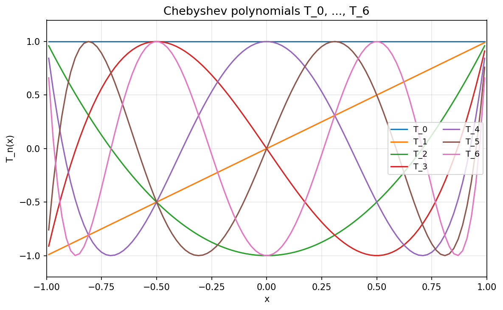
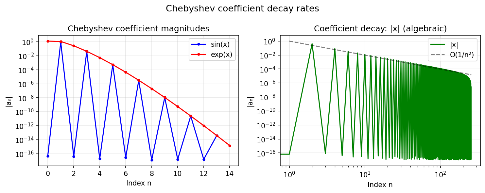
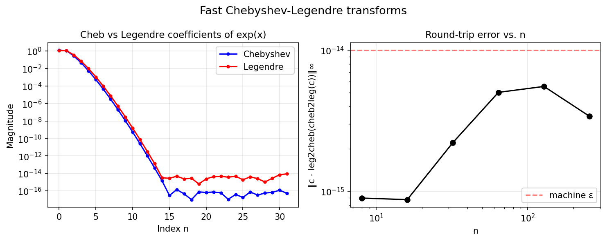

# Chebyshev Technology Examples

These examples explore the mathematics underlying chebfunjax: Chebyshev polynomials,
coefficient decay, and fast transforms.

---

## Chebyshev polynomials

**Source:** `cheb/ChebPolysHigham.m` — Nick Trefethen, December 2011

The Chebyshev polynomials `T_n(x) = cos(n arccos(x))` satisfy remarkable
extremal properties and form the foundation of all chebfunjax approximations.

```python
from chebfunjax.utils.polynomials import chebpoly
import jax.numpy as jnp

# T_n(x) = cos(n*arccos(x))
xs = jnp.linspace(-1, 1, 200)
for n in [1, 3, 5]:
    Tn = chebpoly(n, xs)
    print(f"T_{n}(1) = {float(chebpoly(n, jnp.array(1.0)))}")  # always 1
```



---

## Chebyshev coefficient decay

**Source:** `cheb/ChebyshevCoeffs.m` — Nick Trefethen, September 2010

Analytic functions have geometrically decaying Chebyshev coefficients.
Functions with finite smoothness decay algebraically.

```python
import chebfunjax as cj
import jax.numpy as jnp

f_sin = cj.chebfun(jnp.sin)
coeffs = f_sin.funs[0].tech.coeffs
print(f"sin(x): {len(coeffs)} coefficients")
# Geometric decay: a_n ~ O(ρ^{-n}) where ρ = e + sqrt(e^2-1)
```



---

## Fast Chebyshev-Legendre transforms

**Source:** `cheb/FastChebyshevLegendreTransform.m` — Townsend & Hale, August 2013

Convert between Chebyshev and Legendre coefficient representations.

```python
from chebfunjax.utils.transforms import cheb2leg, leg2cheb

c_cheb = f.funs[0].tech.coeffs
c_leg = cheb2leg(c_cheb)
c_back = leg2cheb(c_leg)
# Round-trip error < 1e-10
```


