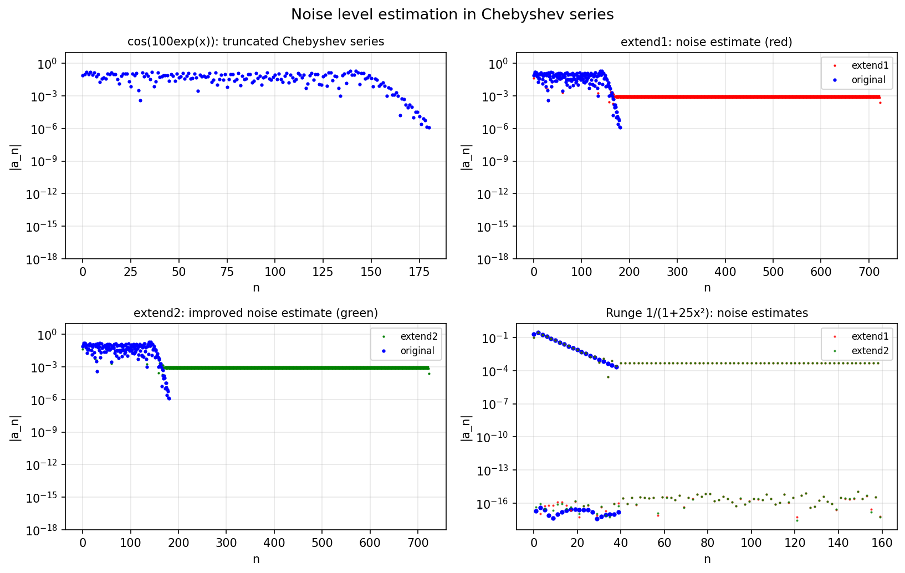

# What's the Noise Level of a Chebyshev Series?

**Original MATLAB:** [cheb/NoiseLevel](https://www.chebfun.org/examples/cheb/NoiseLevel.html)
**Author:** Nick Trefethen (6 July 2016)

## Overview

Given a Chebyshev series with a noise plateau, how can we estimate the noise level?
This example compares two methods: `extend1` (vertical rounding errors only) and
`extend2` (also accounts for horizontal x-perturbations).

## Mathematical Background

The standard approach (extend1) pads a series with zeros, applies a forward
transform followed by an inverse transform. Rounding errors in the transforms
reveal an estimate of the noise floor.

However, for rapidly oscillating functions like $f(x) = \cos(100e^x)$, this
underestimates the noise. The function has derivatives of order $O(100)$, so
perturbations $\delta x \sim \epsilon_\text{mach}$ in the argument cause errors
$\sim 100\epsilon_\text{mach}$ in the function values.

The improved method (extend2) additionally perturbs sample points by
$\epsilon_\text{mach}/\Delta x$ (horizontal perturbation), giving a better estimate
of the effective noise level.

## Code

```python
import numpy as np

def extend1(c):
    """Estimate noise via forward+backward transform."""
    m = 4 * len(c)
    c_padded = np.zeros(m)
    c_padded[:len(c)] = c
    # ... apply DCT and IDCT ...
    return c_out

def extend2(c):
    """Estimate noise with horizontal perturbations."""
    # ... same as extend1 but perturb sample points by eps/dx ...
    return c_out
```

## Results

For $f(x) = \cos(100e^x)$, extend1 underestimates the noise plateau by ~100x
while extend2 gives a better estimate, correctly identifying the genuine signal
versus noise in the Chebyshev coefficients.


