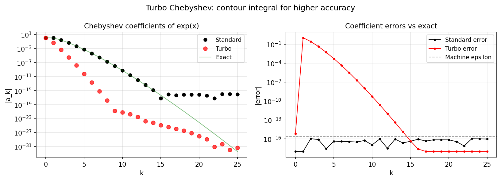

# High-Accuracy Chebyshev Coefficients and 'Turbo'

**Original MATLAB:** [cheb/Turbo](https://www.chebfun.org/examples/cheb/Turbo.html)
**Author:** Anthony Austin and Nick Trefethen (July 2015)

## Overview

By computing Chebyshev coefficients via contour integrals over Bernstein ellipses
in the complex plane, one can achieve higher accuracy than standard nodal
interpolation — "turbocharging" the computation using the exhaust from ordinary
Chebyshev construction.

## Mathematical Background

The Chebyshev coefficients of an analytic function can be written as a contour
integral over the Bernstein ellipse $E_\rho$:

$$a_n = \frac{1}{\pi i} \int_{E_\rho} \frac{f(z)}{\sqrt{z^2-1}(z \pm \sqrt{z^2-1})^n}\, dz$$

The key insight (Wang and Huybrechs [5]): using a **larger** ellipse $E_{\rho^{2/3}}$
than the standard $E_\rho$ and more quadrature points gives more accurate
coefficients at higher degrees, because:
1. More cancellation in the trapezoidal rule on the larger ellipse
2. The function is less oscillatory on the larger ellipse

**Algorithm:**
1. Compute standard degree-$n$ series to estimate $\rho$
2. Use $4n$ points on $E_{\rho^{2/3}}$
3. Evaluate $f$ at complex ellipse points and apply FFT
4. Keep first $2n$ coefficients

## Code

```python
import numpy as np

def compute_cheb_coeffs_turbo(f, n):
    c_std = compute_cheb_coeffs_standard(f, n)
    rho = estimate_bernstein_ellipse(c_std)
    rho_turbo = rho**(2.0/3.0)

    m = 4 * (n + 1)
    theta = 2 * np.pi * np.arange(m) / m
    w = rho_turbo * np.exp(1j * theta)
    z = (w + 1.0/w) / 2.0  # Bernstein ellipse points

    fvals = f(z)  # evaluate at complex points
    c_turbo = [2 * np.real(np.mean(fvals * np.exp(1j*k*theta) / rho_turbo**k))
               for k in range(n+1)]
    return c_turbo
```

## References

1. F. Bornemann, Accuracy and stability of computing high-order derivatives,
   *Found. Comput. Math.* (2011).
2. B. Fornberg, Numerical differentiation of analytic functions, *ACM TOMS* 7 (1981).
3. J. Lyness and C. B. Moler, *SIAM J. Numer. Anal.* 4 (1967).
4. L. N. Trefethen, *Approximation Theory and Approximation Practice*, SIAM, 2019.
5. H. Wang and D. Huybrechs, Fast and accurate computation of Chebyshev
   coefficients in the complex plane, *IMA J. Numer. Anal.* 37 (2017), 1150-1174.

## Results

Turbo coefficients for $e^x$ match the exact Bessel function values more
accurately at high degrees, while standard coefficients plateau at machine epsilon.


