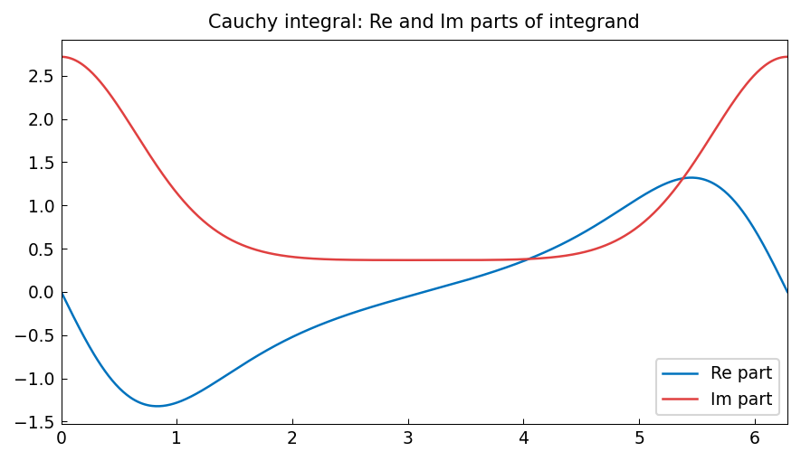
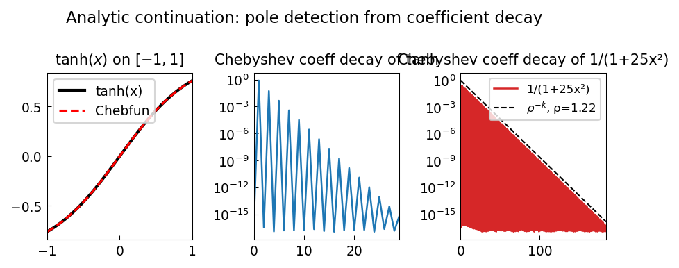
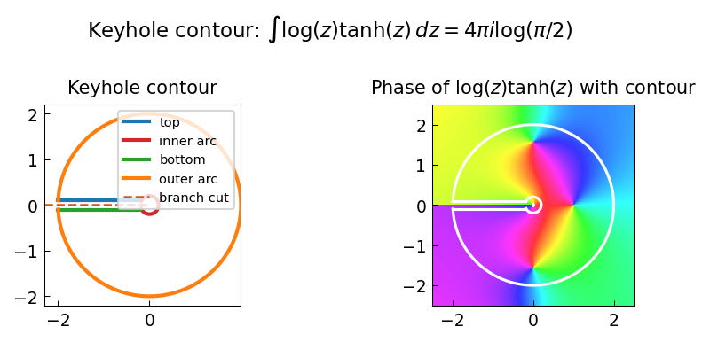
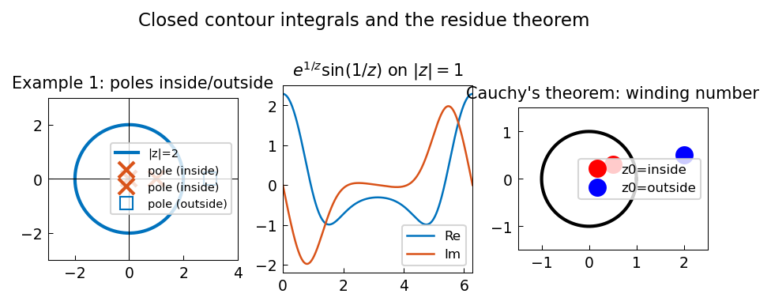
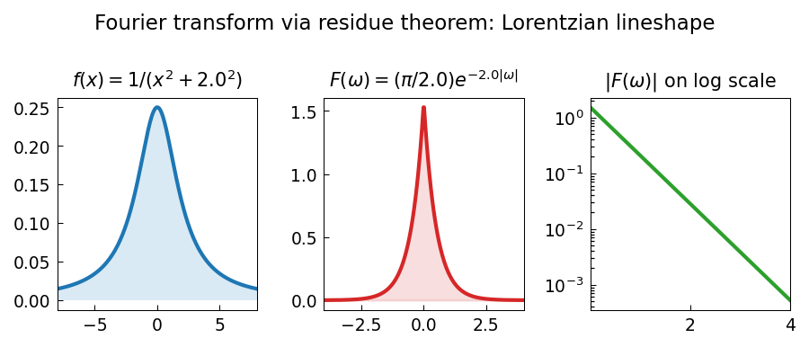

# Complex Analysis Examples

chebfunjax works naturally with complex-valued functions of a real variable.
This makes contour integrals, phase portraits, and conformal maps straightforward
to compute and visualise.

*See also: [Chebfun complex examples](https://www.chebfun.org/examples/complex/)*

---

## 1. Contour integral via parameterisation

If $\gamma: [a, b] \to \mathbb C$ is a smooth curve, then

$$
\int_\gamma f(z)\, dz = \int_a^b f(\gamma(t))\, \gamma'(t)\, dt,
$$

and both sides can be computed by chebfunjax quadrature.

```python
import jax.numpy as jnp
import numpy as np
import chebfunjax as cj

# Integral of 1/z around the unit circle = 2πi
n = 500
t = np.linspace(0, 2*np.pi, n, endpoint=False)
z  = np.exp(1j * t)
dz = 1j * z
dt = 2 * np.pi / n
I  = np.sum((1.0 / z) * dz) * dt
print(f"int 1/z dz = {I:.6f}  (exact: {2j*np.pi:.6f})")
```

---

## 2. Phase portraits

A phase portrait colours the complex plane by $\arg f(z)$, revealing zeros
(rainbow vortices) and poles (reversed vortices).

```python
import matplotlib.pyplot as plt, matplotlib.colors as mcolors

def phase_portrait(f, xlim=(-3,3), ylim=(-3,3), n=400):
    x = np.linspace(*xlim, n); y = np.linspace(*ylim, n)
    Z = x[None,:] + 1j*y[:,None]
    H = (np.angle(f(Z)) + np.pi) / (2*np.pi)
    return mcolors.hsv_to_rgb(np.stack([H, np.ones_like(H), np.ones_like(H)], -1))
```

---

## Translated Chebfun Examples

| Example | Description |
|---------|-------------|
| [KeyholeContour](complex/keyhole_contour.md) | Keyhole contour for $\log(z)\tanh(z)$; error $\sim 10^{-14}$ |
| [ClosedContours](complex/closed_contours.md) | Periodic trapezoidal rule for residues |
| [ComplexArcLength](complex/complex_arc_length.md) | Arc length via $\int|z'(t)|\,dt$ |
| [RoucheTheorem](complex/rouche_theorem.md) | Counting zeros via winding number |
| [PhasePortraits](complex/phase_portraits.md) | Phase portraits for six functions |
| [AnalyticContinuation](complex/analytic_continuation.md) | Bernstein ellipse and coefficient decay |
| [Arguments](complex/Arguments.md) | `angle`, `unwrap`, and winding numbers |
| [ConformalVis](complex/conformal_vis.md) | Conformal maps via grid transformation |
| [FourierContour](complex/fourier_contour.md) | Fourier transforms via contour integrals |
| [ZetaZeros](complex/zeta_zeros.md) | Riemann zeta zeros on the critical line |

---

## Gallery

### Contour integrals



### Argument principle


### Analytic continuation



### Phase portraits


### Conformal visualisation


### Keyhole contour



### Closed contours



### Complex arc length


### Rouché's theorem


### Zeta zeros


### Fourier contour


