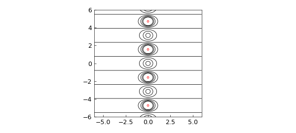
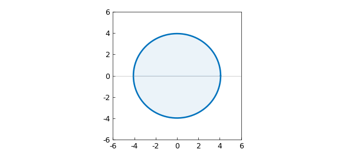
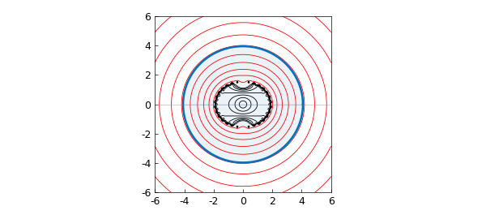
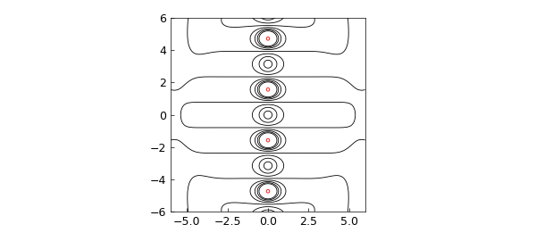

# Analytic continuation via rational approximation

*Nick Trefethen, March 2013*

[Original MATLAB Chebfun example](https://www.chebfun.org/examples/complex/AnalyticContinuation.html)

Python translation: [`examples/complex/analytic_continuation.py`](https://github.com/ma-gilles/chebfunjax/blob/main/examples/complex/analytic_continuation.py)

Suppose we have an analytic function on $[-1,1]$, like

```matlab
f = @(z) tanh(z);
```

In principle, $f$ can be analytically continued to a larger domain in the complex plane that includes a neighborhood of $[-1,1]$. In practice, computing such an analytic continuation is a notoriously ill-posed problem.

Now of course for this function, we know what the analytic continuation should look like. Here is a picture of level curves of $|f(z)|$ in the complex plane:

```matlab
x = -6:.05:6; y = -6:.05:6; [xx, yy] = meshgrid(x,y);
zz = xx+1i*yy; ff = f(zz);
lev1 = .25:.25:2; lev2 = 10.^(1:2:19);
hold off, contour(x,y,abs(ff),lev1,'k')
hold on, contour(x,y,abs(ff),lev2,'r')
axis(6*[-1 1 -1 1]), axis square
```



How might we calculate some of this structure based on the values of $f$ on $[-1,1]$? One idea would be to use polynomials. The chebfun for $f$ is a polynomial $p$ that matches $f$ to about 16 digits:

```matlab
z = chebfun('z');
p = f(z);
length(p)
```

```text
ans =
    30
```

As is discussed in Chapter 8 of [1], one can expect $p$ to approximate $f$ roughly within the Chebfun ellipse for $f$, which is approximately the smallest Bernstein ellipse around $[-1,1]$ passing through a singularity of $f$:

```matlab
hold off, plotregion(p), axis(6*[-1 1 -1 1]), axis square
```



To confirm this prediction, here is a contour plot of the absolute value $|p(z)|$ in the complex plane, following Chapter 28 of [1]. Inside the Chebfun ellipse it matches $|\tanh(z)|$ beautifully, but outside it bears no relation. The zeros of $p$ line up along the boundary curve, illustrating a theorem of Walsh discussed in Chapter 18 of [1].

```matlab
pp = p(zz);
hold off, contour(x,y,abs(pp),lev1,'k')
hold on, contour(x,y,abs(pp),lev2,'r')
plotregion(p), axis(6*[-1 1 -1 1]), axis square
```



How can we compute $f$ further out in the complex plane? The classic idea is to use rational approximations. Suppose we use the Chebfun `ratinterp` command to compute a type (7,8) rational approximation to $f$ based on rational interpolation in Chebyshev points in $[-1,1]$:

```matlab
[p,q,r,mu,nu,poles] = ratinterp(f,7,8);
rr = r(zz);
hold off, contour(x,y,abs(rr),lev1,'k')
hold on, contour(x,y,abs(rr),lev2,'r')
axis(6*[-1 1 -1 1]), axis square
```



The rational function has evidently done a far better job of analytic continuation than the polynomial. (Admittedly, the choice of the parameters (7,8) is something of an art.) Here are the first eight exact poles of $f$ compared with those of $r$:

```matlab
format long
exact = 0.5i*pi*(-7:2:7)';
disp('   Exact     rational approx')
disp([sort(exact) sort(poles)])
```

```text
   Exact     rational approx
  Column 1
  0.000000000000000 - 1.570796326794897i
  0.000000000000000 + 1.570796326794897i
  0.000000000000000 - 4.712388980384690i
  0.000000000000000 + 4.712388980384690i
  0.000000000000000 - 7.853981633974483i
  0.000000000000000 + 7.853981633974483i
  0.000000000000000 -10.995574287564276i
  0.000000000000000 +10.995574287564276i
  Column 2
  0.000000000000000 - 1.570796330355370i
  0.000000000000000 + 1.570796330355370i
  0.000000000000000 - 4.717144397762665i
  0.000000000000000 + 4.717144397762665i
 -0.000000000000000 - 8.698767601127866i
 -0.000000000000000 + 8.698767601127866i
  0.000000000000001 -27.750588773102695i
  0.000000000000001 +27.750588773102695i
```

For much more on these matters, see [1], [2] and [3].

## References

1. L. N. Trefethen, Approximation Theory and Approximation Practice, SIAM, 2013.
2. M. Webb, Computing complex singularities of differential equations with Chebfun, SIAM Undergraduate Research Online, 2013.
3. M. Webb, L. N. Trefethen, and P. Gonnet, Stability of barycentric interpolation formulas for extrapolation, SIAM J. Sci. Comput. 34 (2012), A3009--A3015.

---

*Translated with [chebfunjax](https://github.com/ma-gilles/chebfunjax); prose and MATLAB code from the original example, copyright The University of Oxford and The Chebfun Developers.  Printed outputs and figures are chebfunjax's.*
