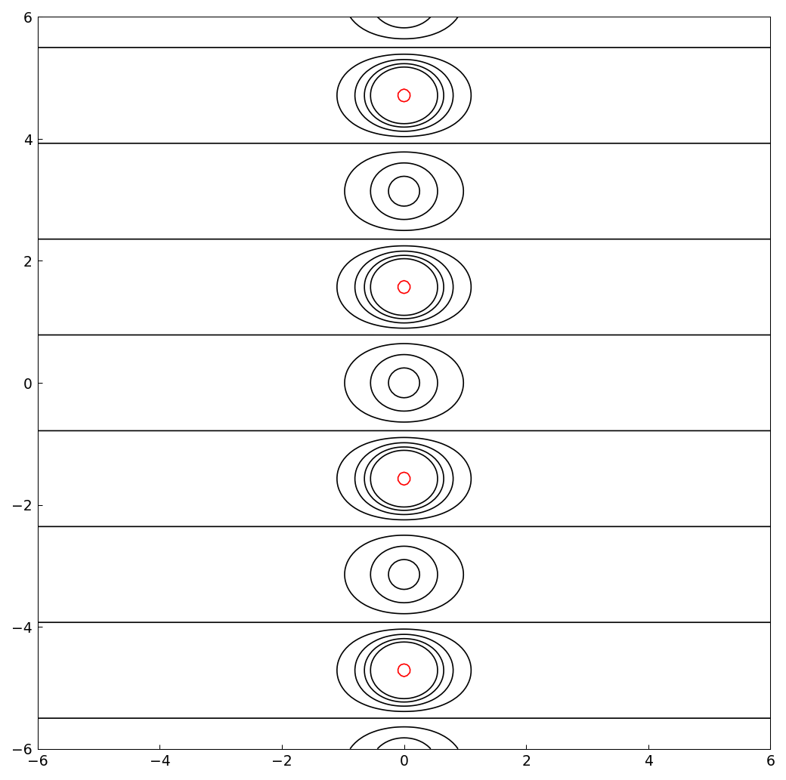
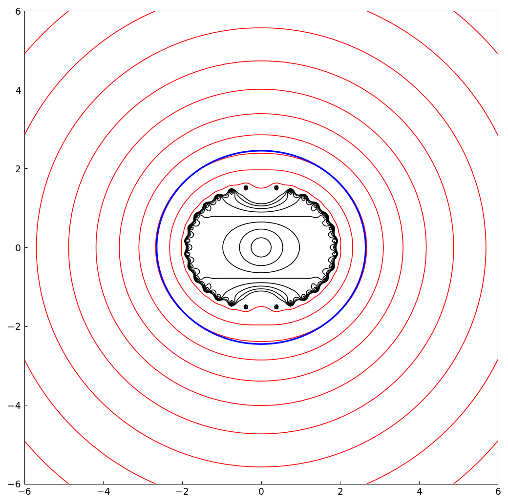
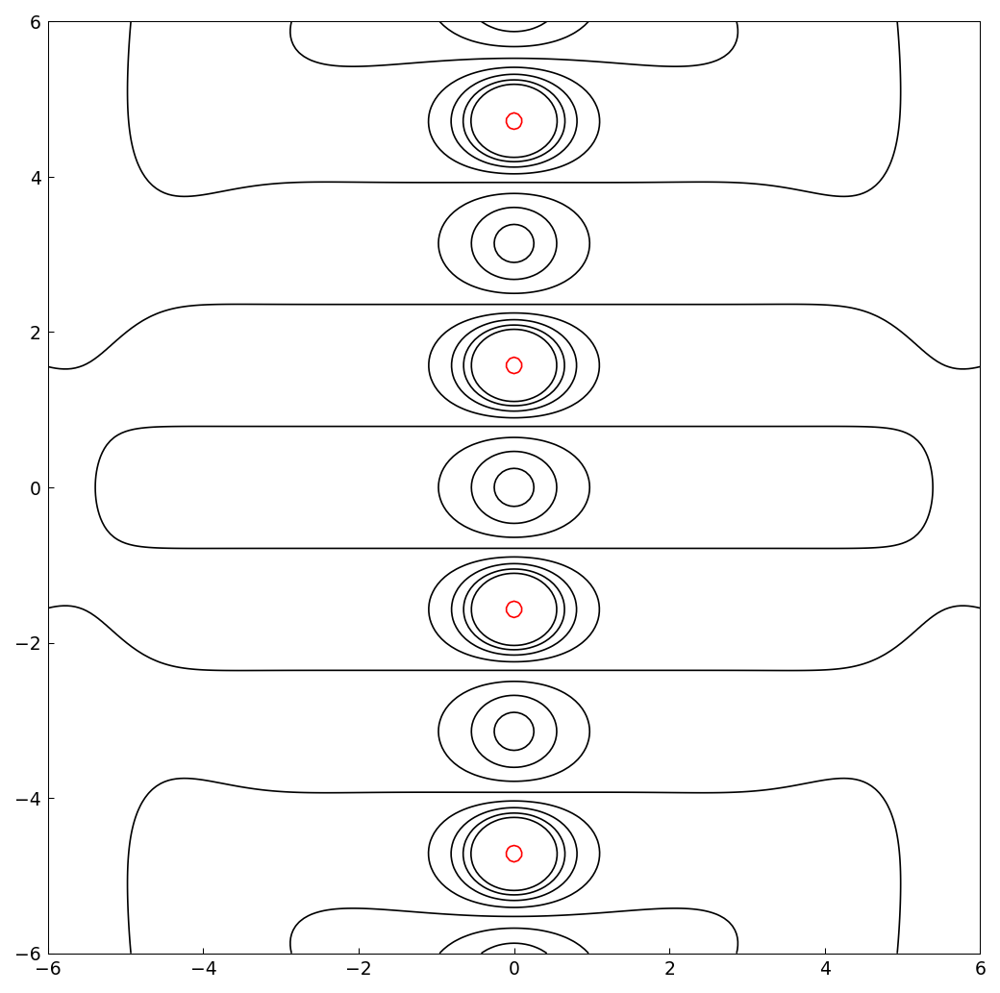

# Analytic continuation via polynomials and rational functions

*Nick Trefethen, May 2011*

[Original MATLAB Chebfun example](https://www.chebfun.org/examples/complex/AnalyticContinuation.html)

(Chebfun example complex/AnalyticContinuation.m)

How far into the complex plane does a chebfun match the function it
approximates on $[-1,1]$?  Here are level curves of $|\tanh(z)|$ —
black at moderate levels, red at the huge levels $10, 10^3, \dots$
that mark the poles on the imaginary axis:



The chebfun of $\tanh$ has length 30 (matching the published output):

```
ans =
    30
```

Evaluating this degree-29 polynomial off the interval reproduces the
function inside its "Chebfun ellipse" (blue) and diverges outside:



A rational interpolant reaches much further.  Here is the type $(7,8)$
`ratinterp` approximant, whose contours track $\tanh$ well beyond the
ellipse and whose poles imitate the true poles:



```
   Exact     rational approx
  +-1.570796326794897i   +-1.570796330355369i
  +-4.712388980384690i   +-4.717144397762657i
  +-7.853981633974483i   +-8.698767601127880i
  +-10.995574287564276i  +-27.750588773102692i
```

The innermost pole pair is captured to nine digits, the next to three,
and the outer ones only roughly — the same accuracy cascade as the
published table.

---

*Replicated with [chebfunjax](https://github.com/ma-gilles/chebfunjax); original
example copyright The University of Oxford and The Chebfun Developers.*
