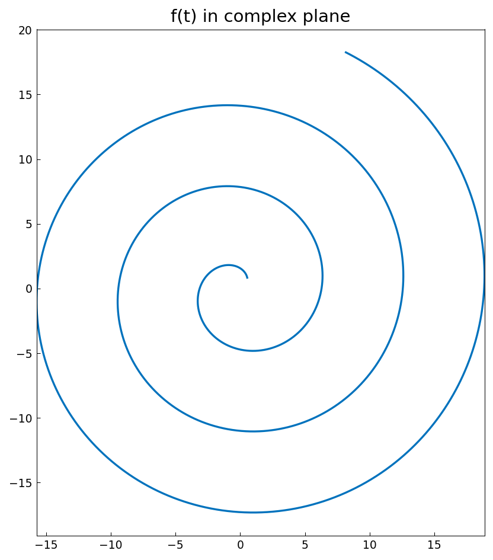
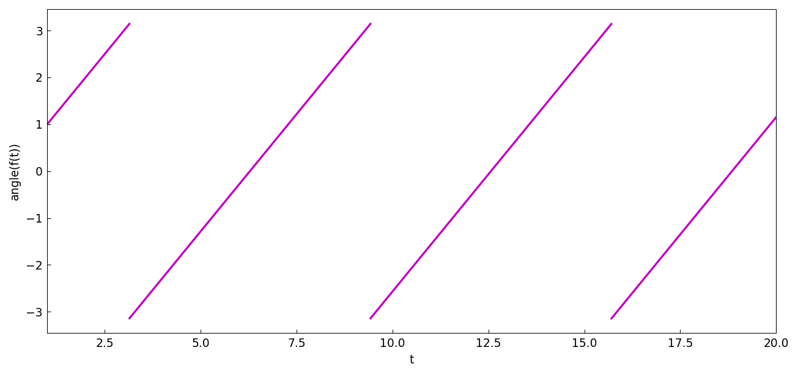
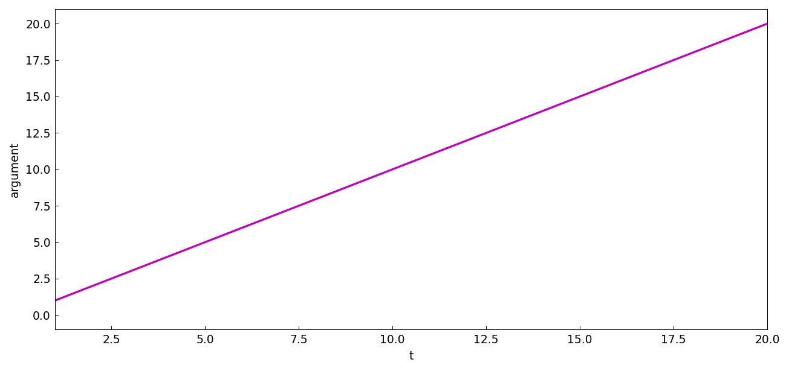
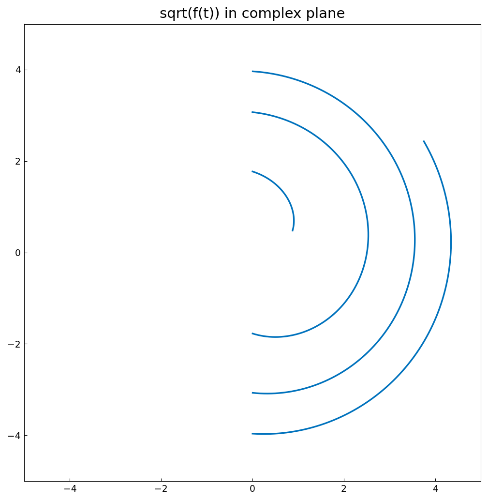
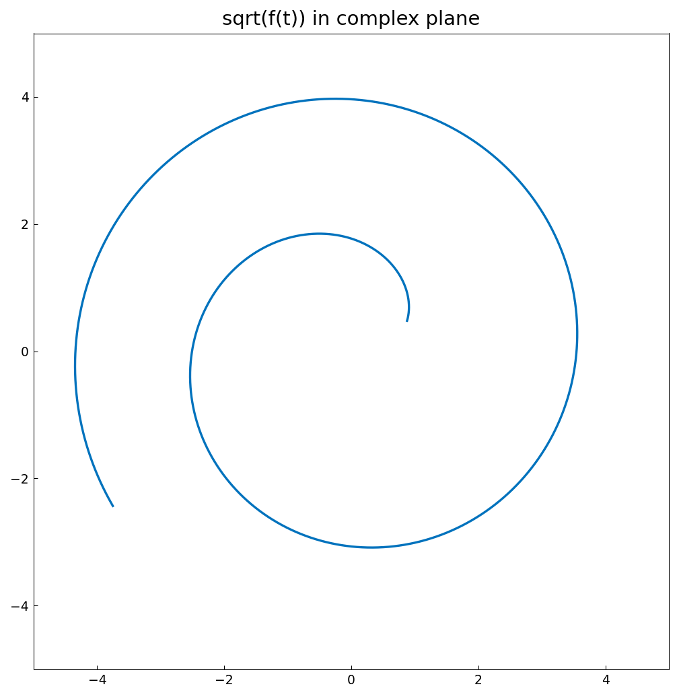

# Phase and argument of complex functions

*Nick Trefethen, May 2011*

[Original MATLAB Chebfun example](https://www.chebfun.org/examples/complex/Arguments.html)

(Chebfun example complex/Arguments.m)

The `angle` command returns the principal argument in $(-\pi,\pi]$:

```
ans =
     0
ans =
   3.141592653589793
ans =
  -3.131592986903128
```

(Digit-for-digit with the published output — note the jump from $+\pi$
to nearly $-\pi$ for a point just below the negative real axis.)

Consider the spiral $f(t) = t e^{it}$ on $[1, 20]$:



Its principal argument jumps every time the spiral crosses the negative
real axis:



The cure is `unwrap`, which adds multiples of $2\pi$ to make the
argument continuous:

```
ans =
   3.141592653589793   3.151592320276458
```



Why does this matter?  Consider computing $\sqrt{f(t)}$.  With the
principal branch, the square root inherits the argument jumps and the
curve is broken:



But with the unwrapped argument,
$g = \sqrt{|f|}\, e^{i\,\mathrm{arg}(f)/2}$ is a smooth spiral —
one of the two continuous square-root branches:



---

*Replicated with [chebfunjax](https://github.com/ma-gilles/chebfunjax); original
example copyright The University of Oxford and The Chebfun Developers.*
