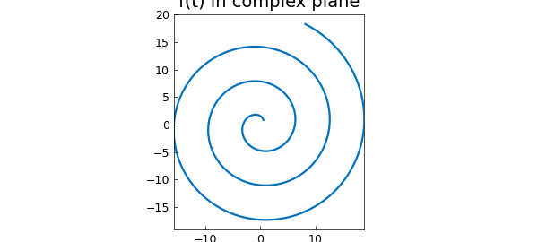
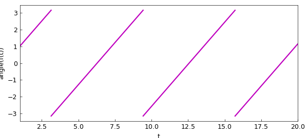
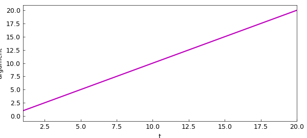
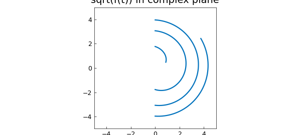
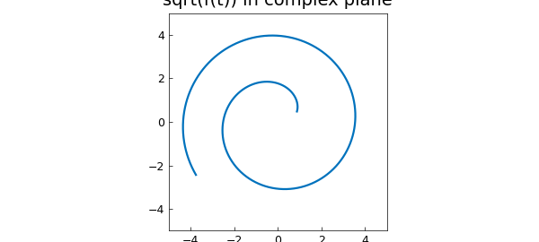

# angle, unwrap, and branches of complex chebfuns

*Nick Trefethen, May 2011*

[Original MATLAB Chebfun example](https://www.chebfun.org/examples/complex/Arguments.html)

Python translation: [`examples/complex/arguments.py`](https://github.com/ma-gilles/chebfunjax/blob/main/examples/complex/arguments.py)

A complex number $z$ has a modulus or absolute value in $[0,\infty)$, which MATLAB computes with `abs(z)`, and an argument in $(-\pi,\pi]$, which MATLAB computes with `angle(z)`. For example:

```matlab
angle(1)
```

```text
ans =
     0
```

```matlab
angle(-1)
```

```text
ans =
   3.141592653589793
```

```matlab
angle(-1-.01i)
```

```text
ans =
  -3.131592986903128
```

Chebfun overloads the `angle` command in the obvious fashion, analogously to `ceil`, `floor`, and `round`. For example, here is a spiral in the complex plane:

```matlab
LW = 'linewidth'; lw = 1.6; FS = 'fontsize'; fs = 14;
t = chebfun('t',[1 20]);
f = t.*exp(1i*t);
plot(f,LW,lw), axis equal
title('f(t) in complex plane',FS,fs)
```



And here is its angle:

```matlab
plot(angle(f),'m',LW,lw)
xlabel t, ylabel angle(f(t))
```



Often one would prefer to define a continuous argument, and for this purpose MATLAB has the command `unwrap`. For example:

```matlab
unwrap(angle([-1 -1-.01i]))
```

```text
ans =
   3.141592653589793   3.151592320276458
```

If we apply the Chebfun overload, we get a continuous argument for that spiral that makes more sense:

```matlab
plot(unwrap(angle(f)),'m',LW,lw), ylim([-1 21])
xlabel t, ylabel argument
```



An important area of application of these commands is to functions in the complex plane, where keeping track of branch cuts is often a headache. For example, suppose we want to take the square root of that function $f$. The result is not very useful. (For the moment we have to construct the function again with `splitting on` to make this experiment work, though in principle Chebfun should be clever enough to introduce a breakpoint without splitting on.)

```matlab
g = chebfun('sqrt(t.*exp(1i*t))',[1 20],'splitting','on');
plot(g,LW,lw), axis(5*[-1 1 -1 1]), axis square
title('sqrt(f(t)) in complex plane',FS,fs)
```



We can get the right effect with `unwrap`:

```matlab
g = sqrt(abs(f)).*exp(.5i*unwrap(angle(f)));
plot(g,LW,lw), axis(5*[-1 1 -1 1]), axis square
title('sqrt(f(t)) in complex plane',FS,fs)
```



---

*Translated with [chebfunjax](https://github.com/ma-gilles/chebfunjax); prose and MATLAB code from the original example, copyright The University of Oxford and The Chebfun Developers.  Printed outputs and figures are chebfunjax's.*
