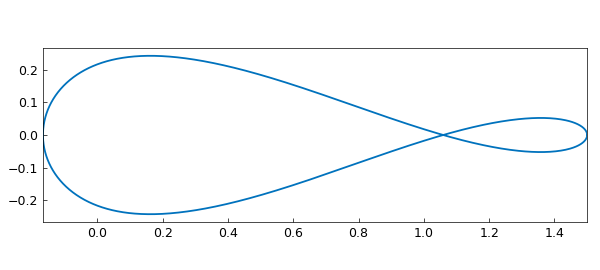
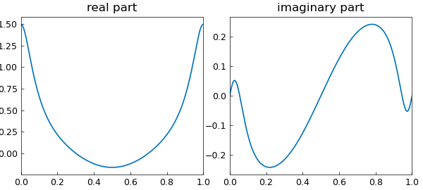
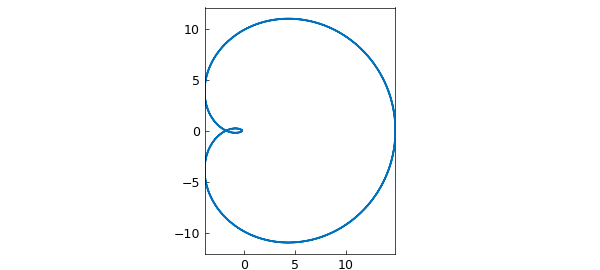

# Integrals over closed contours using periodic chebfuns

*Mohsin Javed, June 2014*

[Original MATLAB Chebfun example](https://www.chebfun.org/examples/complex/ClosedContours.html)

Python translation: [`examples/complex/closed_contours.py`](https://github.com/ma-gilles/chebfunjax/blob/main/examples/complex/closed_contours.py)

In this example, we compute a few integrals over closed contours in the complex plane using periodic chebfuns.

Consider a smooth and closed contour $\Gamma$ in the complex plane and let us say we want to compute $$ \int_{\Gamma} f(z) dz. $$ If we parametrize $\Gamma$ using a real varaible, say $t$ , then since the contour is closed, the intgrand becomes periodic in $t$ and we get $$ \int_{\Gamma} f(z) dz = \int_{a}^{b} f(z(t)) z'(t) dt. $$

All this can be done very efficiently in Chebfun, thanks to the Fourier technology which has been integrated with Chebfun's longstanding Chebyshev technology.

Here is a simple example. Consider the function:

```matlab
ff = @(z) (1-2*z)/(z*(z-1)*(z-3));
```

Suppose we want to integrate this function on a circle of radius $2$. To do this in Chebfun's periodic mode, we first parametrize the circle:

```matlab
z = chebfun(@(t) 2*exp(2*pi*1i*t), [0, 1], 'trig');
```

The integrand is then constructed by a simple composition:

```matlab
f = ff(z)
plot(f), axis equal
```

```text
f =
   chebfun column (1 smooth piece)
       interval       length     endpoint values trig
[       0,       1]      183     complex values
vertical scale = 1.5
```



This is how the real and imaginary parts of the integrand look on the contour:

```matlab
subplot(1, 2, 1)
plot(real(f))
title('real part')
subplot(1, 2, 2)
plot(imag(f))
title('imaginary part')
```



To compute the integral, we recall that

$$ \int_{|z|=2} f(z) dz = \int_{0}^{1} f(z(t)) z'(t) dt. $$

We therefore first compute $z'(t)$:

```matlab
dz = diff(z);
```

Computing the integral now could not be easier:

```matlab
s = sum(f.*dz)
```

```text
s =
  0.000000000000000 + 5.235987755982987i
```

The true answer is $5 \pi i/3$, and we see that Chebfun has done a very good job:

```matlab
norm(s - 5/3*pi*1i)
```

```text
ans =
     1.776424107608476e-15
```

Here is another example. Consider the sinc function

```matlab
ff = @(z) sin(5*z)/(5*z);
```

This analytic function has a removable singularity at the origin. Therefore, the integral of the function on any closed contour should be zero according to Cauchy's theorem.

```matlab
z = chebfun(@(t) exp(2*pi*1i*t), [0, 1], 'trig');
f = ff(z);
dz = diff(z);
```

Here is a plot of the function:

```matlab
clf
plot(f), axis equal
```



And here is the integral, which is numerically zero:

```matlab
s = sum(f.*dz)
```

```text
s =
     -2.274849545869297e-15 + -2.623542408960370e-15i
```

As our final example, we pick a function with an essential singularity at the origin and compute its integral on the unit circle.

```matlab
ff = @(z) exp(1/z)*sin(1/z);
z = chebfun(@(t) exp(2*pi*1i*t), [0, 1], 'trig');
f = ff(z);
dz = diff(z);
s = sum(f.*dz)
```

```text
s =
  0.000000000000000 + 6.283185307179586i
```

The result nicely matches $2\pi i$:

```matlab
exact = 2i*pi
```

```text
exact =
  0.000000000000000 + 6.283185307179586i
```

---

*Translated with [chebfunjax](https://github.com/ma-gilles/chebfunjax); prose and MATLAB code from the original example, copyright The University of Oxford and The Chebfun Developers.  Printed outputs and figures are chebfunjax's.*
