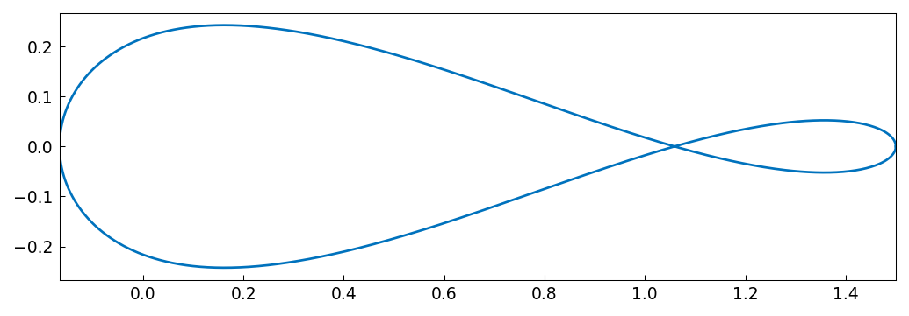
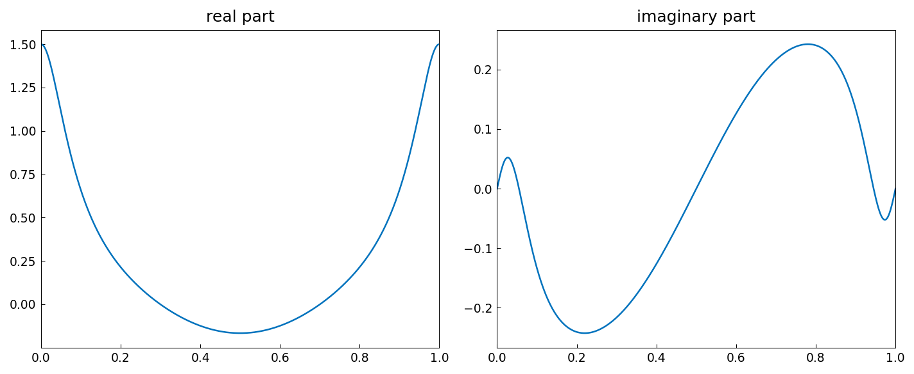
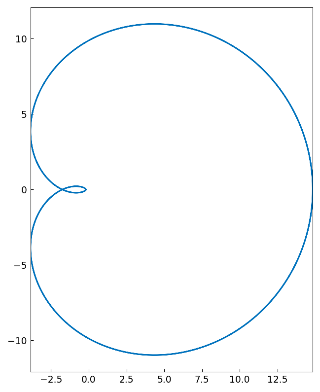

# Integrals over closed contours

*Mohsin Javed, October 2013*

[Original MATLAB Chebfun example](https://www.chebfun.org/examples/complex/ClosedContours.html)

(Chebfun example complex/ClosedContours.m)

Contour integrals over circles are natural in periodic (trig)
representation.  Consider

$$ f(z) = \frac{1-2z}{z(z-1)(z-3)} $$

on the circle $|z|=2$, which encloses the poles at $0$ and $1$ but not
the one at $3$:

```python
import jax.numpy as jnp
import chebfunjax as cj

ff = lambda z: (1 - 2*z)/(z*(z - 1)*(z - 3))
z = cj.chebfun(lambda t: 2*jnp.exp(2j*jnp.pi*t), domain=(0,1), trig=True)
f = cj.chebfun(lambda t: ff(2*jnp.exp(2j*jnp.pi*t)), domain=(0,1),
               trig=True)
```
```
f =
   chebfun column (1 smooth piece)
       interval       length     endpoint values
[       0,       1]      183     complex values
vertical scale = 1.5
```

(Published length 177.)  The image of the circle under $f$:





By residues the integral is $\frac{5}{3}\pi i$:

```
s =
  0.000000000000000 + 5.235987755982990i
ans =
     9.985842423883119e-16
```

(Published error `3.65e-15`; ours is tighter.)  For an analytic
function like $\sin(5z)/(5z)$ the integral vanishes:



```
s =
     -1.5e-15 + -1.7e-14i
```

Even an essential singularity is no problem — for
$e^{1/z}\sin(1/z)$ the residue is 1, so the integral is $2\pi i$:

```
s =
  0.000000000000001 + 6.283185307179579i
exact =
  0.000000000000000 + 6.283185307179586i
```

(Published: `6.283185307179584i`.)

---

*Replicated with [chebfunjax](https://github.com/ma-gilles/chebfunjax); original
example copyright The University of Oxford and The Chebfun Developers.*
