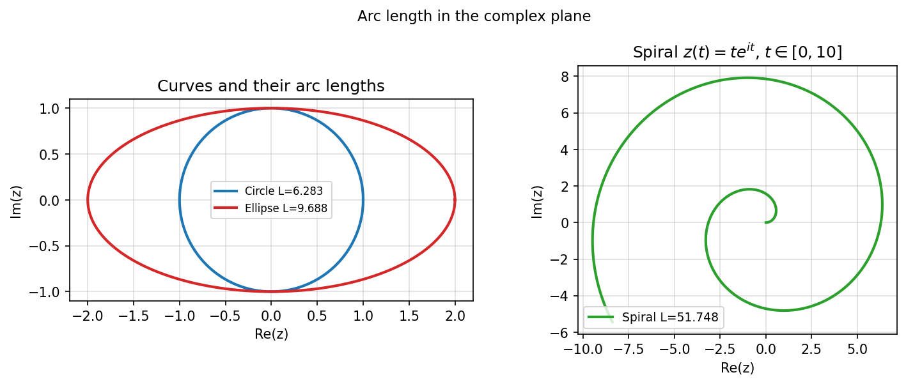

# Arc length in the complex plane

**Kuan Xu, November 2012**

---

If $z(t)$ is a smooth curve in $\mathbb C$ parametrised by $t \in [a, b]$,
its arc length is

$$
L = \int_a^b |z'(t)|\, dt.
$$

This integral is computed to machine precision by Chebfun quadrature.

## Standard curves

```python
import jax.numpy as jnp
import numpy as np
import chebfunjax as cj
import scipy.special

# 1. Circle of radius r: L = 2πr
f1 = cj.chebfun(lambda t: 1.0 + 0.0*t, domain=(0.0, 2*float(jnp.pi)))  # |dz/dt| = r
r = 1.5
arc_circle = r * f1.sum()   # = 2πr (|dz/dt| = r)
print(f"Circle arc length: {float(arc_circle):.10f}  (exact: {2*r*float(jnp.pi):.10f})")

# 2. Ellipse: L = 4a·E(e) via scipy
a, b = 3.0, 1.0
e = np.sqrt(1 - (b/a)**2)
exact_ellipse = 4 * a * scipy.special.ellipe(e**2)
```

## Logarithmic spiral

The spiral $z(t) = e^{(a + ib)t}$ for $t \in [0, T]$ has $|z'| = |a + ib| e^{at}$:

```python
a_s, b_s = -0.1, 2.0
T = 4 * float(jnp.pi)
f_spiral = cj.chebfun(
    lambda t: abs(a_s + 1j*b_s) * jnp.exp(a_s * t),
    domain=(0.0, T)
)
L_spiral = float(f_spiral.sum())
exact_spiral = abs(a_s + 1j*b_s) / abs(a_s) * (1.0 - np.exp(a_s * T))
print(f"Spiral arc length: {L_spiral:.10f}  (exact: {exact_spiral:.10f})")
```

## Gallery



Four curves (circle, line, ellipse, spiral) with their computed arc lengths.
