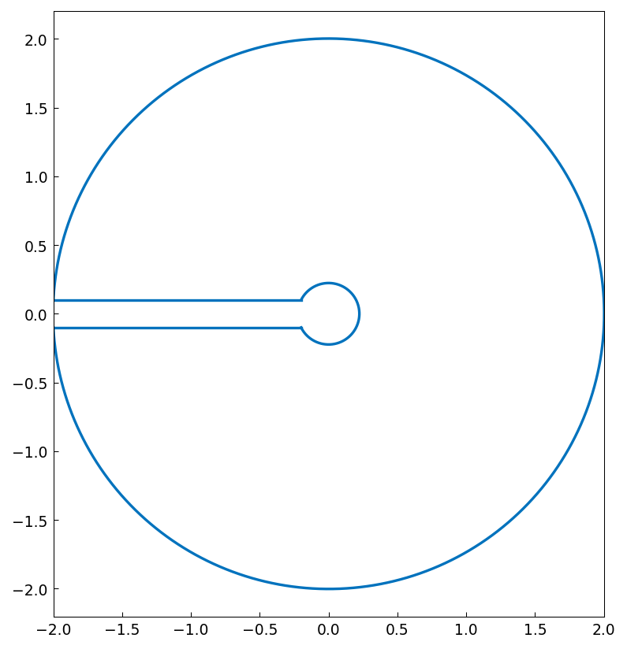
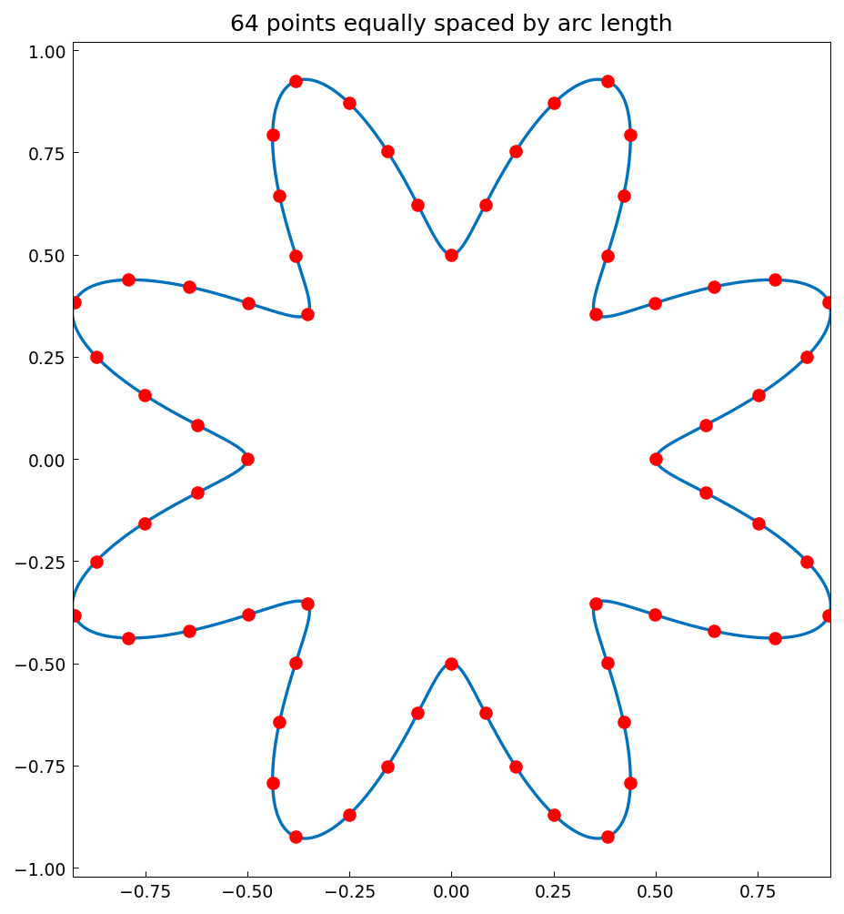

# Arc length of complex paths

*Kuan Xu, October 2012*

[Original MATLAB Chebfun example](https://www.chebfun.org/examples/complex/ComplexArcLength.html)

(Chebfun example complex/ComplexArcLength.m)

The `arc_length` command computes the length of a path in the complex
plane, $\int |z'(t)|\,dt$.  For the keyhole contour of
[complex/KeyholeContour](KeyholeContour.md):

```python
L = sum(z.arc_length() for z in segments)
```
```
L =
  17.179598985403501
```

(Published: `17.179598985403512`.)



The pieces individually — two straight edges of length 1.8, the short
inner arc, and the long outer arc:

```
L (per piece) =
   1.800000000000000   1.197613431941936   1.800000000000000   12.381985553461565
```

(Published: `1.800000000000000  1.197613431941939  1.800000000000000
12.381985553461572`.)

Now a flower-like curve
$s(t) = e^{2\pi it}(\tfrac12\sin^2(8\pi t)+\tfrac12)$:

```
L =
   9.634012138198033
```

(Published: `9.634012138198036`.)  To place $N=64$ points equally
spaced in arc length along the curve, we solve
$\mathrm{len}(t) = kh$ for each $k$ with chebfun rootfinding on the
cumulative arclength:

```python
speed = cj.chebfun(lambda t: jnp.abs(sp(t)), domain=(0.0, 1.0))
cum = speed.cumsum()
T = [(cum - k*h).roots()[0] for k in range(1, N)]
```



---

*Replicated with [chebfunjax](https://github.com/ma-gilles/chebfunjax); original
example copyright The University of Oxford and The Chebfun Developers.*
