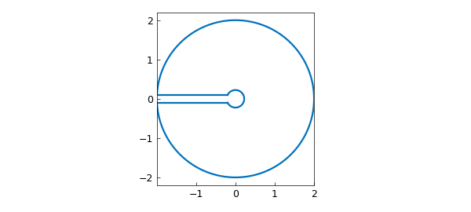
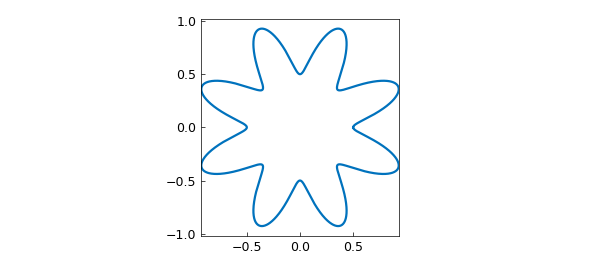
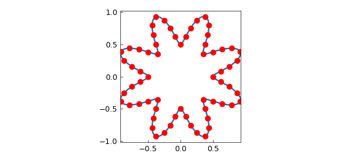
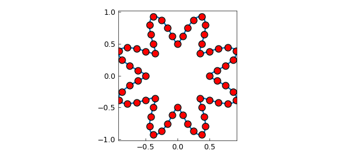

# Arc length in the complex plane

*Kuan Xu, November 2012*

[Original MATLAB Chebfun example](https://www.chebfun.org/examples/complex/ComplexArcLength.html)

Python translation: [`examples/complex/complex_arc_length.py`](https://github.com/ma-gilles/chebfunjax/blob/main/examples/complex/complex_arc_length.py)

## 1. Arc length of a contour

Here is a contour discussed in the Example "A Keyhole Contour Integral" [1]:

```matlab
r = 0.2; R = 2; e = 0.1;
t = chebfun('t',[0 1]);                   % parameter
c = [-R+e*1i -r+e*1i -r-e*1i -R-e*1i];
z = join( c(1) + t*(c(2)-c(1)), ...       % top of the keyhole
          c(2)*c(3).^t ./ c(2).^t, ...    % inner circle
          c(3) + t*(c(4)-c(3)), ...       % bottom of the keyhole
          c(4)*c(1).^t ./ c(4).^t);       % outer circle
LW = 'LineWidth'; lw = 1.6;
plot(z,LW,lw), axis equal
```



The total length of the contour can be calculated with one command:

```matlab
L = arcLength(z)
```

```text
L =
  17.179598985403484
```

If the length of each patch is what you want to know, then you can make the input a quasimatrix whose columns are the different pieces.

```matlab
z = [ c(1) + t*(c(2)-c(1))...           % Top of the keyhole
      c(2)*c(3).^t ./ c(2).^t...        % Inner circle
      c(3) + t*(c(4)-c(3))...           % Bottom of the keyhole
      c(4)*c(1).^t ./ c(4).^t];         % Outer circle
L = arcLength(z)
```

```text
L =
  Columns 1 through 3
   1.800000000000000   1.197613431941934   1.800000000000000
  Column 4
  12.381985553461551
```

## 2. Equidistributing points along a contour

It is not uncommon that we need to discretize and sample over a 2D curve in the complex plane. For instance, we may want to uniformly distribute points along the boundary of a domain when the boundary integral method is used. That is, the points should be equally-spaced with respect to arc length. Consider the following star-shaped curve:

```matlab
t = chebfun('t',[0 1]);
s = exp(1i*2*pi*t).*(0.5*sin(8*pi*t).^2+0.5);
plot(s,LW,lw), axis equal, hold on
```



First, we calculate the total arc length of this closed curve.

```matlab
L = arcLength(s)
```

```text
L =
   9.634012138198033
```

Suppose, for example, that we want to equidistribute 64 points.

```matlab
N = 64;
h = L/N;
T = zeros(1,N);
```

We could do this by solving 63 rootfinding problems:

```matlab
tic
len = cumsum(abs(diff(s)));
for k = 1:N-1
    T(k+1) = roots(len-k*h);
end
toc
```

```text
Elapsed time is 85.348594 seconds.
```

Now that we have the coordinates of the points, and let's mark them on the curve.

```matlab
P = s(T);
MS = 'MarkerSize'; ms = 16;
plot(P,'.r',MS,ms)
```



The rootfinding problems above, unfortunately, took quite a while, because the chebfun `len` is rather long:

```matlab
length(len)
```

```text
ans =
        2762
```

A better approach is not to solve our own rootfinding problems but to first invert `len` with the Chebfun command `inv`:

```matlab
tic, g = inv(len); toc
```

```text
Elapsed time is 2018.385789 seconds.
```

Here we put circles around the dots to confirm that we have the same result as before:

```matlab
plot(s(g((0:N-1)*h)),'ok',MS,8)
```



## References

1. Chebfun Example [complex/KeyholeContour](KeyholeContour.md)

---

*Translated with [chebfunjax](https://github.com/ma-gilles/chebfunjax); prose and MATLAB code from the original example, copyright The University of Oxford and The Chebfun Developers.  Printed outputs and figures are chebfunjax's.*
