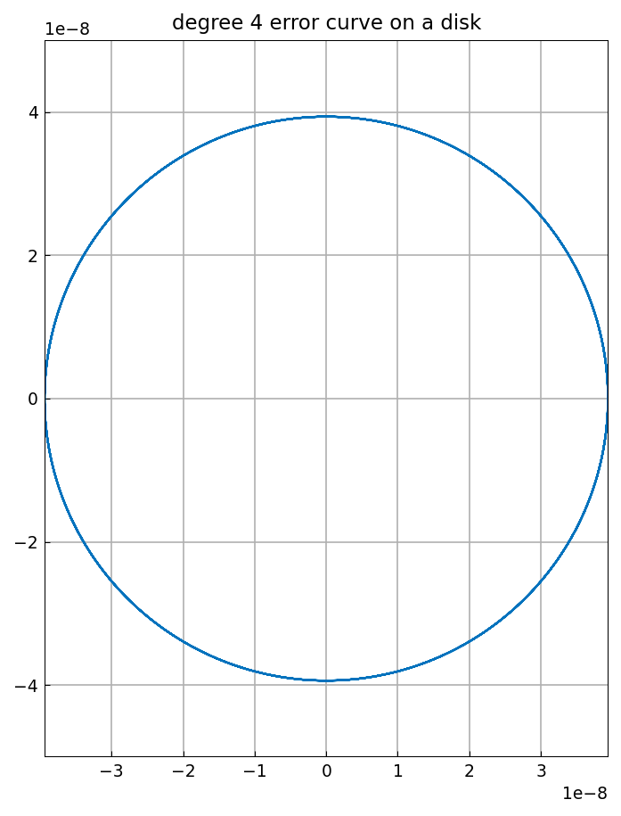
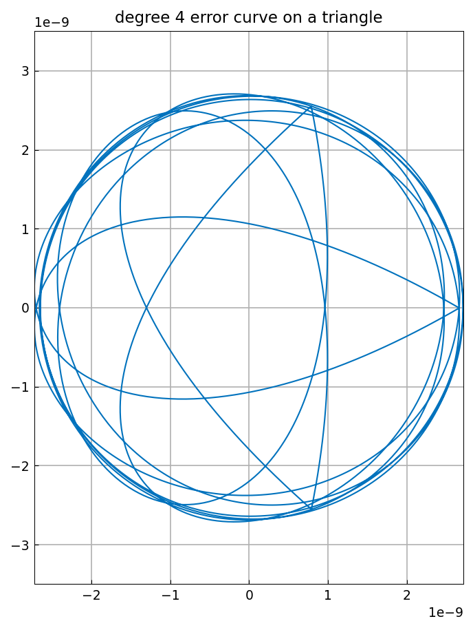
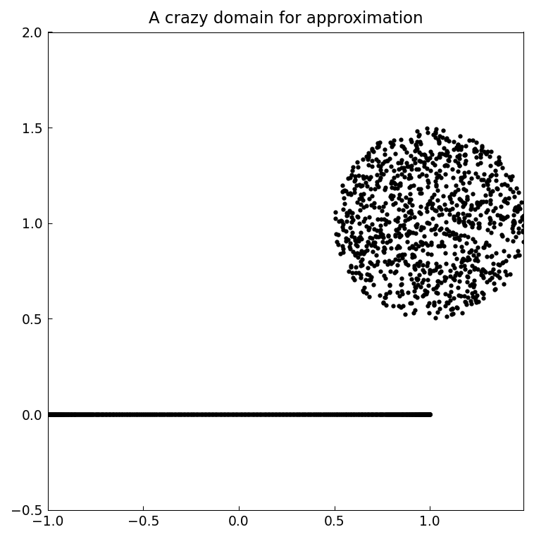
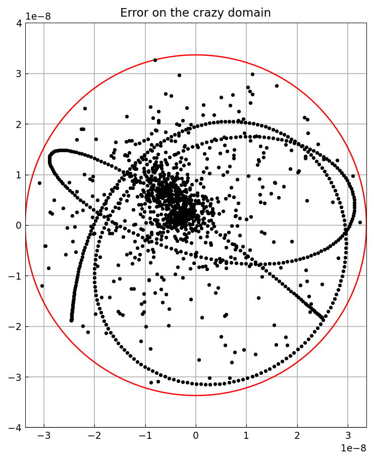
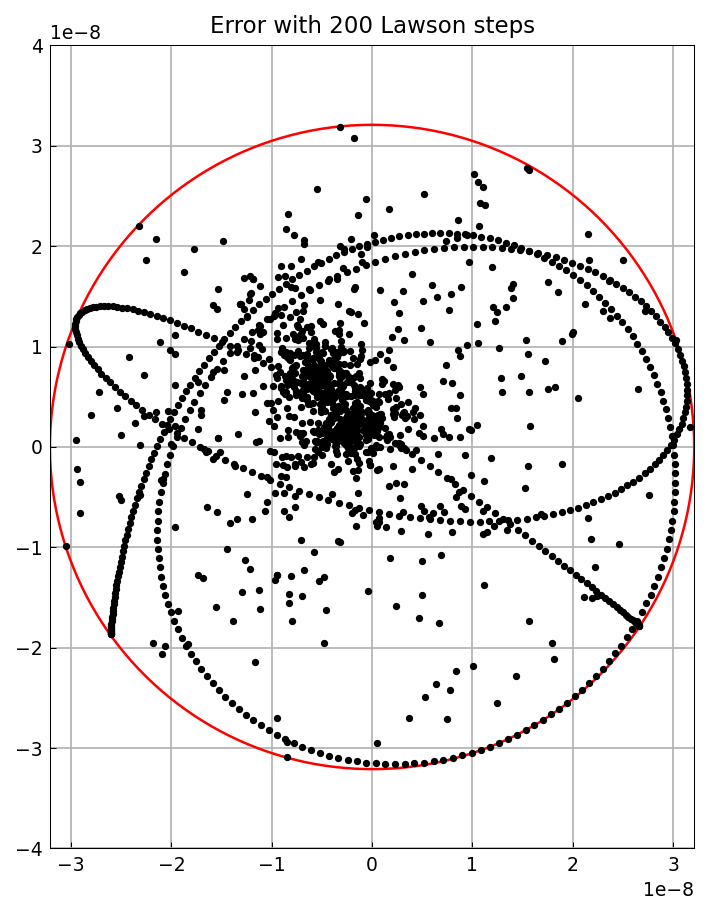

# Minimax approximation in the complex plane

*Nick Trefethen, December 2019*

[Original MATLAB Chebfun example](https://www.chebfun.org/examples/complex/ComplexMinimax.html)

(Chebfun example complex/ComplexMinimax.m)

On a complex domain, the error curve of a best rational approximation
of degree $n$ is close to a perfect circle traversed $2n+1$ times.  The
AAA-Lawson iteration (`aaa` with a `degree` argument) computes such
near-minimax approximations.  For $e^z$ on the unit disk with $n=4$:

```python
Z = np.exp(2j*np.pi*np.arange(1, 1001)/1000)
r, *_ = aaa(jnp.asarray(np.exp(Z)), jnp.asarray(Z), degree=4)
```
```
error =
     3.938867635037386e-08
winding_number =
     9
```

(Published: `3.938867571915709e-08`, winding number 9 $= 2n+1$.)



On a triangle with corners at the cube roots of unity, the error is
smaller and the curve slightly less circular, but the winding number is
still 9:

```
error =
     2.746139148200226e-09
winding_number =
     9
```



Minimax approximation makes sense on any compact set.  Here is a
"crazy" domain — 1000 random points in a half-disk plus an interval:



```
error =
     3.368279183198941e-08
```



With 200 Lawson steps the error dots hug the minimax circle more
tightly:

```
error =
     3.209697167685234e-08
```



(Published crazy-domain errors: `3.23e-08` and `3.25e-08` on its own
random point set.)

---

*Replicated with [chebfunjax](https://github.com/ma-gilles/chebfunjax); original
example copyright The University of Oxford and The Chebfun Developers.*
