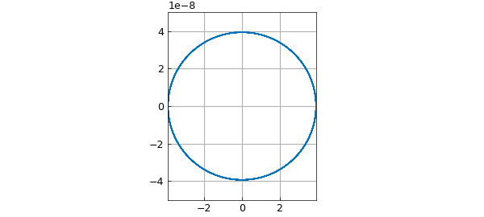
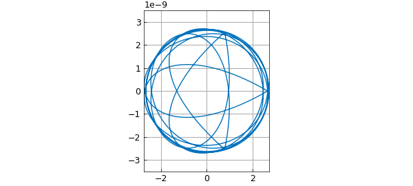
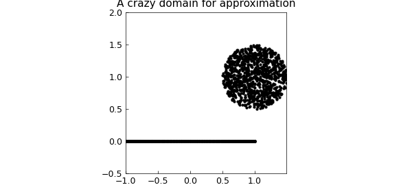
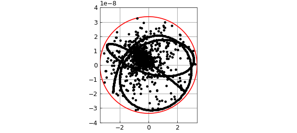
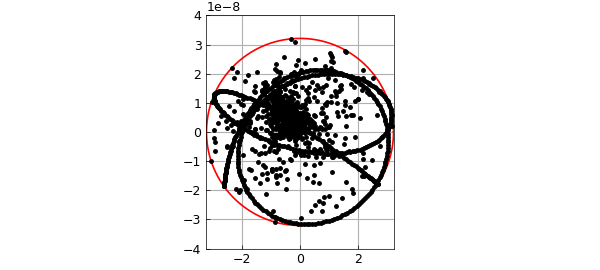

# Complex Rational Minimax Approximation

*Nick Trefethen, October 2019*

[Original MATLAB Chebfun example](https://www.chebfun.org/examples/complex/ComplexMinimax.html)

Python translation: [`examples/complex/complex_minimax.py`](https://github.com/ma-gilles/chebfunjax/blob/main/examples/complex/complex_minimax.py)

The Chebfun `minimax` code computes rational minimax approximations -- i.e., best approximations in the maximum norm -- for real functions on a real interval. For complex functions on a complex domain, the corresponding computation can now be done by `aaa`, thanks to the recent introduction of a "AAA-Lawson iteration" [1].

For example, suppose we want to find the degree $n=4$ minimax approximation to $e^z$ on the unit circle (i.e., at most 4 zeros and 4 poles). We can do it like this:

```matlab
tic
Z = exp(2i*pi*(1:1000)/1000);
F = exp(Z);
r = aaa(F,Z,'degree',4);
```

If we plot the *error curve*, which is the image of the unit circle under $(f-r)(z)$, we see what looks like a perfect circle of radius 4e-8:

```matlab
E = F - r(Z);
plot(E), grid on
error = norm(E,inf)
ylim(5e-8*[-1 1]), axis equal
title('degree 4 error curve on a disk')
```

```text
error =
     3.938867635037386e-08
```



In fact, it is not exactly a circle, but the radius (in theory) varies by only about one part in $10^{8}$. And its winding number is not 1 but $2n+1 = 9$:

```matlab
a = unwrap(angle(E([1:end 1])));
winding_number = (a(end)-a(1))/(2*pi)
```

```text
winding_number =
     9
```

The observation that complex minimax approximants of smooth functions on smooth domains have nearly-circular error curves goes back to around 1980 and is the basis of the Carathéodory-Fejér method for computing such approximations [2], implemented (for a real interval) in Chebfun's `cf` code. However, `aaa` can also compute approximations that are not in this regime. For example, here is a set $Z$ defining a triangle inscribed in the unit circle:

```matlab
omega = exp(2i*pi/3);
Z = chebpts(1001,[1,omega]);
Z = [Z; omega*Z; omega^2*Z];
```

If we approximate $e^z$ on this set, we get an error curve with three corners:

```matlab
F = exp(Z);
r = aaa(F,Z,'degree',4);
E = F - r(Z);
plot(E), grid on
error = norm(E,inf)
ylim(3.5e-9*[-1 1]), axis equal
title('degree 4 error curve on a triangle')
```

```text
error =
     2.746139148200226e-09
```



Note that the error curve is close to a circle for most of the way around. Again the winding number is 9:

```matlab
a = unwrap(angle(E([1:end 1])));
winding_number = (a(end)-a(1))/(2*pi)
```

```text
winding_number =
     9
```

We can do crazier things. For example, let's take Z to be 500 Chebyshev points in the unit interval together with a cloud of 1000 points above it and to the right:

```matlab
Z = .5 + rand(2000,1) + .5i + 1i*rand(2000,1);
Z = Z(abs(Z-(1+1i))<.5);
Z = Z(1:1000);
Z = [Z; chebpts(500)];
MS = 'markersize';
plot(Z,'.k',MS,4)
ylim([-.5 2]), axis equal
title('A crazy domain for approximation')
```



Now we approximate and plot the errors as dots. The red circle show that once again, the errors fit snugly in a disk.

```matlab
F = exp(Z);
r = aaa(F,Z,'degree',4);
E = F - r(Z);
error = norm(E,inf)
plot(error*chebfun('exp(pi*1i*x)'),'r'), hold on
plot(E,'.k',MS,6), grid on, hold off
ylim(4e-8*[-1 1]), axis equal
title('Error on the crazy domain')
```

```text
error =
     3.368279183198941e-08
```



Why isn't the fit snugger than this? As it happens, the Lawson iteration converges toward the optimum and by default, Chebfun takes just 20 steps, which for this problem isn't really enough. By instructing Chebfun to take more steps, we can get the minimax approximant to higher accuracy:

```matlab
r = aaa(F,Z,'degree',4,'lawson',200);
E = F - r(Z);
error = norm(E,inf)
plot(error*chebfun('exp(pi*1i*x)'),'r'), hold on
plot(E,'.k',MS,6), grid on, hold off
ylim(4e-8*[-1 1]), axis equal
title('Same but more accurate')
```

```text
error =
     3.209697167685234e-08
```



The `aaa` code isn't always successful at computing minimax approximations, but usually it works.

At present, `aaa` just works for type $(m,n)$ rational approximation with $m=n$. So far as we know, this is the only code in existence for complex rational minimax approximation.

```matlab
total_time_for_this_example = toc
```

```text
total_time_for_this_example =
   1.769532
```

[1] Y. Nakatsukasa and L. N. Trefethen, An algorithm for real and complex rational minimax approximation, *SIAM J. Sci. Comput.,* 42 (2020), A3157-A3179.

[2] L. N. Trefethen, Rational Chebsyhev approximation on the unit disk, *Numer. Math.* 37 (1981), 297--320.

---

*Translated with [chebfunjax](https://github.com/ma-gilles/chebfunjax); prose and MATLAB code from the original example, copyright The University of Oxford and The Chebfun Developers.  Printed outputs and figures are chebfunjax's.*
