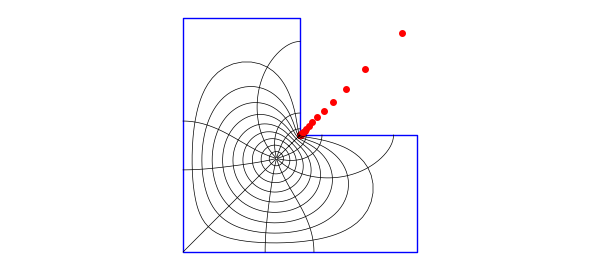
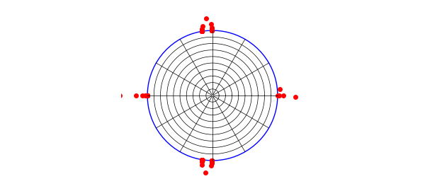
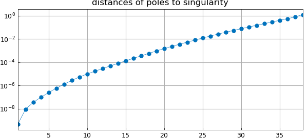

# Conformal mapping of an L-shaped region

*Nick Trefethen, October 2019*

[Original MATLAB Chebfun example](https://www.chebfun.org/examples/complex/ConformalL.html)

Python translation: [`examples/complex/conformal_l.py`](https://github.com/ma-gilles/chebfunjax/blob/main/examples/complex/conformal_l.py)

The problem of conformally mapping a simply connected domain $\Omega$ to the unit disk, with $f(z_c) = 0$ for a given point $z_c\in \Omega$, can be reduced to a Laplace problem on $\Omega$. If $u$ is a real harmonic function that satisfies $u(z) = -\log|z-z_c|$ on the boundary of $\Omega$, then the conformal map is $f(z) = (z-z_c)\exp (u(z) + i v(z))$, where $v$ is the harmonic conjugate of $u$. To solve this Laplace problem numerically, an easy method is to expand $u$ as a linear combination of a suitable family of harmonic functions -- real and imaginary parts of analytic functions -- and find expansion coefficients by least-squares fitting in a set of sample points on the boundary [2,3].

This process gives the "boundary correspondence function", the homeomorphism between the boundary of $\Omega$ and the unit circle. From here, one can then approximate both $f$ and its inverse by rational functions using AAA approximation as described in [1], invoking the the Chebfun `aaa` command. The resulting representations of $f$ and $f^{-1}$ can typically be evaluated in microseconds per point.

Here we apply this idea to a simple example of "Schwarz--Christoffel mapping without the Schwarz--Christoffel formula". The following commands determine the map of an L-shaped domain. We make use of an expansion basis consisting of two kinds of terms: powers $(z-z_0)^k$ for a point $z_0$ interior to $\Omega$, and fractional powers $z^{2k/3}$ to handle the singularity at the reentrant corner at $z=0$.

```matlab
  tic, N = 24;
  format short, warning off                       % suppress Froissart message
  Z = 1i*(1-tanh(12*linspace(1,0,5*N)'));         % sample pts on bndry
  Z = [Z(1:end-1); chebpts(2*N,[1i -1+1i])];
  Z = [Z(1:end-1); chebpts(2*N,[-1+1i -1-1i])];
  a = exp(.25i*pi);                               % 45 degree rotation
  Z = a*[Z/a; conj(Z(end-1:-1:1)/a)];
  mZ = a^3*Z/norm(Z,inf);                         % avoid branch cut
  z0 = -.5-.5i; cZ = (Z-z0)/norm(Z-z0,inf);
  k1 = (0:N); k2 = (1:N);                         % exponents for (z-z0)^k terms
  m1 = k1*(2/3); m2 = k2*(2/3);
  m1(3:3:end) = []; m2(3:3:end) = [];             % exponents for z^(2k/3) terms
  A = [real(cZ.^k1) imag(cZ.^k2) ...              % least-squares matrix
       real(mZ.^m2) imag(mZ.^m2)];
  zc = -.2-.2i;
  U = -log(abs(Z-zc));                            % right-hand side
  c = A\U;                                        % solve the problem
  boundary_err = norm(A*c-U,inf)                  % measure residual
  V = [imag(cZ.^k1) -real(cZ.^k2) ...             % conjugate harmonic fun
       imag(mZ.^m2) -real(mZ.^m2)]*c;
  W = (Z-zc).*exp(U+1i*V); W = W/W(1);            % boundary correspondence
  [f,pol] = aaa(W,Z,'tol',10*boundary_err);       % conformal map
  [finv,polinv] = aaa(Z,W,'tol',10*boundary_err); % inverse map
```

```text
boundary_err =
   5.2028e-07
```

Here is a plot of the map. The red dots show the poles of the AAA approximation, which represents $f$ to about six digits of accuracy. There are also a few more poles off-scale.

```matlab
  LW = 'linewidth'; MS = 'markersize';
  plot(Z,'b',LW,1)
  axis(1.1*[-1 1 -1 1]), axis square, hold on, axis off
  plot(pol,'.r',MS,10)
  ray = chebpts(100); ray = ray(ray>=0);
  for th = 2*pi*(1:12)/12, plot(finv(exp(1i*th)*ray),'k',LW,.5), end
  circ = exp(2i*pi*(0:200)/200);
  for r = .1:.1:.9, plot(finv(r*circ),'k',LW,.5), end, hold off
  number_of_poles_of_f = length(pol)
```

```text
number_of_poles_of_f =
    46
```



The curves just plotted are the images under $f^{-1}$ of circles and radial lines in the unit disk, which we now plot. The red dots are the poles of $f^{-1}$.

```matlab
  plot(W,'b',LW,1)
  axis(1.4*[-1 1 -1 1]), axis square, hold on, axis off
  plot(polinv,'.r',MS,10)
  for th = 2*pi*(1:12)/12, plot(exp(1i*th)*ray,'k',LW,.5), end
  for r = .1:.1:.9, plot(r*circ,'k',LW,.5), end, hold off
  number_of_poles_of_finv = length(polinv)
```

```text
number_of_poles_of_finv =
    67
```



A well-known effect, going back to Newman and 1964 and Zolotarev in the 19th century, is that poles of rational approximations tend to cluster exponentially near singularities [6]. Let us examine this effect for the first plot above, where the poles cluster near the reentrant corner. Here are the distances of those poles from the singularity plotted on a log scale. The curving down at the left edge is a known phenomenon, whcih is modeled in equation (3.2) of [2] and explained in [6].

```matlab
distances = sort(abs(pol(real(pol)>0 & imag(pol)>0)));
clf, semilogy(distances,'.-',MS,12,LW,.5), grid on
title('distances of poles to singularity')
```



The exponential clustering is striking. The see it quantitatively, we can look at the ratios of successive distances:

```matlab
ratios = distances(2:end)./distances(1:end-1)
```

```text
ratios =
    18.8106
    3.9764
    2.7747
    2.5037
    2.3872
    2.2352
    2.1073
    1.9633
    1.8047
    1.7333
    1.7002
    1.6879
    1.6591
    1.6464
    1.6368
    1.6390
    1.6299
    1.6290
    1.5899
    1.5527
    1.5267
    1.5120
    1.5070
    1.5044
    1.4865
    1.4656
    1.4449
    1.4273
    1.4166
    1.4054
    1.3942
    1.3862
    1.3835
    1.3854
    1.3913
    1.4215
    1.5653
```

For much more about numerical conformal mapping of regions with corners, see [4] and also the code `confmap` available at [5].

```matlab
total_time_for_this_example = toc
```

```text
total_time_for_this_example =
    1.2556
```

[1] A. Gopal and L. N. Trefethen, Representation of conformal maps by rational functions, *Numer. Math.* 142 (2019), 359-382.

[2] A. Gopal and L. N. Trefethen, Solving Laplace problems with corners singularities via rational functions, *SIAM J. Numer. Anal.* 57 (2019), 2074-2094.

[3] L. N. Trefethen, Conformal mapping in Chebfun, Chebfun example `chebfun.org/examples/complex/ConformalMapping.html`.

[4] L. N. Trefethen, Numerical conformal mapping with rational functions, *Computational Methods and Function Theory*, 20 (2020), 369-387.

[5] L. N. Trefethen, `confmap.m` code, `people.maths.ox.ac.uk/trefethen/lightning.html`.

[6] L. N. Trefethen, Y. Nakatsukasa, and J. A. C. Weideman, Exponential node clustering at singularities for rational approximation, quadrature, and PDEs, *Numerische Mathematik*, 147 (2021), 227-254.

---

*Translated with [chebfunjax](https://github.com/ma-gilles/chebfunjax); prose and MATLAB code from the original example, copyright The University of Oxford and The Chebfun Developers.  Printed outputs and figures are chebfunjax's.*
