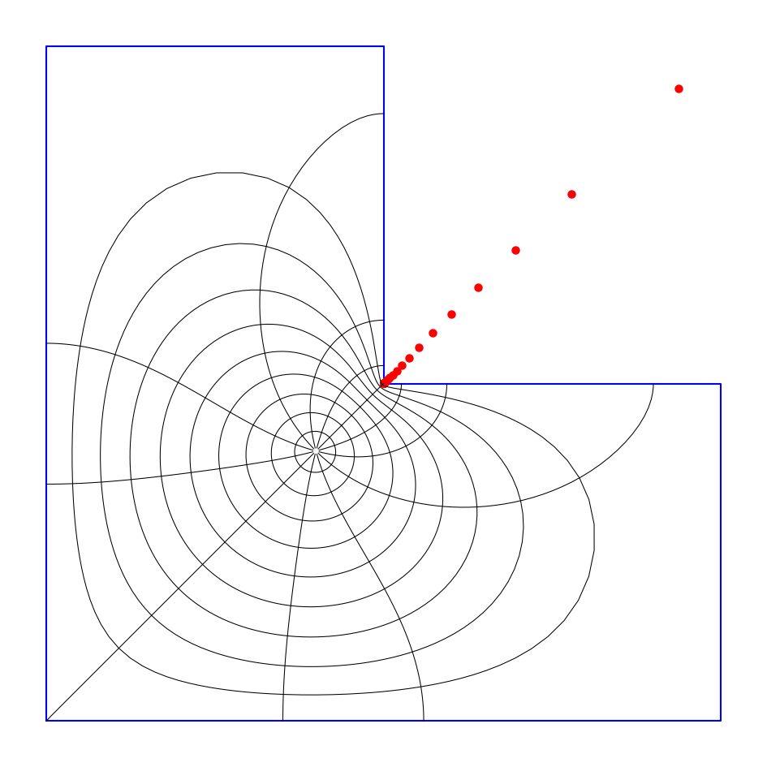
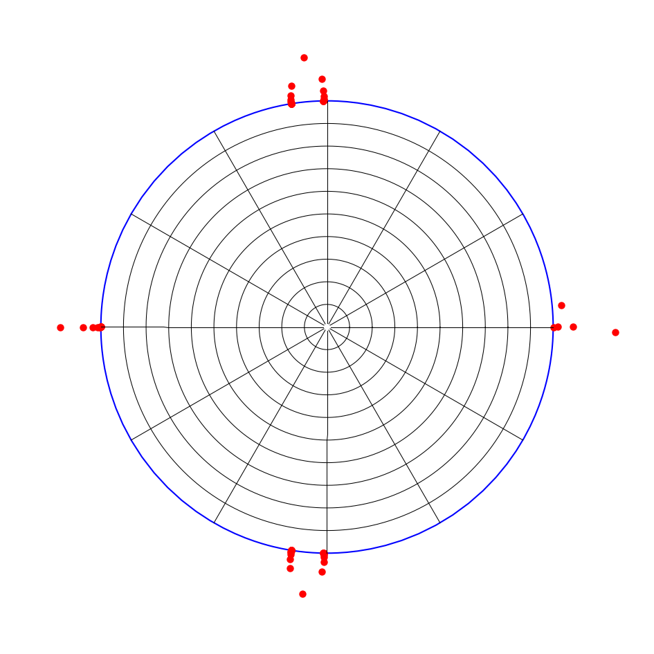
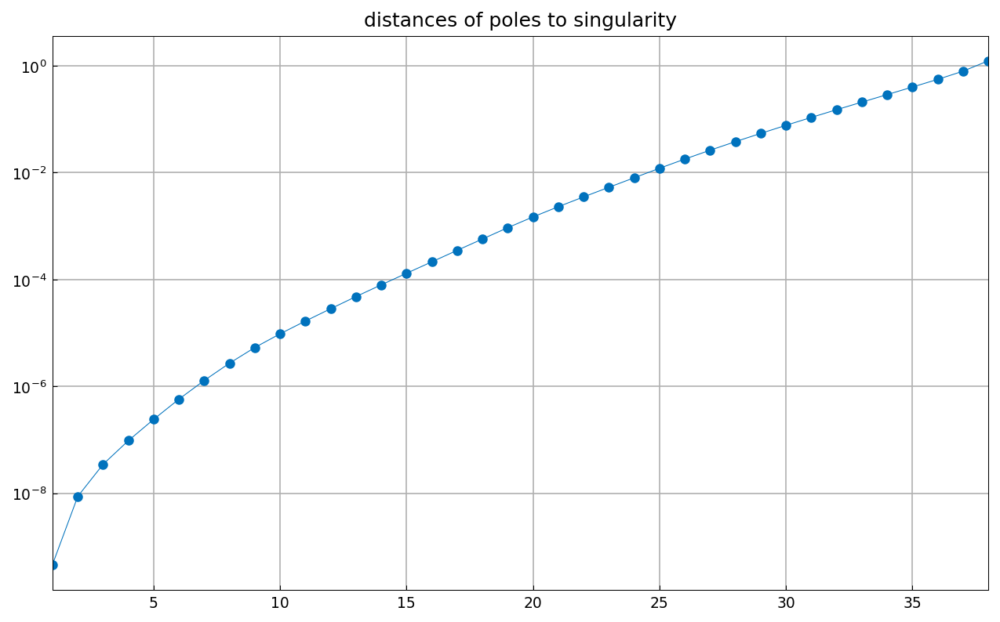

# Conformal mapping of an L-shaped region

*Nick Trefethen, October 2019*

[Original MATLAB Chebfun example](https://www.chebfun.org/examples/complex/ConformalL.html)

(Chebfun example complex/ConformalL.m)

The problem of conformally mapping a simply connected domain $\Omega$
to the unit disk with $f(z_c)=0$ reduces to a Laplace problem: if $u$
is harmonic with $u(z) = -\log|z-z_c|$ on the boundary, then
$f(z) = (z-z_c)\exp(u(z) + iv(z))$ with $v$ the harmonic conjugate.
We solve the Laplace problem by least-squares fitting a basis of
harmonic functions on boundary samples — powers $(z-z_0)^k$ plus
fractional powers $z^{2k/3}$ for the reentrant corner — then represent
$f$ and $f^{-1}$ by AAA rational approximation ("Schwarz-Christoffel
mapping without the Schwarz-Christoffel formula").

```text
boundary_err =
   5.2028e-07
```

The red dots are the poles of the AAA approximation, which represents
$f$ to about six digits:



```text
number_of_poles_of_f =
    46
```

The curves above are images under $f^{-1}$ of circles and radial lines
in the disk, plotted below with the poles of $f^{-1}$:



```text
number_of_poles_of_finv =
    67
```

(The 2019 published page reports 27 and 44 poles from the AAA of that
era; running the identical MATLAB code with Chebfun today gives 46 and
66, and chebfunjax's `aaa` on the byte-identical MATLAB data
reproduces 46 and 66 exactly — the small remaining difference here
comes from the rank-deficient least-squares step.)

Poles of rational approximations cluster exponentially near
singularities (Newman 1964, Zolotarev in the 19th century).  Here are
the distances of the poles from the reentrant corner on a log scale:



The ratios of successive distances show the exponential clustering
quantitatively, curving down at the left edge as modeled in equation
(3.2) of Gopal & Trefethen (2019).

## References

1. A. Gopal and L. N. Trefethen, Representation of conformal maps by
   rational functions, *Numer. Math.* 142 (2019), 359-382.
2. A. Gopal and L. N. Trefethen, Solving Laplace problems with corner
   singularities via rational functions, *SIAM J. Numer. Anal.* 57
   (2019), 2074-2094.
3. L. N. Trefethen, Numerical conformal mapping with rational
   functions, *Comput. Methods Funct. Theory* 20 (2020), 369-387.
4. L. N. Trefethen, Y. Nakatsukasa, and J. A. C. Weideman, Exponential
   node clustering at singularities for rational approximation,
   quadrature, and PDEs, *Numer. Math.* 147 (2021), 227-254.

---

*Replicated with [chebfunjax](https://github.com/ma-gilles/chebfunjax); original
example copyright The University of Oxford and The Chebfun Developers.*
