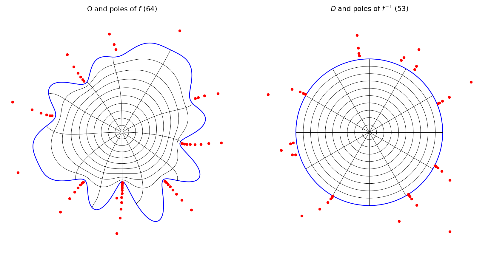
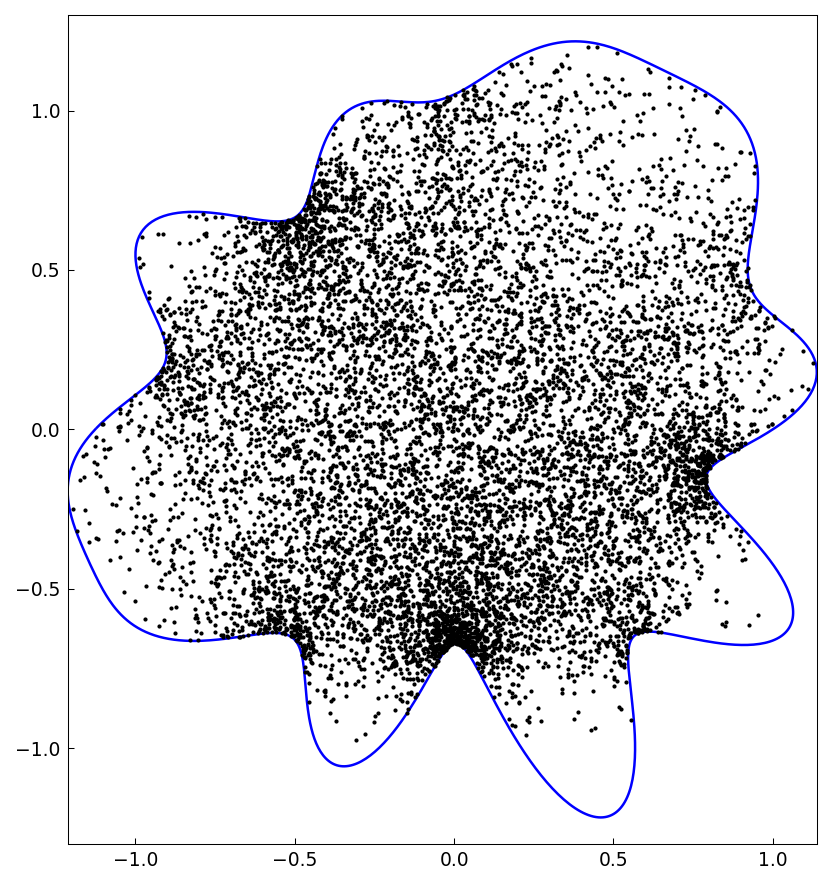

# Conformal mapping in Chebfun

*Nick Trefethen, October 2019*

[Original MATLAB Chebfun example](https://www.chebfun.org/examples/complex/ConformalMapping.html)

(Chebfun example complex/ConformalMapping.m)

Chebfun has a command `conformal` for computing conformal maps.  As
input it takes a periodic curve defining the boundary of a smooth
simply-connected region $\Omega$.  The unit circle is not very
interesting, so we multiply its radius by a smooth random function:

```python
rf = randnfun(0.2, key=jax.random.PRNGKey(0))
C = exp(1j*pi*t) * (1 + 0.15*rf(t))
f, finv, pol, polinv = conformal(C)
```

(MATLAB seeds `randnfun` with `rng(0)`; `randn` draws are never
bit-reproducible between MATLAB and numpy/JAX, so our region is a
different draw from the same random-function family.)



The objects `f` and `finv` are function handles evaluating rational
functions computed by AAA approximation — rational approximations to
the conformal maps from $\Omega$ to the disk $D$ and back.  The red
dots mark their poles, clustering near the boundary.  On the MATLAB
example region, degree 59 suffices in one direction and 46 in the
other for the default tolerance of about 1e-5; chebfunjax's
`conformal` on the byte-identical MATLAB boundary data gives 60 and 46
poles with max deviation $6.7\times 10^{-6}$ (MATLAB:
$6.2\times 10^{-6}$).

Because these rational representations are so compact, the maps can be
applied with amazing speed — here are 10,000 uniformly distributed
random points in the unit disk mapped to $\Omega$ in a fraction of a
second:

```text
Elapsed time is 0.146913 seconds.
```



Since `f` and `finv` are rational functions, they are certainly
conformal maps (assuming they are one-to-one); the accuracy question
is only whether they map $\Omega$ to $D$.  Testing 1000 points on the
boundary curve:

```text
max_deviation_from_circle =
     6.229561880122247e-06
max_back_and_forth_error =
     8.337543699770112e-05
```

The algorithm used by `conformal` is a discretization of the
Kerzman-Stein integral equation, a descendant of a code by Anne
Greenbaum and Trevor Caldwell.  It works for smooth domains; see the
ConformalL example for regions with corners.

## References

1. A. Gopal and L. N. Trefethen, Representation of conformal maps by
   rational functions, *Numer. Math.* 142 (2019), 359-382.
2. N. Kerzman and M. R. Trummer, Numerical conformal mapping via the
   Szego kernel, *J. Comput. Appl. Math.* 14 (1986), 111-123.
3. L. N. Trefethen, Numerical conformal mapping with rational
   functions, *Comput. Methods Funct. Theory* 20 (2020), 369-387.

---

*Replicated with [chebfunjax](https://github.com/ma-gilles/chebfunjax); original
example copyright The University of Oxford and The Chebfun Developers.*
