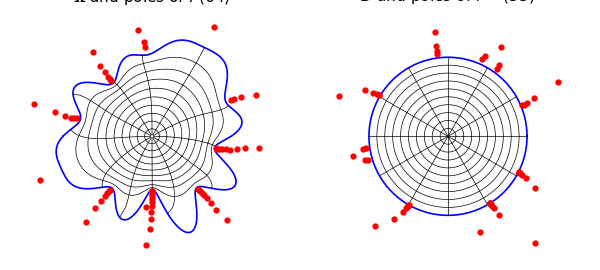
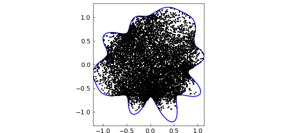

# Conformal mapping in Chebfun

*Nick Trefethen, October 2019*

[Original MATLAB Chebfun example](https://www.chebfun.org/examples/complex/ConformalMapping.html)

Python translation: [`examples/complex/conformal_mapping.py`](https://github.com/ma-gilles/chebfunjax/blob/main/examples/complex/conformal_mapping.py)

Chebfun has a new command `conformal` for computing conformal maps. As input it takes a periodic chebfun defining the boundary curve of a smooth simply-connected region $\Omega$ in the complex plane. For example, here is the unit circle:

```matlab
C = chebfun('exp(1i*pi*t)','trig');
```

That's not very interesting, so let's multiply the radius by a smooth random function:

```matlab
rng(0)
C = C.*(1+.15*randnfun(.2,'trig'));
```

To compute and plot the conformal map of $\Omega$ onto the unit disk $D$, normalized by default by $f(0)=0$ and $f'(0)>0$, we type

```matlab
tic
[f, finv] = conformal(C,'plots');
toc
```

```text
Elapsed time is 1.433953 seconds.
```



The red dots show a very interesting aspect of the numerical method used to represent these maps. The objects `f` and `finv` are function handles corresponding to rational functions computed by the AAA rational approximation command `aaa`, rational approximations to the conformal maps from $\Omega$ to $D$ and from $D$ to $\Omega$, respectively. For this example, we see that a rational function of degree $59$ (i.e., 59 poles and zeros) is enough to achieve the default tolerance of about 1e-5 in one direction and degree $46$ is enough in the other. The red dots mark poles of `f` on the left and `finv` on the right, and their clustering near the boundary reflects the powerful role that rational functions can play in problems like this. See [1] and [3].

Because these rational representations are so compact, the maps can be applied with amazing speed. For example, here are 10,000 uniformly distributed random points in the unit disk:

```matlab
W = 2*rand(2e4,1)-1 + 2i*rand(2e4,1)-1i;
W = W(abs(W)<1); W = W(1:1e4);
```

We can compute the images in $\Omega$ of all 10,000 points in around one hundredth of a second:

```matlab
tic, Z = finv(W); toc
clf, plot(C,'b'), hold on
plot(Z,'.k','markersize',3), hold off
ylim([-1.3 1.3]), axis equal
```

```text
Elapsed time is 1.433953 seconds.
```



Since `f` and `finv` are rational functions, they are certainly conformal maps (assuming they are one-to-one); the accuracy question is only whether they map $\Omega$ to $D$. As a simple test of this, here are 1000 points on the boundary curve $C$:

```matlab
W = C(linspace(-1,1,1001));
```

The images come very close to absolute value $1$, as required:

```matlab
Z = f(W);
max_deviation_from_circle = norm( abs(Z)-1 , inf)
```

```text
max_deviation_from_circle =
     6.229561869686151e-06
```

As a test of how accurately `f` and `finv` are inverses of each other, we compare the computed preimages of these points `Z` to the original set of points `W`:

```matlab
W2 = finv(Z);
max_back_and_forth_error = norm( W-W2 , inf)
```

```text
max_back_and_forth_error =
     8.337543733114265e-05
```

The algorithm used by `conformal` is a discretization of the Kerzman-Stein integral equation [2], and our code is a descendant of one written by Anne Greenbaum and Trevor Caldwell of the University of Washington. This code only works for smooth domains, but we hope to introduce capabilities for regions with corners in the future.

To learn more about `conformal`, type `help conformal`. For example, an optional additional argument can be used to specify a center point in $\Omega$ other than $0$. One can also tighten the tolerance, though the exponential distortions inherent in conformal maps (the "crowding phenomenon") make it hard to get close to machine precision except for very simple regions.

[1] A. Gopal and L. N. Trefethen, Representation of conformal maps by rational functions, *Numer. Math.* 142 (2019), 359-382.

[2] N. Kerzman and M. R. Trummer, Numerical conformal mapping via the Szegö kernel, *J. Comput. Appl. Math.* 14 (1986), 111-123.

[3] L. N. Trefethen, Numerical conformal mapping with rational functions, *Computational Methods and Function Theory* (2020), 1-19.

---

*Translated with [chebfunjax](https://github.com/ma-gilles/chebfunjax); prose and MATLAB code from the original example, copyright The University of Oxford and The Chebfun Developers.  Printed outputs and figures are chebfunjax's.*
