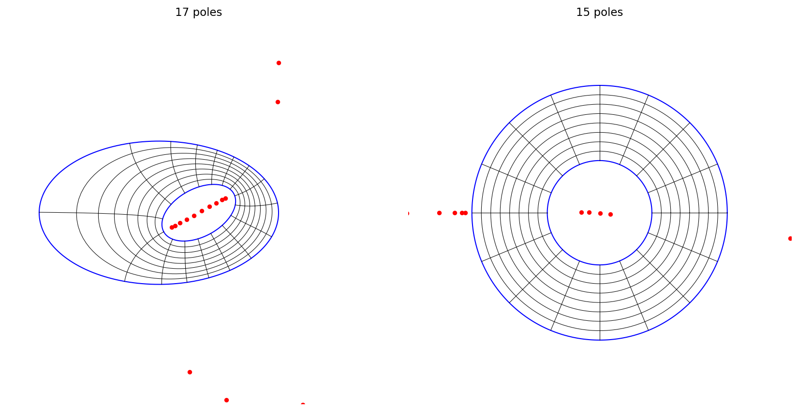
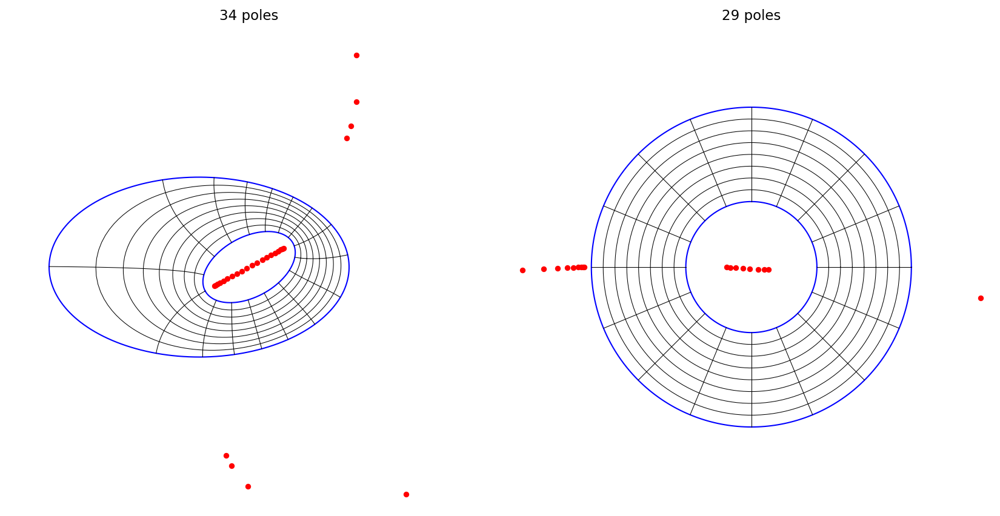
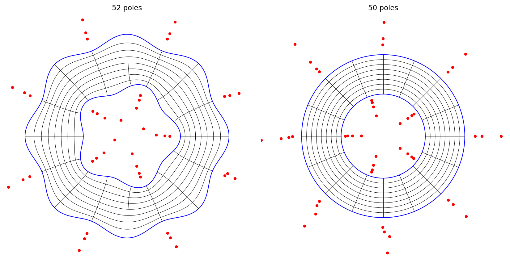
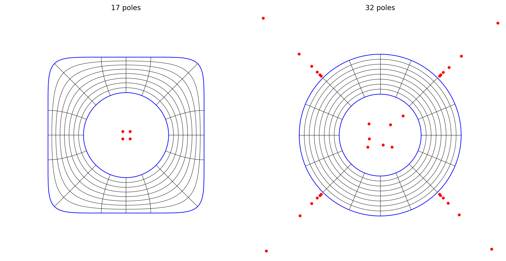

# Conformal maps to an annulus

*Nick Trefethen, March 2020*

[Original MATLAB Chebfun example](https://www.chebfun.org/examples/complex/ConformalMapping2.html)

(Chebfun example complex/ConformalMapping2.m)

By the Riemann mapping theorem, a simply-connected region can be
mapped conformally to the unit disk.  A doubly-connected region can be
mapped to a circular annulus $\rho < |w| < 1$, but the conformal
modulus $\rho$ is not known in advance: it is determined as part of
the computation.  The `conformal2` command handles this.  Here is an
ellipse-in-ellipse example:

```python
ellipse = circle.real + 0.6j*circle.imag
C1 = 3*ellipse - 1
C2 = exp(0.5j)*ellipse
f, finv, rho, pol, polinv = conformal2(C1, C2)
```



```text
rho =
   0.409705344072606
```

Tightening the tolerance to 1e-12 confirms the modulus (MATLAB gets
0.409705344001634 — identical to all 15 digits):



```text
rho =
   0.409705344001634
```

The maps are rational functions, so they are fast and accurately
inverses of each other:

```text
ans =
  1.000000000000033 + 0.000000000000001i
  -0.000000000000004 + 1.000000000000002i
```

A million points map back and forth in a fraction of a second:

```text
Elapsed time is 0.376741 seconds.
```

Here are wavy boundaries (MATLAB: rho = 0.515907564661642; ours
agrees to 9 digits):



```text
rho =
   0.515907564248333
```

The boundaries can come from anywhere — here the outer boundary is
the zero contour of the chebfun2 $x^8+y^8-1/2$ (MATLAB:
rho = 0.506114112297563; ours agrees to 11 digits):



```text
rho =
   0.506114112299566
```

---

*Replicated with [chebfunjax](https://github.com/ma-gilles/chebfunjax); original
example copyright The University of Oxford and The Chebfun Developers.*
