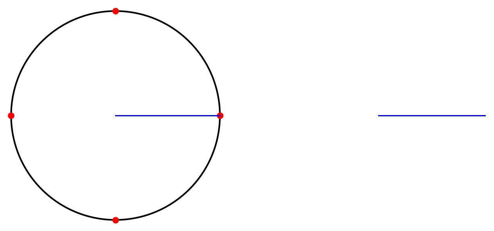
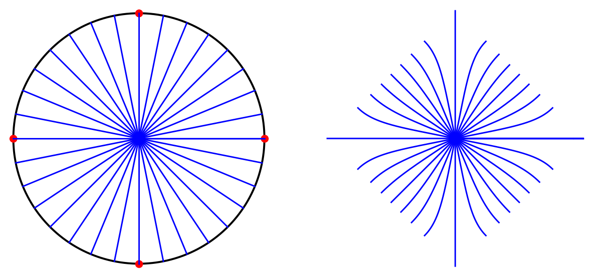
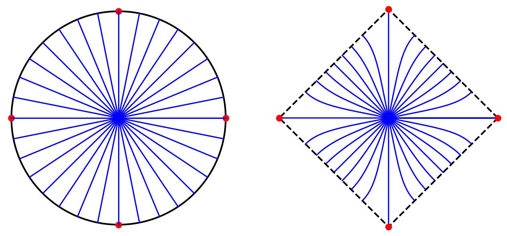
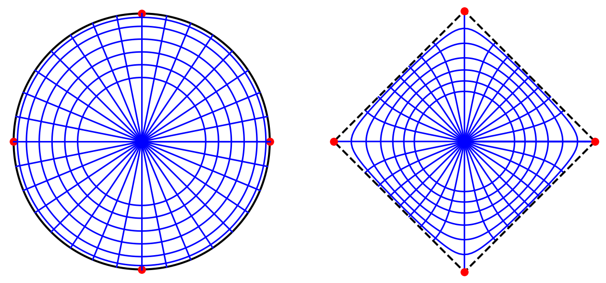
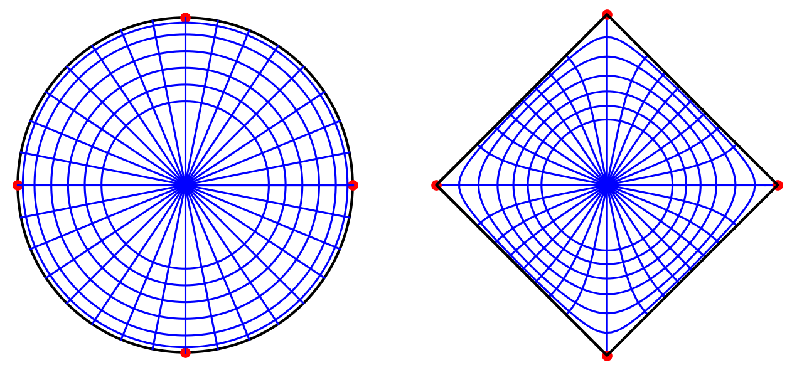

# Conformal map to a square

*Toby Driscoll, January 2013*

[Original MATLAB Chebfun example](https://www.chebfun.org/examples/complex/ConformalSquare.html)

(Chebfun example complex/ConformalSquare.m)

An analytic function creates a conformal map between regions of the
complex plane, distorting lengths but exactly preserving angles.  The
Schwarz-Christoffel formula gives the derivative of the map $f$ from
the unit disk to a polygon with prevertices $z_k$ and interior angles
$\pi\alpha_k$:

$$ f'(z) = c \prod_{k=1}^n \left(1-\frac{z}{z_k}\right)^{\alpha_k-1}. $$

For a square we impose fourfold symmetry, $z_k = 1, i, -1, -i$ and
$\alpha_k = 1/2$.  Integrating $f'$ along the ray $[0,1]$ with
`cumsum` (the integrand has an inverse-square-root endpoint
singularity; construction with splitting grinds at the corner exactly
as MATLAB's published output does, yet the corner value
$w(1) = 1.31102875$ agrees with the exact lemniscatic value
$1.31102878$ to $3\times 10^{-8}$):

```python
z = chebfun(lambda x: x, domain=(0, 1))
w = fprime_chebfun.cumsum()
```



Integrating along 33 rays from the origin shows the square turned so
its corners point in the compass directions; except at the corners,
every ray meets the boundary at a perfect right angle:





The images of circles of different radii complete the orthogonal
network:



Finally the boundary circle itself maps onto the square, acquiring
square-root singularities at the four corners (MATLAB handles these
with SINGFUN and prints accuracy warnings; here the endpoint
singularities are removed exactly by a smoothstep substitution before
quadrature):



For more on Schwarz-Christoffel mapping see Driscoll & Trefethen,
*Schwarz-Christoffel Mapping*, Cambridge U. Press, 2002.

---

*Replicated with [chebfunjax](https://github.com/ma-gilles/chebfunjax); original
example copyright The University of Oxford and The Chebfun Developers.*
