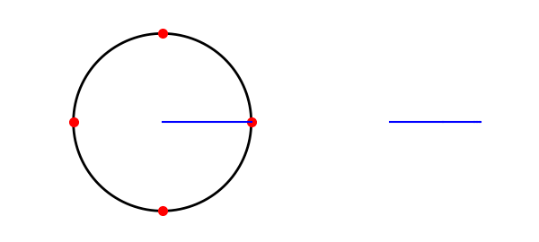
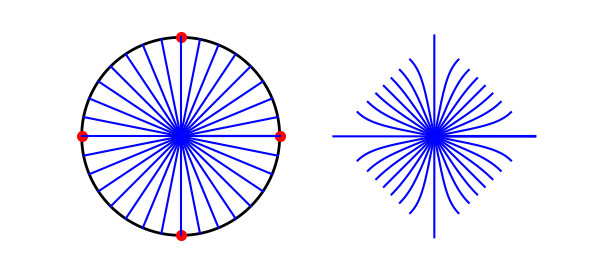
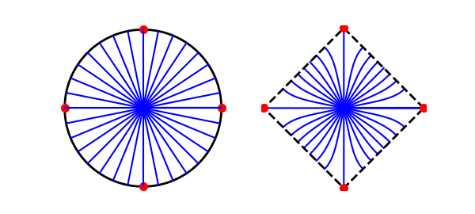
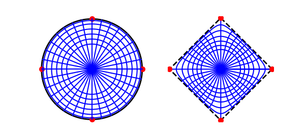
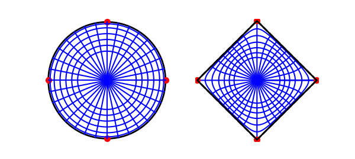

# Conformal map to a square

*Toby Driscoll, January 2013*

[Original MATLAB Chebfun example](https://www.chebfun.org/examples/complex/ConformalSquare.html)

Python translation: [`examples/complex/conformal_square.py`](https://github.com/ma-gilles/chebfunjax/blob/main/examples/complex/conformal_square.py)

An analytic function creates a conformal map between regions of the complex plane. These maps distort lengths but exactly preserve all angles. These maps turn out to be useful in some classical physics applications, most notably those using the 2D Laplace equation.

While analytic functions, and hence conformal maps, are hardly rare, finding the conformal map between two given regions is an old and interesting problem. A major breakthrough was discovered in the 1860's simultaneously by Schwarz and Christoffel and is known now as the Schwarz-Christoffel formula.

Let $f(z)$ be the map from the interior of the unit disk to the interior of a region bounded by a polygon with $n$ vertices. Then $$ f'(z) = c \prod_{k=1}^n \left(1-\frac{z}{z_k}\right)^{\alpha_k-1}. $$

In this formula, the points $z_1,\ldots,z_n$ are the inverse images of the vertices (or *prevertices*) of the polygon, and the interior angles of the polygon are given by $\pi\alpha_1,\ldots,\pi\alpha_n$.

One cannot choose the prevertices arbitrarily in general, as they are nonlinearly constrained by the side lengths of the target polygon. However, symmetry is often useful at reducing the difficulty of this problem. If the target region is a square, then we can impose fourfold symmetry on the prevertices as well:

```matlab
zpre = [ 1, 1i, -1, -1i ];
```

Given the prevertices, and the fact that $\alpha_k=1/2$ for each $k$, we now can compute the derivative of the map anywhere:

```matlab
fprime = @(z) ( (1-z/zpre(1)).*(1-z/zpre(2)).*(1-z/zpre(3)).*(1-z/zpre(4)) ).^(-0.5);
```

Now we'll integrate $f'$ to get the mapping along the ray $[0,1]$.

```matlab
z = chebfun('z',[0 1]);
w = cumsum( fprime(z) )
```

```text
w =
   chebfun column (55 smooth pieces)
       interval       length     endpoint values
[       0,    0.74]       32     complex values
[    0.74,    0.99]       85     complex values
[    0.99,       1]       29     complex values
[       1,       1]       72     complex values
[       1,       1]       17     complex values
[       1,       1]       85     complex values
[       1,       1]       14     complex values
[       1,       1]       14     complex values
[       1,       1]       10     complex values
[       1,       1]        9     complex values
[       1,       1]        9     complex values
[       1,       1]        9     complex values
[       1,       1]        9     complex values
[       1,       1]        9     complex values
[       1,       1]        9     complex values
[       1,       1]        9     complex values
[       1,       1]        9     complex values
[       1,       1]        9     complex values
[       1,       1]        9     complex values
[       1,       1]        9     complex values
[       1,       1]        4     complex values
[       1,       1]        9     complex values
[       1,       1]        9     complex values
[       1,       1]        9     complex values
[       1,       1]        9     complex values
[       1,       1]        9     complex values
[       1,       1]        9     complex values
[       1,       1]        9     complex values
[       1,       1]        9     complex values
[       1,       1]        9     complex values
[       1,       1]        9     complex values
[       1,       1]      130     complex values
[       1,       1]        9     complex values
[       1,       1]      130     complex values
[       1,       1]      130     complex values
[       1,       1]        9     complex values
[       1,       1]        9     complex values
[       1,       1]        9     complex values
[       1,       1]        9     complex values
[       1,       1]        9     complex values
[       1,       1]        9     complex values
[       1,       1]        9     complex values
[       1,       1]        9     complex values
[       1,       1]      130     complex values
[       1,       1]        9     complex values
[       1,       1]      130     complex values
[       1,       1]        9     complex values
[       1,       1]        9     complex values
[       1,       1]        9     complex values
[       1,       1]      130     complex values
[       1,       1]        9     complex values
[       1,       1]        9     complex values
[       1,       1]        9     complex values
[       1,       1]        9     complex values
[       1,       1]      130     complex values
vertical scale = 1.3    Total length = 1614
corner value w(1) = 1.31102831 (exact lemniscatic value 1.31102878)
```

In fact, the resulting expression is essentially real.

```matlab
zcirc = exp(1i*chebfun('t',[0 2*pi]));
subplot(1,2,1), LW = 'linewidth'; MS = 'markersize';
plot(zcirc,'k',LW,2)
hold on, plot(zpre,'r.',MS,20)
axis equal, axis(1.05*[-1 1 -1 1]), axis off
plot(real(z),imag(z),'b',LW,1.5)
subplot(1,2,2)
plot(w,'b',LW,1.5)
hold on, axis equal, axis(1.35*[-1 1 -1 1]), axis off
```



Now we'll start to make things interesting by integrating along different rays from the origin. We have to account for the direction of the ray in our integration, through the relation $\int f'(z)\,dz = \int f'(z(r))\, z'(r)\,dr$.

```matlab
for t = linspace(0,2*pi,33)
    z = chebfun('r',[0 1])*exp(1i*t);
    subplot(1,2,1), plot(real(z),imag(z),'b',LW,1.5)
    subplot(1,2,2), plot( cumsum(fprime(z)*exp(1i*t)), 'b',LW,1.5 )
end
```



It's now apparent that the square is turned so that the corners point in the compass directions.

```matlab
subplot(1,2,2)
plot(w(1)*zpre([1:4 1]),'k--',LW,2), plot(w(1)*zpre,'r.',MS,20)
```



Except for the rays that end at corners, each one makes a perfect right angle with the boundary of the square.

We finish the picture by plotting the images of circles of different radii. We have to use the chain rule to account for integrating over the curved paths. We also have to account for the integration constant, which was implicitly defined by $f(0)=0$, by using the value of $w$ we computed along the first ray.

```matlab
for r = [.5 .6 .7 .8 .9 .97]
    z = r*zcirc;
    f = w(r) + cumsum( fprime(z).*diff(z) );
    subplot(1,2,1), plot(z,'b',LW,1.5)
    subplot(1,2,2), plot(f,'b',LW,1.5)
end
```



Thanks to conformality, both networks of curves make orthogonal intersections.

The boundary is interesting. The map can't be conformal there, because the smooth curve obtains 90 degree corners. In fact, this observation shows that the mapping will have square-root singularities at those points. Nevertheless, Chebfun's built-in integration is able to handle those singularities, because we constructed them from smooth Chebfun objects.

```matlab
f = w(1) + cumsum( fprime(zcirc).*diff(zcirc) );
subplot(1,2,2), plot(f,'k',LW,2)
```

```text

```



For more on Schwarz-Christoffel mapping, see [1]. For general-purpose SC mapping software, refer to [2] and [3].

## References

1. T. A. Driscoll and L. N. Trefethen, Schwarz-Christoffel Mapping, Cambridge U. Press, 2002.
2. T. A. Driscoll, , ACM Transactions on Mathematical Software 31 (2005), 239-251. T. A. Driscoll, Schwarz-Christoffel Mapping Toolbox for MATLAB. [http://www.math.udel.edu/~driscoll/SC](http://www.math.udel.edu/~driscoll/SC) © Copyright 2025 the University of Oxford and the Chebfun Developers.

---

*Translated with [chebfunjax](https://github.com/ma-gilles/chebfunjax); prose and MATLAB code from the original example, copyright The University of Oxford and The Chebfun Developers.  Printed outputs and figures are chebfunjax's.*
