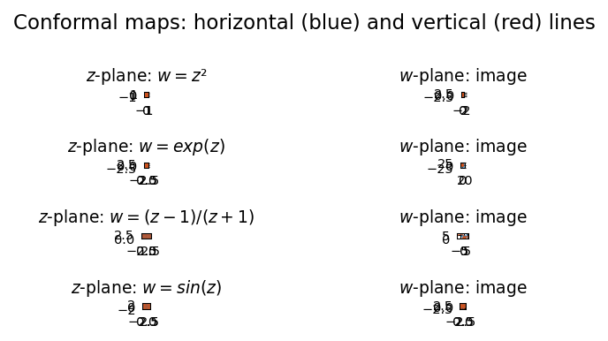

# Visualizing conformal maps

**Nick Trefethen, December 2016**

[Original MATLAB Chebfun example](https://www.chebfun.org/examples/complex/ConformalVis.html)

---

A *conformal map* is an angle-preserving map of the complex plane. The
standard way to visualise one is to apply it to a grid of horizontal and
vertical lines and observe how the straight lines become curves.

## Four classical maps

| Map | Formula | Property |
|-----|---------|---------|
| Squaring | $w = z^2$ | Doubles angles; maps upper half-plane to full plane |
| Exponential | $w = e^z$ | Maps horizontal strip to annulus |
| Cayley | $w = (z-1)/(z+1)$ | Maps right half-plane to unit disk |
| Sine | $w = \sin(z)$ | Maps horizontal strip to cut plane |

```python
import numpy as np
import matplotlib.pyplot as plt

def plot_conformal(ax_in, ax_out, f, xlim=(-2,2), ylim=(-2,2),
                  n_lines=12, title=""):
    # Horizontal lines
    for y in np.linspace(ylim[0], ylim[1], n_lines):
        z = np.linspace(xlim[0], xlim[1], 400) + 1j*y
        w = f(z)
        ax_out.plot(w.real, w.imag, 'b-', lw=0.7)
    # Vertical lines
    for x in np.linspace(xlim[0], xlim[1], n_lines):
        z = x + 1j*np.linspace(ylim[0], ylim[1], 400)
        w = f(z)
        ax_out.plot(w.real, w.imag, 'r-', lw=0.7)
    ax_out.set_title(title)
    ax_out.set_aspect('equal')
```

## The Cayley map

$(z-1)/(z+1)$ maps the right half-plane $\text{Re}(z) > 0$ to the unit disk
$|w| < 1$, and the imaginary axis to the unit circle:

```python
cayley = lambda z: (z - 1) / (z + 1)

# Verify: Re(z) > 0 → |w| < 1
z_test = 2.0 + 1j
w_test = cayley(z_test)
print(f"|w| = {abs(w_test):.6f}  (should be < 1)")

# Imaginary axis → unit circle
z_imag = 1j
w_imag = cayley(z_imag)
print(f"|cayley(i)| = {abs(w_imag):.6f}  (should be 1)")
```

## Gallery



Grid lines mapped by $z^2$, $e^z$, $(z-1)/(z+1)$, and $\sin(z)$.
