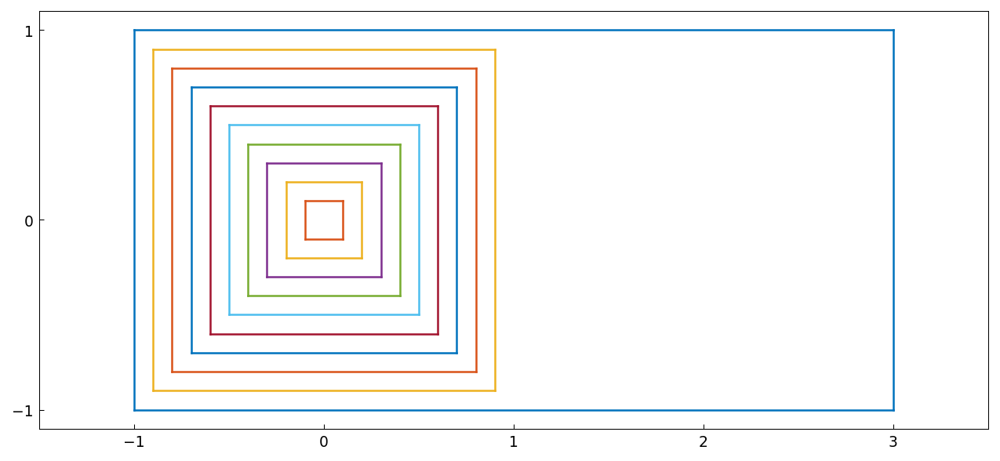
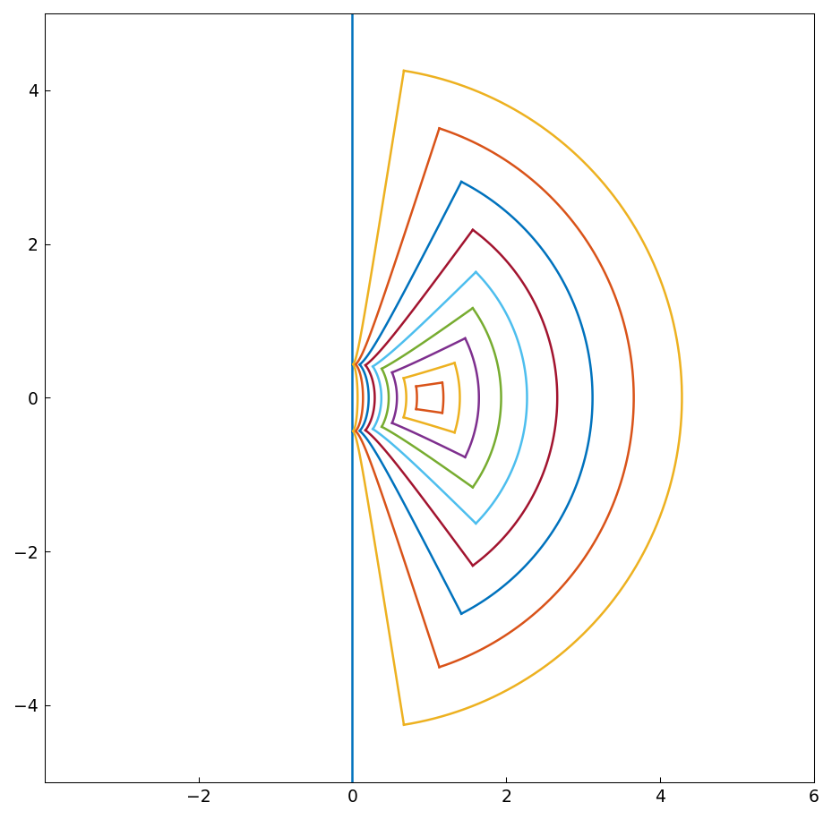
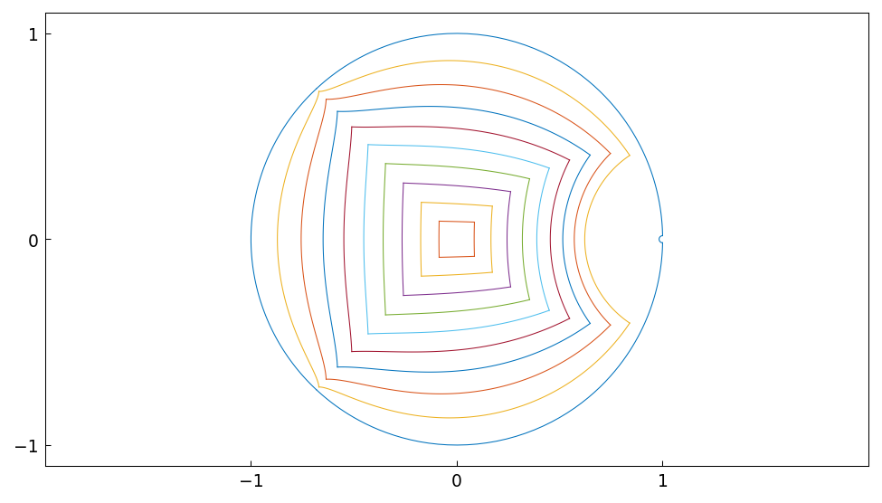
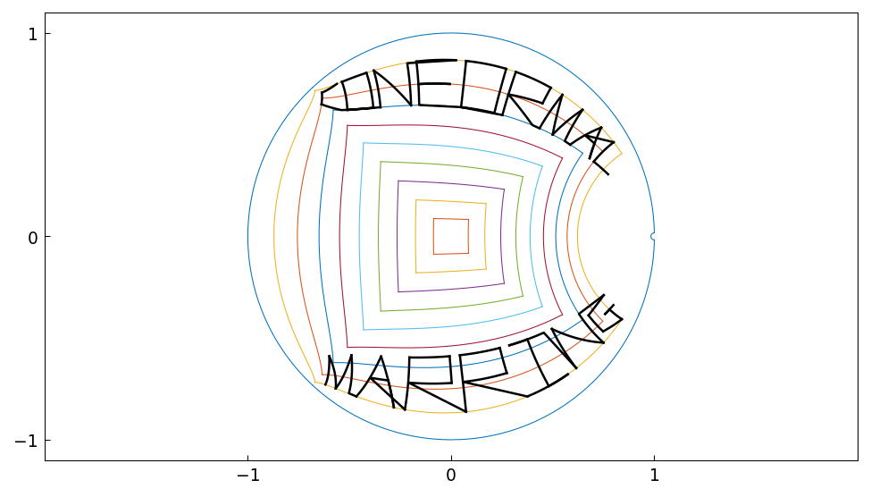
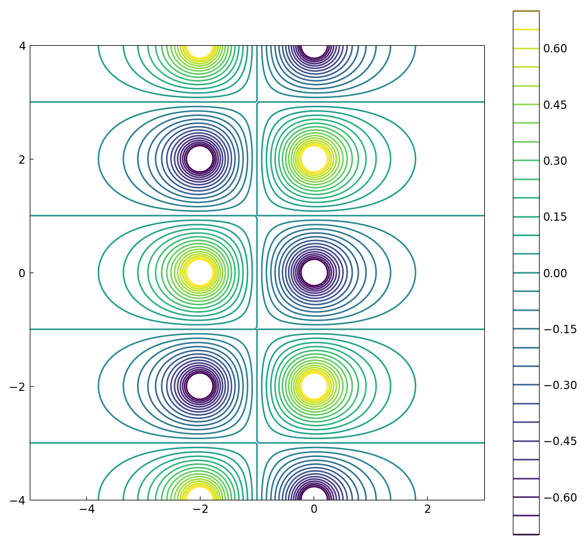

# Visualizing conformal maps

*Nick Trefethen, December 2016*

[Original MATLAB Chebfun example](https://www.chebfun.org/examples/complex/ConformalVis.html)

(Chebfun example complex/ConformalVis.m)

Chebfun is a convenient tool for visualizing conformal maps because it
works at the level of curves rather than points.  Here we map an
infinite half-strip ($\mathrm{Re}\,z \ge -1$, $|\mathrm{Im}\,z| \le 1$)
to the unit disk.  Each concentric square is a single complex chebfun
constructed with the `join` command:

```python
s = chebfun(lambda x: x)
unitsquare = (-1j+s).join(1+1j*s, 1j-s, -1-1j*s)
```



First, $g(z) = \sinh(\pi(z+1)/2)/\sinh(\pi/2)$ maps the half-strip to
the right half-plane:



Next, the Mobius transformation $h(w) = (w-1)/(w+1)$ maps the
half-plane to the unit disk, giving $f = h \circ g$:



For fun we add some text with `scribble` and map it too:



A contour plot of $\log_{10}|f(z)|$ shows the level curves of the
modulus of the map:



---

*Replicated with [chebfunjax](https://github.com/ma-gilles/chebfunjax); original
example copyright The University of Oxford and The Chebfun Developers.*
