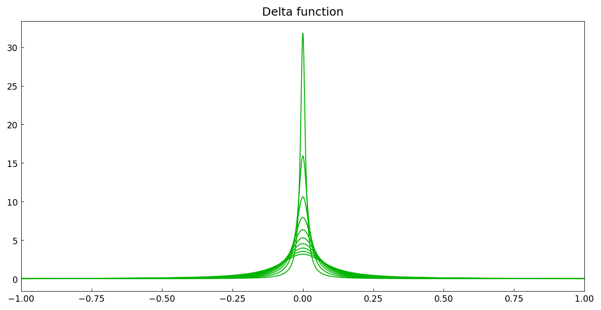
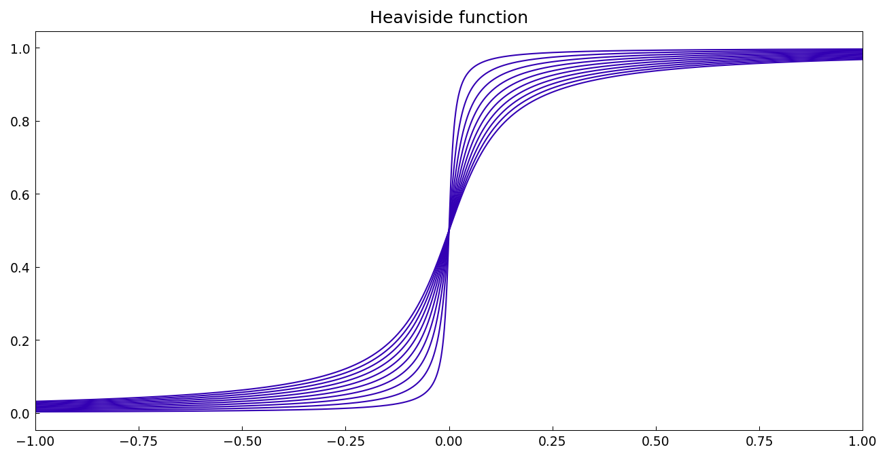

# Hyperfunctions

*Nick Trefethen, June 2013*

[Original MATLAB Chebfun example](https://www.chebfun.org/examples/complex/Hyperfuns.html)

(Chebfun example complex/Hyperfuns.m)

The theory of hyperfunctions represents generalized functions on the
real line as differences of analytic functions evaluated just above and
just below the axis.  The delta function is the hyperfunction of
$F(z) = -1/(2\pi i z)$:

$$ \delta(x) = \lim_{\epsilon\to 0}\;
\mathrm{Re}\left[F(x+i\epsilon)-F(x-i\epsilon)\right]. $$

```python
F = lambda z: -1.0/(2j*np.pi*z)
delta_ep = np.real(F(x + 1j*ep) - F(x - 1j*ep))
```



(Each curve integrates to exactly 1.)  Likewise the Heaviside step is
the hyperfunction of $G(z) = -\log(-z)/(2\pi i)$:



---

*Replicated with [chebfunjax](https://github.com/ma-gilles/chebfunjax); original
example copyright The University of Oxford and The Chebfun Developers.*
