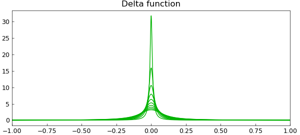
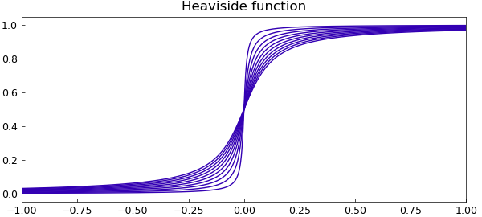

# Delta and Heaviside hyperfunctions

*Mohsin Javed, April 2012*

[Original MATLAB Chebfun example](https://www.chebfun.org/examples/complex/Hyperfuns.html)

Python translation: [`examples/complex/hyperfuns.py`](https://github.com/ma-gilles/chebfunjax/blob/main/examples/complex/hyperfuns.py)

## Introduction

Hyperfunction theory describes a generalized function $f(x)$ on the real line by viewing it as the difference between two generating functions $F_+(z)$ and $F_-(z)$, holomorphic in the upper and lower complex planes, respectively. The value of $f(x)$ at a *regular point* $x$ on the real line is calculated by taking the difference of the upper and lower parts of the generating functions and then applying the limit,

$$ \lim_{\varepsilon\to 0} [ F_+(x+i\varepsilon) - F_-(x-i\varepsilon) ] $$

i.e., we approach the real axis from directly above and below the point $x$. If the limit does not exist, $x$ is called a *singular point* of $f$ and it does not make sense to talk about the value of $f$ at $x$ [1].

A given hyperfunction does not have a unique choice of generators; you can add any analytic function to $F_+$ and $F_-$ without changing their difference along the real axis. So properly speaking, a hyperfunction is an equivalence class.

## The Dirac delta function

An elegant choice of generating function for the Dirac delta function is to take both $F_-$ and $F_+$ equal to the same function,

```matlab
F = @(z) -1./(2i*pi*z);
```

Thus in this case $F_+ = F_-$.

## The Heaviside function

The Heaviside function also has an elegant choice of generator, again with $G_- = G_+$ equal to the same function, the integral of the previous one:

```matlab
G = @(z) -1/(2*pi*1i)*log(-z);
```

Using the above definitions, we define anonymous functions to describe the delta function and the Heaviside function on the interval $[-1,1]$. Note that we take the real part only to remove imaginary rounding errors.

```matlab
x = chebfun('x');
hyperDelta = @(ep) real(F(x+1i*ep)-F(x-1i*ep));
hyperHeaviside = @(ep) real(G(x+1i*ep)-G(x-1i*ep));
```

We now imitate the limiting process by taking small values of the parameter $\varepsilon$ and plotting the corresponding functions below. First, delta functions.

```matlab
for ep = .1:-.01:.001;
    plot(hyperDelta(ep), 'color', [0 .7 0]), hold on
end
title('Delta function','fontsize',12), hold off
```



Next, Heaviside functions.

```matlab
for ep = .1:-.01:.001;
    plot(hyperHeaviside(ep), 'color', [.2 0 .7]), hold on
end
title('Heaviside function','fontsize',12), hold off
```



## References

1. Urs Graf, *Introduction to Hyperfunctions and Their Integral Transforms: An Applied and Computational Approach*, Birkhäuser, 2010.

---

*Translated with [chebfunjax](https://github.com/ma-gilles/chebfunjax); prose and MATLAB code from the original example, copyright The University of Oxford and The Chebfun Developers.  Printed outputs and figures are chebfunjax's.*
