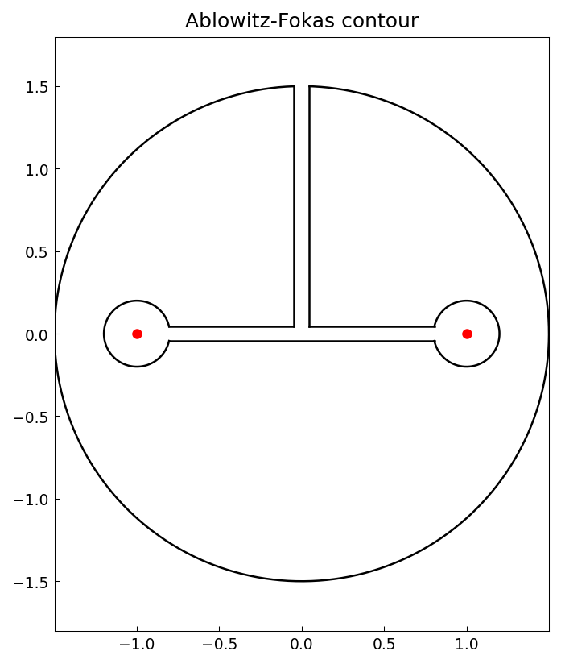
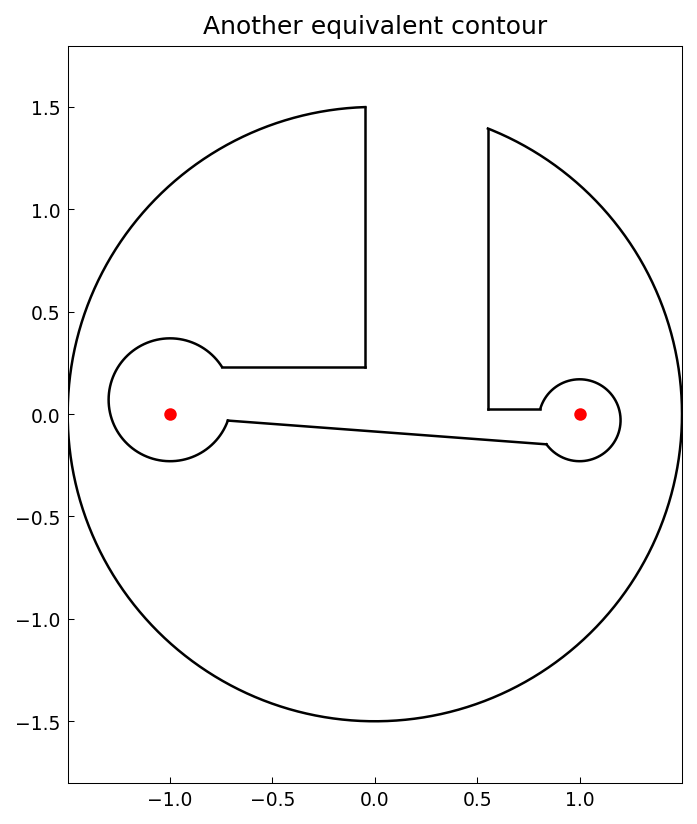

# A double-keyhole contour of Ablowitz and Fokas

*Nick Trefethen, December 2019*

[Original MATLAB Chebfun example](https://www.chebfun.org/examples/complex/KeyholeAblowitzFokas.html)

(Chebfun example complex/KeyholeAblowitzFokas.m)

Ablowitz and Fokas's complex-analysis textbook features the integral of

$$ f(z) = \frac{i}{2\pi}\,\frac{(z^2-1)^{1/2}}{1+z^2} $$

(with the branch of the square root that behaves like $z$ at infinity)
around a contour that encircles the branch cut $[-1,1]$ — a big
circular arc with two small keyholes around the branch points:



Parametrizing the eight pieces and integrating $f(z(t))z'(t)$:

```
I =
  0.707106781186548 - 0.000000000000000i
Iexact =
   0.707106781186548
```

By Cauchy's theorem, any homotopic contour gives the same answer.
Here is a lopsided variant — different arc angles, shifted circle
centers, unequal radii:



```
I =
  0.707106781186548 + 0.000000000000000i
```

Both integrals equal $\sqrt 2/2$ to the last digit, matching the
published outputs.

---

*Replicated with [chebfunjax](https://github.com/ma-gilles/chebfunjax); original
example copyright The University of Oxford and The Chebfun Developers.*
