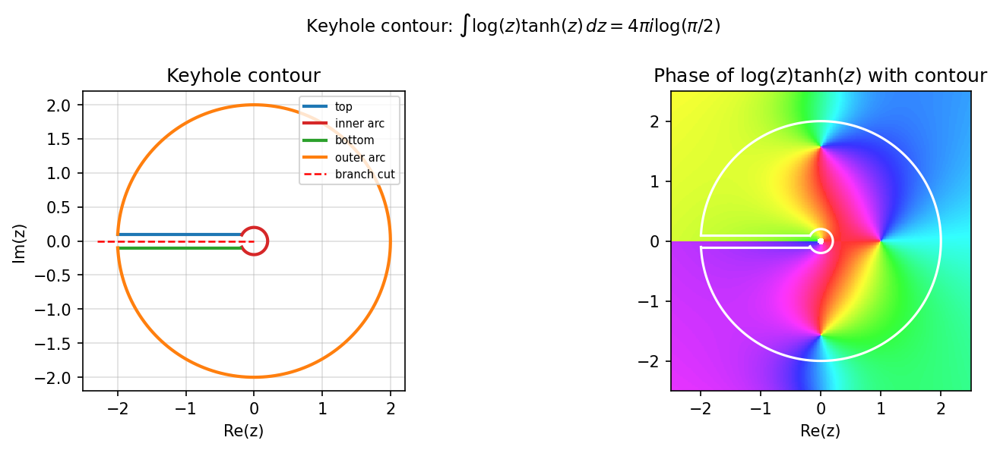

# A keyhole contour integral

**Nick Trefethen and Nick Hale, October 2010 (revised June 2019)**

[Original MATLAB Chebfun example](https://www.chebfun.org/examples/complex/KeyholeContour.html)

---

Chebfun can represent complex-valued functions of a real variable, making
contour integrals in the complex plane natural to compute.  In this example
we integrate $f(z) = \log z \cdot \tanh z$ around a *keyhole contour* that
avoids the branch cut of $\log$ on the negative real axis.

## The keyhole contour

The contour has four segments:

1. **Top horizontal leg**: from $-R + \varepsilon i$ to $-r + \varepsilon i$
2. **Inner circular arc**: radius $r$, from $-r+\varepsilon i$ to $-r-\varepsilon i$ (clockwise)
3. **Bottom horizontal leg**: from $-r-\varepsilon i$ to $-R-\varepsilon i$
4. **Outer circular arc**: radius $R$, from $-R-\varepsilon i$ to $-R+\varepsilon i$ (counterclockwise)

with $r = 0.2$, $R = 2$, $\varepsilon = 0.1$.

## Exact value

By the residue theorem, the integral equals

$$
\oint \log(z)\,\tanh(z)\, dz = 4\pi i \log\!\left(\frac{\pi}{2}\right) \approx 5.6748\, i.
$$

## chebfunjax computation

Each segment is integrated using Chebfun quadrature on the parameter:

```python
import numpy as np
import chebfunjax as cj

pi = float(__import__('jax').numpy.pi)

def cheb_integrate_line(z_start, z_end):
    dc = complex(z_end - z_start)
    # ... (real and imaginary parts separately)
    fr = cj.chebfun(re_integrand, domain=(0.0, 1.0))
    fi = cj.chebfun(im_integrand, domain=(0.0, 1.0))
    return float(fr.sum()) + 1j * float(fi.sum())

I_exact = 4j * pi * np.log(pi / 2.0)
```

After summing all four contributions, chebfunjax achieves an error of $\sim 10^{-14}$.

## Gallery



*Left*: The keyhole contour (coloured by segment).
*Right*: Phase portrait of $\log(z)\tanh(z)$ with the contour overlaid.
